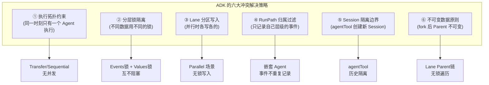
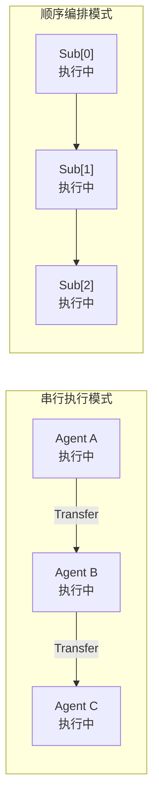
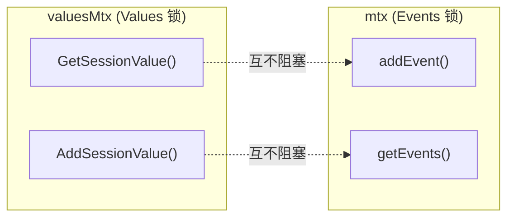
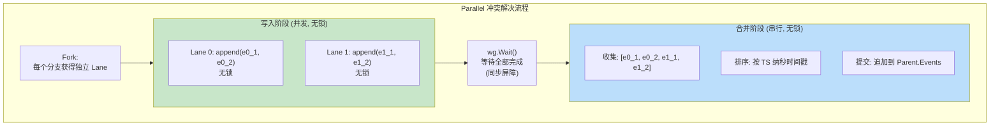
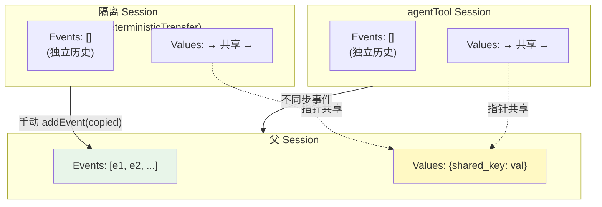
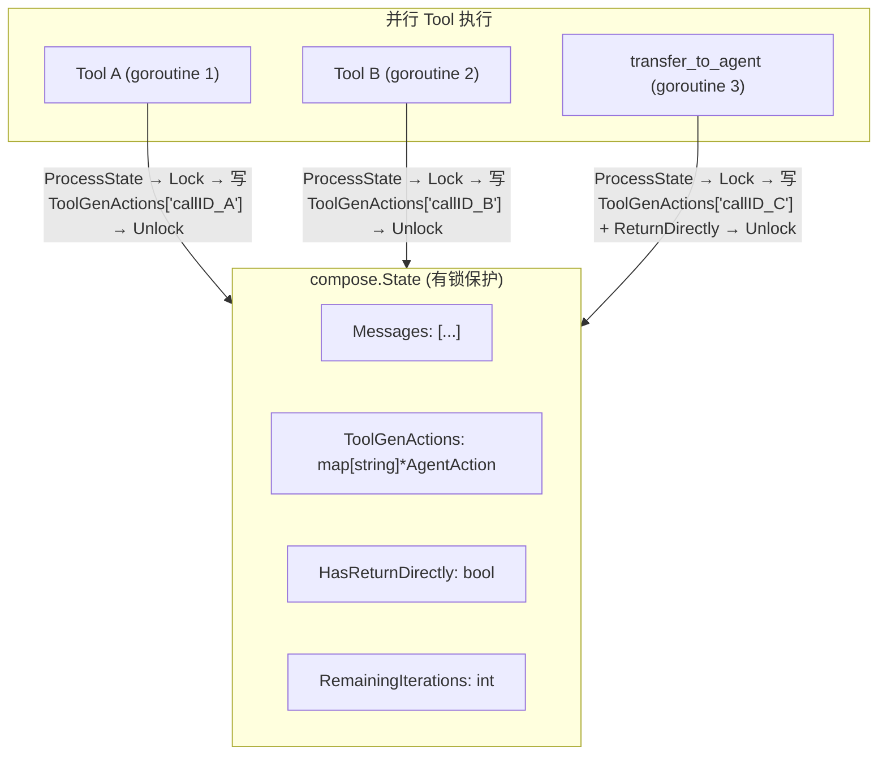
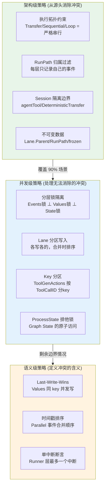

## 一、问题空间

多智能体协作场景中，状态管理面临以下核心挑战：

| 挑战                 | 具体问题                                        |
| ------------------ | ------------------------------------------- |
| **共享状态并发访问**       | 多个 Agent 同时读写 Session Values                |
| **事件历史的一致性**       | 并行 Agent 同时产出事件，如何保序？                       |
| **图内部状态的并发安全**     | ReAct Graph 内 ChatModel 和多个 Tool 并行访问 State |
| **嵌套 Agent 的状态隔离** | agentTool 内部 Agent 不应污染外部的对话历史              |
| **执行路径的状态归属**      | 在多层嵌套中，哪些事件属于哪个 Agent？                      |
| **中断后的状态一致性**      | 中断恢复后，各层状态如何保持一致？                           |

ADK 针对这些挑战，**不是用一个通用的并发控制方案，而是在架构层面就规避了大部分冲突的可能**。下面逐一分析。

---

## 二、核心策略：通过架构设计规避冲突

### 2.1 策略总览



---

## 三、策略一：执行拓扑约束

ADK 的多 Agent 执行模型在绝大多数场景下是 **严格串行** 的：



在 Transfer 和 Sequential 模式下：
- **同一时刻只有一个 Agent 在执行**
- 事件的写入是严格顺序的
- **不存在并发冲突**

这是最根本的冲突规避策略——通过限制执行拓扑，从源头消除大部分并发场景。

**唯一的并行场景是 Parallel 模式和 ReAct 图内的并行 Tool 调用**，这两个场景有专门的处理策略。

---

## 四、策略二：分层锁隔离

`runSession` 使用 **两把独立的锁** 保护不同的数据：

```go
type runSession struct {
    Values    map[string]any
    valuesMtx *sync.Mutex     // ← 锁1：只保护 Values

    Events     []*agentEventWrapper
    LaneEvents *laneEvents
    mtx        sync.Mutex     // ← 锁2：只保护 Events
}
```



**设计意图**：Values 和 Events 是完全独立的数据维度。一个 Agent 在写入事件时，不应阻塞另一个 Agent 读取变量。分锁设计将竞争面缩小到最小。

### compose.Graph 中的 State 锁

在 ReAct 图内部，`compose.State`（如 `*State`）也有自己的锁：

```go
type internalState struct {
    state  any
    mu     sync.Mutex    // ← 每个 State 实例独享一把锁
    parent *internalState
}

func ProcessState[S any](ctx, handler) error {
    s, pMu, _ := getState[S](ctx)
    pMu.Lock()
    defer pMu.Unlock()
    return handler(ctx, s)
}
```

当 ReAct 图中多个 Tool 并行执行时，它们通过 `ProcessState` 加锁访问共享的 `*State`（包含 `Messages`、`ToolGenActions` 等）。

**锁的层级关系**：

```
compose.State 锁
  └─ 保护 ReAct 图内的 State（Messages、ToolGenActions 等）
  └─ 作用域：单个 ChatModelAgent 的 ReAct 循环内

runSession.mtx
  └─ 保护跨 Agent 的事件历史
  └─ 作用域：整个多 Agent 协作

runSession.valuesMtx  
  └─ 保护跨 Agent 的共享变量
  └─ 作用域：整个多 Agent 协作（甚至跨 agentTool 边界）
```

三层锁互不干扰，各管各的数据。

---

## 五、策略三：Lane 分区写入（Parallel 场景）

Parallel 模式是 ADK 中唯一真正并发的编排模式。它的冲突解决策略是 **"分区写入 + 延迟合并"**：

### 5.1 写入阶段：各 Lane 独立，无锁

```go
func (rs *runSession) addEvent(event *AgentEvent) {
    wrapper := &agentEventWrapper{AgentEvent: event, TS: time.Now().UnixNano()}
    
    if rs.LaneEvents != nil {
        // 在 Lane 中 → 写入本地切片（无锁！）
        rs.LaneEvents.Events = append(rs.LaneEvents.Events, wrapper)
        return
    }
    // 主路径 → 加锁写入
    rs.mtx.Lock()
    rs.Events = append(rs.Events, wrapper)
    rs.mtx.Unlock()
}
```

每个并行分支有自己独占的 `laneEvents.Events` 切片，写入不需要任何锁。

### 5.2 合并阶段：排序后原子提交

```go
func joinRunCtxs(parentCtx, childCtxs...) {
    newEvents := unwindLaneEvents(childCtxs...)
    sort.Slice(newEvents, func(i, j int) bool {
        return newEvents[i].TS < newEvents[j].TS   // 按纳秒时间戳排序
    })
    commitEvents(parentCtx, newEvents)               // 批量追加到父
}
```

合并发生在所有 goroutine 都已 `wg.Wait()` 完成之后——此时没有并发，也不需要锁。

### 5.3 读取阶段：合并视图（有序）

如果并行分支内的 Agent 需要重建输入（Transfer 场景），`getEvents()` 构建一个包含已提交历史 + 当前 Lane 链的完整视图：

```go
func (rs *runSession) getEvents() []*agentEventWrapper {
    if rs.LaneEvents == nil {
        return rs.Events
    }
    
    // committed 历史 + 从叶到根遍历 lane 链
    finalEvents = copy(rs.Events)
    for lane := rs.LaneEvents; lane != nil; lane = lane.Parent {
        laneSlices = append(laneSlices, lane.Events)
    }
    // 按链的层级顺序（不是按时间戳）追加
    for i := len(laneSlices) - 1; i >= 0; i-- {
        finalEvents = append(finalEvents, laneSlices[i]...)
    }
    return finalEvents
}
```



---

## 六、策略四：RunPath 归属过滤

在多层嵌套执行中，事件会经过多个 `flowAgent.run()` 的处理。每一层只记录 **直接属于自己的事件**，通过 `exactRunPathMatch` 判断：

```go
// flowAgent.run() 中
if exactRunPathMatch(runCtx.RunPath, event.RunPath) {
    // 路径精确匹配 → 记录到自己的 Session
    runCtx.Session.addEvent(copied)
}
// 不匹配 → 只转发，不记录
```

**这避免了重复记录的问题**：

```
Orchestrator (RunPath=[Orch])
  └─ Planner (RunPath=[Orch, Planner])
       └─ agentTool: Coder (RunPath=[Orch, Planner, tool:Coder])
            └─ Coder Agent (RunPath=[Orch, Planner, tool:Coder, Coder])

Coder Agent 产出事件 event.RunPath = [Orch, Planner, tool:Coder, Coder]
  → Coder 的 flowAgent.run(): 匹配 [Orch, Planner, tool:Coder, Coder] == 自己 ✅ → 记录
  → Planner 的 flowAgent.run(): 匹配 [Orch, Planner] ≠ [Orch, Planner, tool:Coder, Coder] ❌ → 不记录
  → Orchestrator 的 flowAgent.run(): 匹配 [Orch] ≠ [Orch, Planner, tool:Coder, Coder] ❌ → 不记录
```

**不需要锁就能防止事件被重复记录到多个 Session**。

---

## 七、策略五：Session 隔离边界

ADK 通过 **创建新 Session** 在特定边界处实现状态隔离：

### 7.1 agentTool 边界

```go
// agent_tool.go 中使用 withSharedParentSession()
// 最终在 ctxWithNewRunCtx 中：
session = &runSession{
    Values:    parentSession.Values,     // 共享 Values（指针）
    valuesMtx: parentSession.valuesMtx,
    // Events: nil → 全新的空列表
}
```

| 数据       | 是否共享 | 原因                                  |
| -------- | ---- | ----------------------------------- |
| `Values` | ✅ 共享 | 内部 Agent 需要读写共享变量（如 `outputKey` 结果） |
| `Events` | ❌ 隔离 | 内部 Agent 有自己的对话上下文，不应看到外部历史         |

### 7.2 DeterministicTransfer 边界

`AgentWithDeterministicTransferTo` 更进一步——为被包装的 flowAgent 创建 **完全隔离的 Session**：

```go
func runFlowAgentWithIsolatedSession(ctx, fa, input, toAgentNames, options) {
    isolatedSession := &runSession{
        Values:    parentSession.Values,     // 共享 Values
        valuesMtx: parentSession.valuesMtx,
    }
    // Events 完全隔离
    
    // 但是！事件仍然要同步到父 Session
    go handleFlowAgentEvents(ctx, iter, generator, isolatedSession, parentSession, toAgentNames)
}

func handleFlowAgentEvents(..., isolatedSession, parentSession, ...) {
    for event := iter.Next() {
        if parentSession != nil && 非中断事件 {
            copied := copyAgentEvent(event)
            parentSession.addEvent(copied)   // ← 手动同步到父 Session
        }
        generator.Send(event)
    }
}
```

**隔离 + 同步**：内部 Agent 在自己的隔离 Session 中执行（不受父 Session 历史的干扰），但产出的事件会被手动复制到父 Session（确保外部能看到完整历史）。



---

## 八、策略六：不可变数据原则

ADK 在关键数据结构上遵循 **"创建后不可变"** 原则，从根本上消除并发修改的可能：

| 数据 | 不可变性 | 说明 |
|------|---------|------|
| `laneEvents.Parent` | ✅ fork 后不可变 | `getEvents()` 遍历 Parent 链不需要锁 |
| `runContext.deepCopy()` 的 RunPath | ✅ 每次 deepCopy 创建新切片 | 各层 Agent 修改自己的 RunPath 不影响其他层 |
| `agentEventWrapper.concatenatedMessage` | ✅ 一旦赋值不再变更 | 流消费结果的缓存是 write-once |
| `ChatModelAgent.frozen` | ✅ `buildRunFunc` 后冻结 | 防止运行时修改 Agent 配置 |
| `AgentEvent.RunPath` | ✅ 设置一次后不再修改 | 由框架设置，用户不可修改（`RunStep` 字段未导出） |

---

## 九、ReAct 图内的并发状态管理

当 ChatModel 返回多个 ToolCalls 时，ToolsNode 会 **并行执行多个 Tool**。此时多个 Tool goroutine 共享 `*State`：



`ProcessState` 保证了每次访问 State 时的原子性：

```go
func ProcessState[S any](ctx, handler) error {
    s, pMu, _ := getState[S](ctx)
    pMu.Lock()         // ← 排他锁
    defer pMu.Unlock()
    return handler(ctx, s)  // ← handler 内的所有操作都在锁保护下
}
```

**冲突解决策略**：
- 每个 Tool 通过 `ToolCallID` 作为 key 写入 `ToolGenActions`，不同 Tool 写不同的 key，不会覆盖
- `ReturnDirectly` 的判断在 `toolPreHandle` 中（ToolsNode 执行前，串行），不存在并发问题
- `RemainingIterations` 的递减在 `modelPreHandle` 中（ChatModel 执行前，串行）

---

## 十、Values 的 Last-Write-Wins 语义

Session Values 采用的是最简单的冲突解决策略——**最后写入者胜出（Last-Write-Wins）**：

```go
func (rs *runSession) addValue(key string, value any) {
    rs.valuesMtx.Lock()
    rs.Values[key] = value   // 直接覆盖
    rs.valuesMtx.Unlock()
}
```

在 Parallel 场景中，如果两个并行 Agent 同时写入同一个 key：

```
Agent A (goroutine 0): AddSessionValue(ctx, "status", "from_A")
Agent B (goroutine 1): AddSessionValue(ctx, "status", "from_B")
```

最终 `Values["status"]` 取决于哪个 goroutine 最后执行了 `addValue`——这是不确定的。

**ADK 的立场**：**不试图解决 Values 的写冲突**。设计上认为：
1. 大部分场景是串行执行（Transfer/Sequential），不存在并发写冲突
2. Parallel 场景下，不同 Agent 应该写不同的 key（如 `agent_a_result`、`agent_b_result`）
3. 如果确实需要原子更新，用户应该使用 `ProcessState` 机制或在 Tool 中自己加锁

---

## 十一、全局冲突解决策略矩阵

| 编排模式 | 并发度 | Events 冲突 | Values 冲突 | Graph State 冲突 | 解决策略 |
|---------|--------|------------|------------|-----------------|---------|
| **Transfer** | 串行 | ❌ 无 | ❌ 无 | N/A | 架构规避 |
| **Sequential** | 串行 | ❌ 无 | ❌ 无 | N/A | 架构规避 |
| **Loop** | 串行 | ❌ 无 | ❌ 无 | N/A | 架构规避 |
| **Parallel** | 并发 | ✅ Lane 分区 | ⚠️ Last-Write-Wins | N/A | 分区 + 合并 |
| **ReAct 并行 Tool** | 并发 | N/A | N/A | ✅ ProcessState 锁 | 排他锁 + key 分区 |
| **agentTool 嵌套** | 串行* | ✅ Session 隔离 | ✅ 共享 + 锁 | ✅ 独立 Graph State | 边界隔离 |
| **DeterministicTransfer** | 串行* | ✅ 隔离 + 手动同步 | ✅ 共享 + 锁 | N/A | 隔离 + 同步 |

（*串行：嵌套在外层 Agent 的 Tool 调用中，本身是串行的）

---

## 十二、架构级冲突解决总结图



**一句话总结**：ADK 的冲突解决哲学是 **"用架构消除冲突，而非用锁管理冲突"**——通过严格的串行执行拓扑、Session 隔离边界、RunPath 归属过滤和不可变数据原则，将绝大多数并发冲突在设计层面就规避掉了。只有在真正不可避免的并行场景（Parallel 编排、ReAct 并行 Tool 调用），才使用分区写入、分层锁和 Last-Write-Wins 等传统并发控制手段。