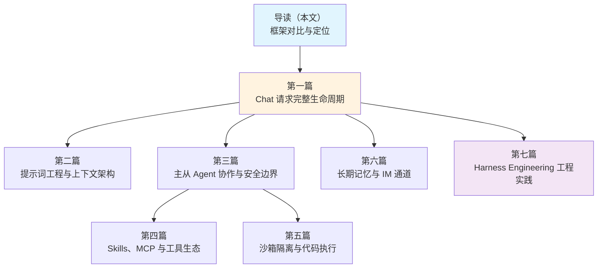

> **DeerFlow 源码解析系列目录**
>
> - **导读（本文）**：AI Agent 框架的选择与 DeerFlow 的定位
> - [第一篇：一个 Chat 请求的完整生命周期](/posts/deerflow-01-chat-request-lifecycle)
> - [第二篇：系统提示词工程与上下文架构](/posts/deerflow-02-prompt-engineering-context)
> - [第三篇：主从 Agent 协作与安全边界](/posts/deerflow-03-multi-agent-collaboration)
> - [第四篇：Skills、MCP 与工具生态](/posts/deerflow-04-skills-mcp-tools)
> - [第五篇：沙箱隔离与代码执行](/posts/deerflow-05-sandbox-isolation)
> - [第六篇：长期记忆、IM 通道与多端接入](/posts/deerflow-06-memory-im-channels)
> - [第七篇：Harness Engineering 工程实践](/posts/deerflow-07-harness-engineering)

---

2025 年下半年到 2026 年初，AI Agent 框架进入了快速分化期。LangGraph 打地基，OpenAI Agents SDK 走极简路线，CrewAI 和 AutoGen 押注多 Agent 协作，Claude Code 把终端编程助手做成了标杆，OpenCode 用 TypeScript 做了一个开源的多模型终端编程助手。

DeerFlow 在这个光谱上处于什么位置？为什么我们选择对它做七篇源码深度解析？这篇导读先回答这两个问题，再给出整个系列的阅读路线。

## 一、当前 AI Agent 框架的分层

把市面上主要的 Agent 框架摆在一起，可以按抽象层级分成三层：


**基础设施层**只有 LangGraph 一个。它提供图状态机、持久化 checkpoint、human-in-the-loop 原语，但不提供任何关于"Agent 应该长什么样"的意见。你拿到的是一堆积木，怎么搭是你的事。

**编排层**是竞争最激烈的区间。CrewAI 用"角色扮演"隐喻（Agent 有 role/goal/backstory），OpenAI Agents SDK 走极简路线（Agent + Handoff + Tool 三个概念搞定一切），AutoGen 从微软研究院出发，强调分布式运行时和跨语言支持。它们的共同点是：给你组装多 Agent 系统的脚手架，但最终产品需要你自己构建。

**应用层**是直接面向终端用户的完整产品。Claude Code 是终端编程助手的标杆，OpenCode 是 100% 开源的终端编程助手（TypeScript/Bun 编写，支持多模型和 LSP）。DeerFlow 在这一层比较特殊——它既是一个可以直接使用的全栈应用（带 Web UI、IM 集成），又把底层的 Agent 运行时（deerflow-harness）设计成了一个可独立发布的 Python 包。

## 二、七个框架的正面对比

### 2.1 LangGraph——地基

LangGraph 是 DeerFlow 的底层依赖。理解 DeerFlow 绕不开 LangGraph，但 LangGraph 本身的抽象非常低：

```python
# LangGraph 的核心 API
graph = StateGraph(MessagesState)
graph.add_node("agent", call_model)
graph.add_node("tools", tool_node)
graph.add_conditional_edges("agent", should_continue)
app = graph.compile(checkpointer=MemorySaver())
```

你需要自己定义状态 schema、自己写 node 函数、自己实现 conditional edge 逻辑。没有中间件、没有提示词管理、没有沙箱、没有记忆系统。它的定位就是"Agent 运行时的 Kubernetes"——提供编排原语，不提供业务逻辑。

DeerFlow 在 LangGraph 之上构建了一整套中间件链、提示词动态组装、工具发现、沙箱隔离、记忆系统。这些是 LangGraph 有意不做的事情。

### 2.2 OpenAI Agents SDK——极简主义

OpenAI Agents SDK（Swarm 的正式继任者）是另一个极端——用最少的概念覆盖最多的场景：

```python
agent = Agent(
    name="Triage",
    instructions="Route the user to the right agent.",
    handoffs=[sales_agent, support_agent],
)
result = Runner.run_sync(agent, "I want a refund")
```

三个核心概念：`Agent`（带 instructions 和 tools 的 LLM）、`Handoff`（一个 Agent 把控制权交给另一个）、`Runner`（执行循环）。没有图、没有状态机、没有 DAG。Agent 之间通过 handoff 链式传递控制权，或者通过 `AgentTool` 把另一个 Agent 包装成工具调用。

它的优势是上手成本极低、概念清晰；劣势是缺少 DeerFlow 那种级别的上下文管理（没有摘要中间件、没有 token 预算控制）和隔离机制（没有沙箱、没有主从 Agent 的提示词隔离）。它甚至不带 Web UI，纯粹是一个 Python 库。

### 2.3 CrewAI——角色扮演隐喻

CrewAI 的核心差异化在于"角色扮演"设计。每个 Agent 不只是一个带 tools 的 LLM，还有 role（角色）、goal（目标）和 backstory（背景故事）：

```python
researcher = Agent(
    role="Senior Research Analyst",
    goal="Find the latest AI trends",
    backstory="You are an expert analyst with 10 years of experience...",
)
crew = Crew(agents=[researcher, writer], tasks=[research_task, write_task])
result = crew.kickoff()
```

两种执行模式：`sequential`（按顺序执行）和 `hierarchical`（自动指派 manager Agent 做任务分配）。2025 年还加入了 `Flow` 系统，用装饰器（`@start`、`@listen`、`@router`）做事件驱动的精确流程控制。

CrewAI 在 2026 年初已突破 80k star，DeepLearning.AI 课程和活跃的社区说明它在"上手友好度"上做得很好。但在工程深度上，它缺少 DeerFlow 的中间件链（CrewAI 没有等价物）、沙箱隔离（只能靠外部工具）和 IM 集成。

### 2.4 AutoGen——学术底色

AutoGen 出自微软研究院，身上带着明显的学术气质。它有三层 API：

- **Core API**：消息传递、事件驱动 Agent、本地/分布式运行时
- **AgentChat API**：简化的快速原型层
- **Extensions API**：LLM client、代码执行器

独特之处是**跨语言支持**（Python + .NET + TypeScript）和**分布式运行时**（通过 gRPC）。它的 `Magentic-One` 是一个参考实现——一个由 5 个 Agent 组成的团队，能做网页浏览、代码执行、文件处理。

不过 AutoGen 的现状需要注意：微软曾宣布 [Microsoft Agent Framework](https://github.com/microsoft/agent-framework) 作为新的方向，但截至 2026 年 3 月，AutoGen 仍在积极开发中（最新更新于 3 月底），两个项目处于并行演进状态。

### 2.5 Claude Code——产品标杆

Claude Code 是一个产品，不是框架。终端 CLI、VS Code 插件、JetBrains 插件、Desktop App、Web 端、移动端、Slack 集成，做到了全端覆盖。

从架构角度看，Claude Code 有两个值得关注的设计：

**CLAUDE.md**：项目级别的持久化指令文件，每次会话启动时自动读取。DeerFlow 深受这个设计的影响——它的 `backend/CLAUDE.md` 就是按照 Claude Code 的模式为 AI 助手撰写的架构指导文档。

**MCP（Model Context Protocol）**：Anthropic 推出的开放标准，用于连接外部工具（Google Drive、Jira、Slack 等）。DeerFlow 完整实现了 MCP 客户端，包括 stdio/SSE/HTTP 三种传输协议和 OAuth 令牌流。

Claude Code 的局限在于**单模型绑定**（只能用 Claude），以及**不可自托管**（Agent 逻辑是闭源的，Agent SDK 提供了编程接口但运行时仍然依赖 Anthropic 的基础设施）。

### 2.6 OpenCode——开源终端编程助手

OpenCode 是一个 100% 开源的 AI 编程助手，用 TypeScript 编写，基于 Bun 运行时。与 Claude Code 类似，它提供了终端 TUI 界面，但有几个关键差异：

- **多模型支持**：不绑定单一供应商，支持 Claude、OpenAI、Google 以及本地模型
- **LSP 集成**：直接对接语言服务器获取代码诊断信息，比简单的"读文件 + grep"更精确
- **Client/Server 架构**：支持远程驱动，TUI 只是可能的客户端之一
- **Plan/Build 双模式**：按 `Tab` 键在只读分析模式（plan）和完整开发模式（build）之间切换

OpenCode 也有 Desktop App 版本，在终端体验上投入了大量精力（开发团队包括 neovim 用户和 terminal.shop 的创作者）。

### 2.7 Anthropic Claude Agent SDK——Claude Code 的可编程接口

Anthropic 在 2025 年中推出了 Claude Agent SDK，与 OpenAI Agents SDK 类似，提供 `Agent` + `Runner` 的极简 API，把 Claude Code 的核心能力封装成可编程接口。它与 OpenAI SDK 的主要差异在于深度集成 Anthropic 的模型能力（如 extended thinking、computer use 等），但两者在抽象层级上属于同一类编排层工具。

## 三、DeerFlow 到底在做什么不同的事

把六个框架摆在一起后，DeerFlow 的定位就清晰了：

| 维度 | LangGraph | OpenAI/Claude SDK | CrewAI | AutoGen | Claude Code | OpenCode | DeerFlow |
|------|-----------|------------|--------|---------|-------------|------------------|----------|----------|
| 抽象层级 | 基础设施 | 编排 | 编排 | 编排 | 应用 | 应用 | **基础设施 + 应用** |
| 多 Agent | 手动组装 | Handoff | Crew | Group Chat | 内置子 Agent | 子 Agent | 主从隔离 |
| 中间件 | 无 | 无 | 无 | 无 | Hooks | 无 | **12 个中间件** |
| 沙箱 | 无 | 无 | 无 | Docker | 无 | 无 | **Docker/K8s** |
| 长期记忆 | Checkpointer | Sessions | 可选 | 无 | CLAUDE.md | 无 | **LLM 提取** |
| 提示词管理 | 无 | 静态 instructions | 静态 backstory | 无 | CLAUDE.md | 静态 | **12 条件动态组装** |
| IM 集成 | 无 | 无 | 无 | 无 | Slack | 无 | **飞书/Slack/TG** |
| Web UI | LangSmith | 无 | Control Plane | Studio | Desktop/Web | Desktop | **Next.js** |
| 模型无关 | 是 | 是 | 是 | 是 | **否** | 是 | 是 |
| 可独立部署 | 库 | 库 | 库+CLI | 库+Studio | 产品 | 产品 | **全栈应用** |

几个关键差异：

**1. 中间件链**：在调研过的七个框架中，只有 DeerFlow 实现了真正的中间件链。12 个中间件分布在 5 个钩子点（`before_agent`、`after_agent`、`before_model`、`after_model`、`wrap_model_call`），覆盖了从线程数据初始化到上下文摘要、从 Plan Mode 到记忆更新的完整生命周期。其他框架要么没有中间件概念（LangGraph、OpenAI/Claude SDK、AutoGen），要么只有简单的 hooks（Claude Code）或装饰器（CrewAI Flow）。

**3. 沙箱即一等公民**：只有 AutoGen 和 DeerFlow 把代码执行沙箱作为一等公民。AutoGen 提供了 Docker 执行器；DeerFlow 在此基础上增加了虚拟路径系统（Agent 看到 `/mnt/user-data/`，实际映射到宿主机的 per-thread 目录）和 Kubernetes provisioner 支持。

**4. 上下文工程的深度**：DeerFlow 的提示词不是一个静态字符串，而是由 12 个条件 section 动态组装的。记忆注入有 2000 token 的精确预算控制（用 tiktoken 计数），上下文摘要有触发条件和保留策略，工具调用结果有延迟过滤。这种级别的上下文工程在其他框架中没有看到。

**5. IM 通道**：DeerFlow 是唯一一个原生集成了三个 IM 平台（飞书、Slack、Telegram）的 Agent 框架。这不是"加个 Webhook 就行"的集成——飞书通道实现了 Interactive Card 的渐进式更新（创建卡片 → 流式 patch → 完成标记），Slack 做了 Markdown 到 mrkdwn 的格式转换，Telegram 区分了私聊（共享线程）和群聊（独立线程）的会话模型。

## 四、为什么对 DeerFlow 做源码解析

选择 DeerFlow 做深度源码解析，不是因为它在所有维度上都"最好"。每个框架都有自己的甜蜜点：

- 如果你需要最大控制力，用 **LangGraph**
- 如果你需要最快上手，用 **OpenAI Agents SDK** 或 **Claude Agent SDK**
- 如果你需要角色化的多 Agent 团队，用 **CrewAI**
- 如果你需要最好的编程助手体验，用 **Claude Code**
- 如果你需要开源的终端编程助手，用 **OpenCode**

选择 DeerFlow 是因为它在一个代码库里同时解决了多个工程问题，每个问题都值得拆开看：

- 怎么在 LangGraph 之上构建中间件链？（第一篇、第三篇）
- 怎么做 token 级别的上下文管理？（第二篇）
- 怎么隔离主 Agent 和子 Agent 的提示词、工具和历史？（第三篇）
- 怎么实现 Skills 的三层渐进加载和 MCP 的完整集成？（第四篇）
- 怎么设计虚拟路径系统来统一本地和 Docker 沙箱？（第五篇）
- 怎么用 LLM 做长期记忆提取，怎么在三个 IM 平台上做消息总线？（第六篇）
- 怎么用 CLAUDE.md 指导 AI Agent 协作，怎么用 AST 测试强制架构边界？（第七篇）

这些问题不是 DeerFlow 独有的——任何认真构建 AI Agent 系统的团队都会遇到。DeerFlow 的源码提供了一套具体的、可审视的答案。

## 五、系列文章路线

整个系列 7 篇文章按"先总后分、先主后辅"的顺序组织：



| 篇目 | 主题 | 对应工程问题 |
|------|------|-------------|
| [第一篇](/posts/deerflow-01-chat-request-lifecycle) | 请求生命周期 | 一个请求从浏览器到 AI 回复经过了什么 |
| [第二篇](/posts/deerflow-02-prompt-engineering-context) | 提示词工程 | 系统提示词怎么做到动态组装和 token 预算控制 |
| [第三篇](/posts/deerflow-03-multi-agent-collaboration) | 主从 Agent | 主 Agent 和子 Agent 的隔离怎么做，死循环怎么防 |
| [第四篇](/posts/deerflow-04-skills-mcp-tools) | 工具生态 | Skills 怎么加载，MCP 怎么集成，工具怎么分组 |
| [第五篇](/posts/deerflow-05-sandbox-isolation) | 沙箱隔离 | 本地和 Docker 执行怎么统一，路径安全怎么保证 |
| [第六篇](/posts/deerflow-06-memory-im-channels) | 记忆与 IM | 长期记忆怎么用 LLM 提取，三个 IM 平台怎么对接 |
| [第七篇](/posts/deerflow-07-harness-engineering) | 工程实践 | CLAUDE.md 怎么写，架构边界怎么强制，CI 怎么配 |

**第一篇是入口**，走一遍完整请求路径，建立全局认知。**第二到六篇各自独立**，放大某个子系统的实现细节，可以按兴趣跳读。**第七篇是收尾**，从具体代码中跳出来，评估整个项目的工程实践水平。

每篇文章都带有 `file:line` 级别的源码引用，指向 DeerFlow 的 [GitHub 仓库](https://github.com/bytedance/deer-flow)中的具体代码位置。建议对照源码阅读。

---

> **下一篇**：[DeerFlow 源码解析（一）：一个 Chat 请求的完整生命周期](/posts/deerflow-01-chat-request-lifecycle)——从用户按下 Enter 开始，追踪请求经过的四个服务、中间件链、Agent Loop，直到 AI 回复出现在屏幕上。
