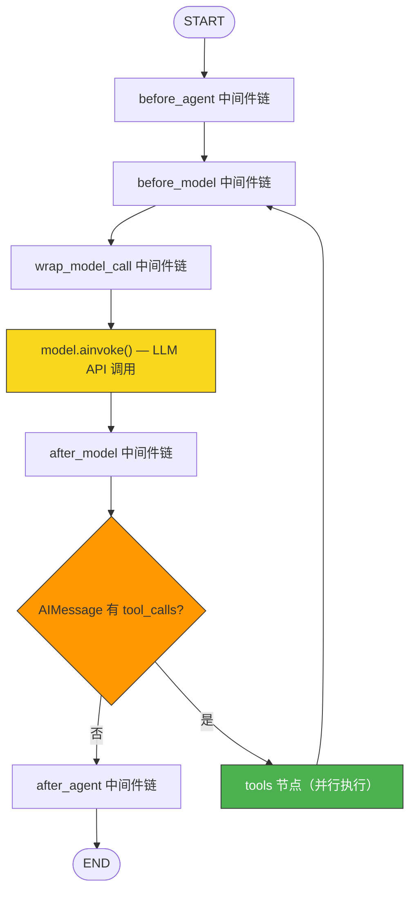
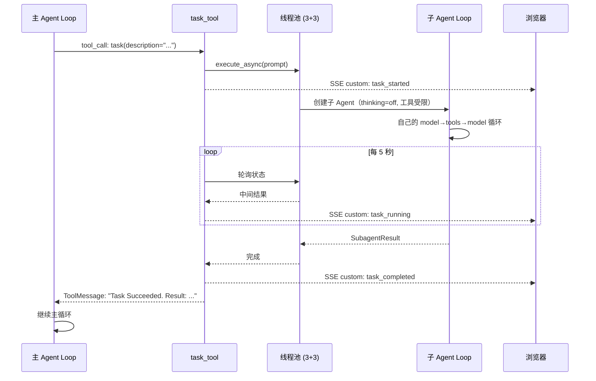

> **DeerFlow 源码解析系列目录**
>
> - [导读：AI Agent 框架的选择与 DeerFlow 的定位](/posts/deerflow-00-introduction)
> - **第一篇（本文）**：一个 Chat 请求的完整生命周期
> - [第二篇：系统提示词工程与上下文架构](/posts/deerflow-02-prompt-engineering-context)
> - [第三篇：主从 Agent 协作与安全边界](/posts/deerflow-03-multi-agent-collaboration)
> - [第四篇：Skills、MCP 与工具生态](/posts/deerflow-04-skills-mcp-tools)
> - [第五篇：沙箱隔离与代码执行](/posts/deerflow-05-sandbox-isolation)
> - [第六篇：长期记忆、IM 通道与多端接入](/posts/deerflow-06-memory-im-channels)
> - [第七篇：Harness Engineering 工程实践](/posts/deerflow-07-harness-engineering)

---

DeerFlow 是字节跳动开源的 AI Agent 运行时框架，基于 LangGraph + FastAPI + Next.js 构建。这个系列共 7 篇文章，从源码层面拆解它的设计和实现。

第一篇从最直观的路径入手：用户在浏览器里输入一句话、按下 Enter，到看到 AI 回复，中间到底经过了什么？

## 四个服务，各司其职

DeerFlow 的后端并不是一个单体服务，而是由 nginx 统一代理的四个独立进程：


一个容易产生误解的地方是：**Chat 的流式传输不经过 Gateway**。Gateway 负责的是模型列表、MCP 配置、技能管理、文件上传这些"管理侧"的 API。Chat 消息直接走 `nginx → LangGraph Server`，Gateway 完全不参与。

## 阶段一：前端发起请求

### 用户按下 Enter

入口在 `ChatPage` 组件。用户提交消息后，`handleSubmit` 把消息转交给 `sendMessage`：

```tsx
// frontend/src/app/workspace/chats/[thread_id]/page.tsx:64
const handleSubmit = useCallback(
  (message: PromptInputMessage) => {
    void sendMessage(threadId, message);
  },
  [sendMessage, threadId],
);
```

`sendMessage` 来自 `useThreadStream` 这个自定义 Hook，它内部使用了 LangGraph SDK 提供的 `useStream`。

### 建立 SSE 流

`useStream` 的配置值得仔细看：

```ts
// frontend/src/core/threads/hooks.ts:113
const thread = useStream<AgentThreadState>({
  client: getAPIClient(),          // LangGraph SDK 客户端（单例）
  assistantId: "lead_agent",       // 对应后端 langgraph.json 中的 graph 名
  threadId: onStreamThreadId,
  reconnectOnMount: true,          // 页面刷新后自动重连
  fetchStateHistory: { limit: 1 }, // 重连时拉取最新状态
  // ...事件回调（下面展开）
});
```

当用户发消息时，`thread.submit()` 被调用。它发出一个 **POST 请求**，核心 payload 长这样：

```ts
// frontend/src/core/threads/hooks.ts:347
await thread.submit(
  {
    messages: [{
      type: "human",
      content: [{ type: "text", text }],
      additional_kwargs: filesForSubmit.length > 0 ? { files: filesForSubmit } : {},
    }],
  },
  {
    threadId,
    streamSubgraphs: true,    // 接收子 Agent 的流式事件
    streamResumable: true,    // 断线可重连
    config: { recursion_limit: 1000 },
    context: {
      thinking_enabled: context.mode !== "flash",
      is_plan_mode: context.mode === "pro" || context.mode === "ultra",
      subagent_enabled: context.mode === "ultra",
      reasoning_effort: /* ... */,
      thread_id: threadId,
    },
  },
);
```

注意 `context` 里的四个标志位。它们来自 UI 上的模式选择（Flash / Thinking / Pro / Ultra），直接决定了后端 Agent 的行为：是否开启深度思考、是否启用计划模式、是否允许委派子 Agent。

### 流式协议

DeerFlow 不使用浏览器原生的 `EventSource`（它只支持 GET），而是用 **`fetch()` POST + ReadableStream** 来解析 SSE 协议。LangGraph SDK 内部实现了 `BytesLineDecoder` 和 `SSEDecoder` 两个 TransformStream，把字节流拆成 `{ event, data, id }` 结构。

断线重连的机制是：SDK 把 `run_id` 存在 `sessionStorage` 中。如果浏览器刷新或网络中断，下次会通过 `GET /runs/{run_id}/join` 重新接入同一个运行中的 Agent 会话。

### 流经 nginx

LangGraph SDK 客户端的 `apiUrl` 默认指向 `{origin}/api/langgraph`：

```ts
// frontend/src/core/config/index.ts:28
return `${window.location.origin}/api/langgraph`;
```

nginx 收到请求后，去掉 `/api/langgraph/` 前缀，转发到 LangGraph Server：

```nginx
# docker/nginx/nginx.conf:57
location /api/langgraph/ {
    rewrite ^/api/langgraph/(.*) /$1 break;
    proxy_pass http://langgraph;   # upstream langgraph -> :2024

    # SSE 必需：关闭缓冲，支持分块传输
    proxy_buffering off;
    proxy_cache off;
    proxy_set_header X-Accel-Buffering no;
    chunked_transfer_encoding on;

    # 长连接超时 10 分钟
    proxy_connect_timeout 600s;
    proxy_send_timeout 600s;
    proxy_read_timeout 600s;
}
```

这段配置有两个要点：`proxy_buffering off` 确保 SSE 事件能即时到达浏览器（否则 nginx 会攒一批再发），600 秒超时给长时间运行的 Agent 留出足够时间。

## 阶段二：LangGraph Server 构建 Agent

LangGraph Server 收到 `/threads/{id}/runs/stream` 请求后，根据 `assistant_id` 查找对应的 graph factory：

```json
// backend/langgraph.json
{
  "graphs": {
    "lead_agent": "deerflow.agents:make_lead_agent"
  }
}
```

`"lead_agent"` 映射到 `make_lead_agent()` 这个工厂函数。它做四件事：

### 1. 解析运行时参数

前端传入的 `context` 会被放进 `config["configurable"]`，工厂函数从中读取所有运行时标志：

```python
# backend/packages/harness/deerflow/agents/lead_agent/agent.py:273
cfg = config.get("configurable", {})
thinking_enabled = cfg.get("thinking_enabled", True)
is_plan_mode = cfg.get("is_plan_mode", False)
subagent_enabled = cfg.get("subagent_enabled", False)
reasoning_effort = cfg.get("reasoning_effort", None)
model_name = cfg.get("model_name") or cfg.get("model")
```

### 2. 聚合工具集

`get_available_tools()` 把四个来源的工具合并成一个列表：

- 配置文件中定义的工具（web_search、bash、read_file 等）
- 内置工具（present_file、ask_clarification、view_image）
- MCP 工具（从外部 MCP server 加载）
- 子 Agent 工具（`task`，仅当 `subagent_enabled=True` 时）

### 3. 构建中间件链

这是 DeerFlow 的核心设计。`_build_middlewares()` 按顺序组装一个中间件链，每个中间件在 Agent 执行的不同阶段插入逻辑：

```python
# backend/packages/harness/deerflow/agents/lead_agent/agent.py:208
def _build_middlewares(config, model_name, agent_name=None):
    # 基础层：ThreadData → Uploads → Sandbox → DanglingToolCall → Guardrail → ToolErrorHandling
    middlewares = build_lead_runtime_middlewares(lazy_init=True)

    # 按条件追加
    if summarization_enabled:     middlewares.append(SummarizationMiddleware(...))
    if is_plan_mode:              middlewares.append(TodoMiddleware())
    if token_usage_enabled:       middlewares.append(TokenUsageMiddleware())
    middlewares.append(TitleMiddleware())
    middlewares.append(MemoryMiddleware(agent_name=agent_name))
    if model_supports_vision:     middlewares.append(ViewImageMiddleware())
    if tool_search_enabled:       middlewares.append(DeferredToolFilterMiddleware())
    if subagent_enabled:          middlewares.append(SubagentLimitMiddleware(...))
    middlewares.append(LoopDetectionMiddleware())
    middlewares.append(ClarificationMiddleware())  # 必须最后
    return middlewares
```

最终的中间件链最多有 16 个，它们分布在 Agent 执行的五个钩子点上：

| 钩子 | 触发时机 | 参与的中间件 |
|------|---------|------------|
| `before_agent` | 整个会话开始前，执行一次 | ThreadData, Uploads, Sandbox |
| `before_model` | 每轮 LLM 调用前 | Todo, ViewImage |
| `wrap_model_call` | 包裹 LLM 调用本身 | DanglingToolCall, Summarization, DeferredToolFilter |
| `after_model` | 每轮 LLM 调用后 | LoopDetection, SubagentLimit, Title, TokenUsage |
| `wrap_tool_call` | 包裹每个工具调用 | ToolErrorHandling, Clarification |
| `after_agent` | 整个会话结束后，执行一次 | Memory, Sandbox(释放) |

### 4. 组装系统提示词

`apply_prompt_template()` 根据配置动态拼接系统提示词——由 12 个可选 section 条件组装，而非一个静态字符串。（第 2 篇会详细分析。）

### 5. 编译 StateGraph

四个组件准备好后，调用 LangChain 的 `create_agent()` 编译成 LangGraph 的 `StateGraph`：

```python
# backend/packages/harness/deerflow/agents/lead_agent/agent.py:337
return create_agent(
    model=create_chat_model(name=model_name, thinking_enabled=thinking_enabled),
    tools=get_available_tools(model_name=model_name, subagent_enabled=subagent_enabled),
    middleware=_build_middlewares(config, model_name=model_name),
    system_prompt=apply_prompt_template(subagent_enabled=subagent_enabled, ...),
    state_schema=ThreadState,
)
```

## 阶段三：Agent Loop 执行

编译后的 StateGraph 是一个循环结构。用 Mermaid 表示：



核心是中间的循环：**model → routing → tools → model → ...**，直到 LLM 返回一个不含 `tool_calls` 的纯文本消息。

### 一轮循环的细节

以用户问"帮我分析一下这段代码"为例，假设 Agent 决定先调用 `read_file` 再回答。

**Step 1: before_model**

`TodoMiddleware` 检查对话历史是否被截断过（被 Summarization 压缩后 todo list 可能丢失），如果是就注入一条提醒消息。`ViewImageMiddleware` 检查最近是否有 `view_image` 工具调用，如果有就把图片 base64 注入消息。

**Step 2: wrap_model_call（三层包裹）**

```
DanglingToolCallMiddleware
  → 扫描历史：有没有 AIMessage 带 tool_calls 但没有对应的 ToolMessage？
  → 如果有，注入占位 ToolMessage："[Tool call was interrupted]"

SummarizationMiddleware
  → 检查消息历史的 token 数是否超过阈值
  → 如果超过，把旧消息交给一个轻量模型做摘要，替换原始消息

DeferredToolFilterMiddleware
  → 如果启用了 tool_search，把延迟加载的 MCP 工具 schema 从 bind_tools 中移除
  → 省下的 context tokens 可以留给对话内容

最内层：model.bind_tools(tools).ainvoke(messages)  ← 真正的 LLM API 调用
```

**Step 3: after_model**

LLM 返回了一个 AIMessage，包含一个 `read_file` 工具调用。中间件依次处理：

- `LoopDetectionMiddleware`：把 tool_calls 哈希后放入滑动窗口，检查是否重复。如果同一个调用出现 3 次，注入警告；5 次，直接剥离 tool_calls 强制停止。
- `SubagentLimitMiddleware`：如果有超过 3 个 `task` 调用，截断多余的。
- `TitleMiddleware`：如果是第一轮对话，异步调用一个轻量模型生成会话标题。
- `TokenUsageMiddleware`：从 LLM 响应的 metadata 中记录 token 消耗。

**Step 4: 路由**

AIMessage 有 `tool_calls` → 进入 tools 节点。LangGraph 使用 `Send()` 机制，**每个工具调用被并行分发执行**。

**Step 5: tools 节点**

每个工具调用被两层中间件包裹：

```
ToolErrorHandlingMiddleware
  → 捕获所有异常（除了 GraphBubbleUp）
  → 转成 ToolMessage："Error: Tool 'X' failed with Y. Continue with available context, or choose an alternative tool."
  → Agent 会读到这条消息并调整策略

ClarificationMiddleware
  → 如果工具是 ask_clarification，拦截执行
  → 返回 Command(goto=END)，物理中断整个 Agent Loop
  → 用户回复后才能继续

最内层：actual_tool.invoke(args)
```

`read_file` 正常执行，返回文件内容作为 ToolMessage。

**Step 6: 回到 before_model**

ToolMessage 进入消息历史，循环回到 Step 1。这次 LLM 有了文件内容，生成一个不含 tool_calls 的文本回复。路由判定"无 tool_calls"，退出循环进入 `after_agent`。

**Step 7: after_agent**

- `MemoryMiddleware`：把这轮对话入队，30 秒防抖后异步更新 `memory.json`
- `SandboxMiddleware`：释放沙箱资源

## 阶段四：流式事件回到浏览器

Agent Loop 的每个节点转换都会生成 SSE 事件。前端通过 5 种 `stream_mode` 并行接收：

| stream_mode | 内容 | 前端处理 |
|---|---|---|
| `values` | 完整状态快照（messages, title, artifacts, todos） | 更新 thread 对象 |
| `messages-tuple` | 流式消息片段 `[AIMessage, metadata]` | Streamdown 组件逐字渲染 Markdown |
| `updates` | 节点级增量更新 `{node: partial_state}` | 更新标题到线程列表缓存 |
| `custom` | 自定义事件（task_started, task_running, task_completed） | 驱动 SubtaskCard 组件 |
| `events` | LangChain 级事件（on_tool_end 等） | 触发工具调用结束回调 |

`useStream` Hook 通过回调函数分发这些事件：

```ts
// frontend/src/core/threads/hooks.ts
onUpdateEvent(data) {
  // 从 updates 事件中提取新标题，立即更新线程列表
  // 用户无需刷新就能看到标题变化
},
onCustomEvent(event) {
  // 子 Agent 的进度事件 → SubtaskCard 组件实时更新
  if (event.type === "task_running") {
    updateSubtask({ id: event.task_id, latestMessage: event.message });
  }
},
```

最终，`thread.isLoading` 变为 `false`，optimistic message 被清除，用户看到完整的 AI 回复。

## 子 Agent：循环中的循环

如果 LLM 在某一轮调用了 `task` 工具（需要 `subagent_enabled=True`，即 Ultra 模式），流程会分叉：



子 Agent 运行在独立的线程池中（3 个调度线程 + 3 个执行线程），有自己的 Agent Loop，但配置大幅精简：thinking 强制关闭、没有记忆注入、没有技能目录、工具集经过过滤（去掉 `task`、`ask_clarification`）。主 Agent 每 5 秒轮询子 Agent 状态，通过 `stream_writer` 发射 custom 事件，浏览器端的 `SubtaskCard` 组件随之更新。

## 完整链路一览

把以上所有阶段串起来：

```
用户 Enter
  → React handleSubmit()
    → LangGraph SDK thread.submit()
      → fetch POST {origin}/api/langgraph/threads/{id}/runs/stream
        → nginx rewrite → LangGraph Server :2024
          → make_lead_agent(config)
            → 解析参数 + 聚合工具 + 构建中间件链 + 组装提示词
              → create_agent() 编译 StateGraph
                → [before_agent] ThreadData → Uploads → Sandbox
                  → { [before_model] → [wrap_model_call] → LLM API → [after_model]
                      → 有 tool_calls? → [wrap_tool_call] → tool.invoke() → 循环 }
                    → [after_agent] Memory → Sandbox释放
                      → SSE 事件流 → nginx → Browser
                        → StreamManager 分发 → React re-render → 用户看到回复
```

下一篇我们放大 Agent Loop 内部最核心的部分——系统提示词是如何被动态组装的，以及 DeerFlow 如何管理上下文窗口不被撑爆。
