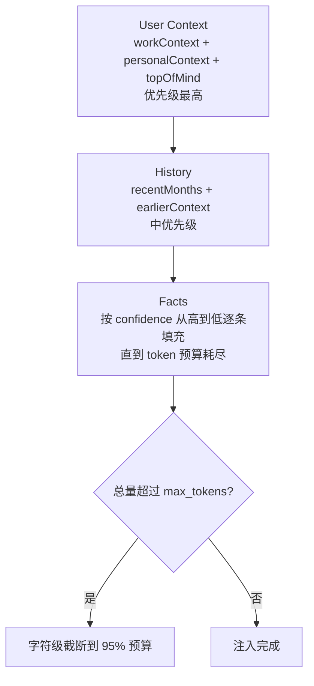

> **DeerFlow 源码解析系列目录**
>
> - [导读：AI Agent 框架的选择与 DeerFlow 的定位](/posts/deerflow-00-introduction)
> - [第一篇：一个 Chat 请求的完整生命周期](/posts/deerflow-01-chat-request-lifecycle)
> - **第二篇（本文）**：系统提示词工程与上下文架构
> - [第三篇：主从 Agent 协作与安全边界](/posts/deerflow-03-multi-agent-collaboration)
> - [第四篇：Skills、MCP 与工具生态](/posts/deerflow-04-skills-mcp-tools)
> - [第五篇：沙箱隔离与代码执行](/posts/deerflow-05-sandbox-isolation)
> - [第六篇：长期记忆、IM 通道与多端接入](/posts/deerflow-06-memory-im-channels)
> - [第七篇：Harness Engineering 工程实践](/posts/deerflow-07-harness-engineering)

---

上一篇我们走完了 Chat 请求的端到端链路。这篇放大 Agent Loop 内部最核心的部分：系统提示词是怎么被组装出来的，以及 DeerFlow 用了哪些手段防止上下文窗口被撑爆。

## 系统提示词不是一个字符串，是一个条件组装过程

DeerFlow 的主 Agent 系统提示词不是写死在代码里的一段话。`apply_prompt_template()` 根据运行时配置，从 12 个可选 section 中挑选需要的部分，拼成最终的 prompt：

```python
# backend/packages/harness/deerflow/agents/lead_agent/prompt.py:468
def apply_prompt_template(
    subagent_enabled: bool = False,
    max_concurrent_subagents: int = 3,
    *,
    agent_name: str | None = None,
    available_skills: set[str] | None = None,
) -> str:
    memory_context = _get_memory_context(agent_name)
    subagent_section = _build_subagent_section(n) if subagent_enabled else ""
    skills_section = get_skills_prompt_section(available_skills)
    deferred_tools_section = get_deferred_tools_prompt_section()
    acp_section = _build_acp_section()

    prompt = SYSTEM_PROMPT_TEMPLATE.format(
        agent_name=agent_name or "DeerFlow 2.0",
        soul=get_agent_soul(agent_name),
        skills_section=skills_section,
        deferred_tools_section=deferred_tools_section,
        memory_context=memory_context,
        subagent_section=subagent_section,
        # ...
    )
    return prompt + f"\n<current_date>{datetime.now().strftime('%Y-%m-%d, %A')}</current_date>"
```

每个 placeholder 背后都有一个独立的加载函数和条件判断。我们逐个看它们什么时候被注入、什么时候被跳过。

## 提示词的 12 个 Section

`SYSTEM_PROMPT_TEMPLATE` 的结构可以用一张表概括：

| # | Section | 始终加载？ | 注入条件 |
|---|---------|-----------|---------|
| 1 | `<role>` | 是 | — |
| 2 | `{soul}` | 否 | 该 Agent 有 `SOUL.md` 文件 |
| 3 | `{memory_context}` | 否 | memory 启用 + injection_enabled + 有内容 |
| 4 | `<thinking_style>` | 是 | — （其中 `{subagent_thinking}` 仅 subagent_enabled 时展开） |
| 5 | `<clarification_system>` | 是 | — |
| 6 | `{skills_section}` | 否 | 有已启用的 skills |
| 7 | `{deferred_tools_section}` | 否 | tool_search 启用 + 注册表非空 |
| 8 | `{subagent_section}` | 否 | subagent_enabled=True |
| 9 | `<working_directory>` | 是 | — （其中 `{acp_section}` 仅 ACP 配置存在时展开） |
| 10 | `<response_style>` | 是 | — |
| 11 | `<citations>` | 是 | — |
| 12 | `<critical_reminders>` | 是 | — （其中 `{subagent_reminder}` 仅 subagent_enabled 时展开） |

追加：`<current_date>` 在最后拼接，不在模板内。

这意味着在 Flash 模式下（subagent_enabled=False, 没有自定义 Agent、没有记忆），提示词是一个精简版本。而在 Ultra 模式下（全部开启），提示词会膨胀几百行。这种按需组装的策略，让每种模式都只携带必要的上下文。

## 几个关键 Section 的设计

### Soul：一个 Markdown 文件定义人格

`get_agent_soul(agent_name)` 会尝试读取 Agent 目录下的 `SOUL.md` 文件。如果存在，整个文件内容被包裹在 `<soul>` 标签中注入提示词。

这个设计的好处是：Agent 的"人格"和"能力"完全解耦。框架负责能力（工具、中间件、记忆），SOUL.md 只负责风格和价值观。创建一个新 Agent 时，写一个 SOUL.md 就能改变它的行为风格，不需要碰任何代码。

### CLARIFY → PLAN → ACT：不是建议，是强制

提示词中最长的 section 是 `<clarification_system>`，大约 70 行。它定义了一个严格的三阶段工作流：

```
1. FIRST: 分析请求——哪些不清楚、缺失、模糊
2. SECOND: 如果需要澄清，立即调用 ask_clarification，不要开始工作
3. THIRD: 澄清解决后，再规划和执行
```

并且列举了 5 种必须澄清的场景（缺失信息、模糊需求、方案选择、危险操作、建议确认），每种都有具体示例和 `REQUIRED ACTION`。

但提示词只是"软约束"——LLM 可以无视它。所以 DeerFlow 用 `ClarificationMiddleware` 做了"硬约束"：当 Agent 调用 `ask_clarification` 工具时，中间件返回 `Command(goto=END)`，**物理中断**整个 Agent Loop。Agent 没法在澄清后继续执行，必须等用户回复。

这是提示词和中间件配合的典型例子：提示词告诉 LLM "应该"怎么做，中间件确保它"不得不"这么做。

### Skills：只给目录，不给全文

Skills section 的设计体现了"渐进式加载"的思路。`get_skills_prompt_section()` 加载所有已启用的 skill，但只把 **名称、描述和文件路径** 放进提示词：

```python
# backend/packages/harness/deerflow/agents/lead_agent/prompt.py:403
skill_items = "\n".join(
    f"    <skill>\n"
    f"        <name>{skill.name}</name>\n"
    f"        <description>{skill.description}</description>\n"
    f"        <location>{skill.get_container_file_path(...)}</location>\n"
    f"    </skill>"
    for skill in skills
)
```

生成的 XML 类似：

```xml
<available_skills>
    <skill>
        <name>deep-research</name>
        <description>Use this skill for ANY question that requires web research...</description>
        <location>/mnt/skills/public/deep-research/SKILL.md</location>
    </skill>
</available_skills>
```

然后在提示词中指示 Agent 使用"Progressive Loading Pattern"：

> 1. 当用户查询匹配某个 skill 时，立即 `read_file` 加载 skill 主文件
> 2. 阅读 skill 的工作流和指令
> 3. Skill 文件中会引用外部资源
> 4. **仅在执行时按需加载引用的资源**

一个 skill 文件可能有 100-200 行。如果 17 个 skill 全部展开放进提示词，会占用几千 token。这种"目录在提示词里，全文在文件里"的设计，把 skill 对 context 的消耗从 O(n) 降到了 O(1)。（第 4 篇会详细分析 skill 的三层加载架构。）

## 上下文窗口管理：三道防线

大模型的上下文窗口有限。随着对话轮次增加，消息历史不断膨胀。DeerFlow 用三个机制协同控制上下文大小。

### 防线一：Summarization——压缩消息历史

`SummarizationMiddleware` 在 `wrap_model_call` 阶段工作。它监控消息历史的大小，当超过阈值时，把旧消息交给一个轻量模型做摘要，用摘要替换原始消息。

触发条件在 `config.yaml` 中配置，支持三种度量方式：

```python
# backend/packages/harness/deerflow/config/summarization_config.py:32
class SummarizationConfig(BaseModel):
    trigger: ContextSize | list[ContextSize] | None  # 何时触发
    keep: ContextSize           # 压缩后保留多少（默认: 最近 20 条消息）
    trim_tokens_to_summarize: int | None = 4000  # 发给摘要模型的最大 token
```

`trigger` 可以是一个列表——比如"50 条消息或 80% token 占用率，哪个先到就触发"。`keep` 决定压缩后保留多少最近消息。`trim_tokens_to_summarize` 限制发给摘要模型的文本量，控制摘要的成本。

关键设计选择：**摘要模型可以和主模型不同**。配置中的 `model_name` 字段允许用一个更便宜的模型做摘要（比如用 GPT-4o-mini 给 Claude Opus 做摘要），降低运行成本。

### 防线二：Memory Token Budget——记忆注入有硬上限

长期记忆被注入到 `{memory_context}` 这个 section 中。但注入量不是无限制的——`format_memory_for_injection()` 用 tiktoken 做精确的 token 计数，有一个硬上限（默认 2000 token）。

分配策略按优先级从高到低：



```python
# backend/packages/harness/deerflow/agents/memory/prompt.py:255
# Facts 按置信度排序，逐条填充直到 token 预算耗尽
ranked_facts = sorted(
    facts_data,
    key=lambda fact: _coerce_confidence(fact.get("confidence"), default=0.0),
    reverse=True,
)

for fact in ranked_facts:
    line_tokens = _count_tokens(line_text)
    if running_tokens + line_tokens <= max_tokens:
        fact_lines.append(line)
        running_tokens += line_tokens
    else:
        break  # 预算用完，停止添加
```

这里有个工程细节：token 计数是增量累加每条 fact 的 token 数，而非每次对整个字符串重新计算。对于 100 条 fact 的场景，这避免了 100 次完整 tokenize 操作。

### 防线三：Deferred Tool Filtering——工具 Schema 按需加载

这是一个容易被忽略的 context 消耗源。每个工具在通过 `bind_tools()` 绑定到模型时，它的完整 JSON Schema（包括参数描述、类型定义）都会进入上下文。如果通过 MCP 接入了大量外部工具，Schema 的 token 消耗会很可观。

`DeferredToolFilterMiddleware` 的做法是：在 `wrap_model_call` 阶段，把"延迟工具"的 Schema 从 `bind_tools` 列表中移除。Agent 只在提示词中看到这些工具的名称列表（不到一行一个），需要时通过 `tool_search` 工具查询完整 Schema。

```python
# 提示词中只列出名称
<available-deferred-tools>
mcp_github_create_issue, mcp_github_list_repos, mcp_slack_send_message, ...
Use `tool_search` to discover and load their full schemas when needed.
</available-deferred-tools>
```

这实质上是把工具从 Tier 1（始终在上下文中）降到了 Tier 3（运行时按需加载），只保留 Tier 2 层的名称目录在提示词里。

## 对比：主 Agent vs 子 Agent 的提示词

对比能更清楚地看到 DeerFlow 在上下文管理上的意图。子 Agent（General-Purpose）的提示词只有 26 行：

```python
# backend/packages/harness/deerflow/subagents/builtins/general_purpose.py:19
"""You are a general-purpose subagent working on a delegated task.
Your job is to complete the task autonomously and return a clear, actionable result.

<guidelines>
- Focus on completing the delegated task efficiently
- Use available tools as needed to accomplish the goal
- Think step by step but act decisively
- If you encounter issues, explain them clearly in your response
- Return a concise summary of what you accomplished
- Do NOT ask for clarification - work with the information provided
</guidelines>
...
"""
```

两者的差异：

| 维度 | 主 Agent | 子 Agent |
|------|---------|---------|
| 提示词长度 | ~336 行模板 + 动态 section | 26 行 |
| 记忆注入 | 有（2000 token 预算） | 无 |
| Soul 人格 | 有（SOUL.md） | 无 |
| 澄清机制 | 完整的 5 场景澄清系统 | "Do NOT ask for clarification" |
| 技能目录 | 所有已启用技能的目录 | 无 |
| 子 Agent 编排 | 完整的批次规划指令 | 禁止（`task` 在 disallowed_tools 中） |
| 思考风格 | 详细的 thinking_style 指导 | 一句话："Think step by step but act decisively" |

子 Agent 被设计成一个"执行者"：接到任务就干，干完就汇报。它不需要理解用户、不需要澄清意图、不需要长期记忆。这种刻意的"上下文瘦身"有两个目的：一是减少 token 消耗（子 Agent 可能被并行启动 3 个），二是减少干扰——给子 Agent 太多无关上下文只会让它表现更差（Dex Horthy 的研究表明，上下文占用超过 40% 后性能开始下降）。

## 小结

DeerFlow 的提示词工程本质上是一个多层次的上下文管理系统：

- **模板层**：12 个条件 section，按运行模式动态组装
- **内容层**：Soul 定义人格，Skills 给目录不给全文，Memory 有 token 预算
- **运行时层**：Summarization 压缩历史，Deferred Tool Filter 隐藏工具 Schema
- **执行层**：提示词的"软约束"由中间件的"硬约束"兜底

下一篇我们看当主 Agent 决定把任务委派给子 Agent 时，两者之间的隔离机制和安全边界是如何实现的。
