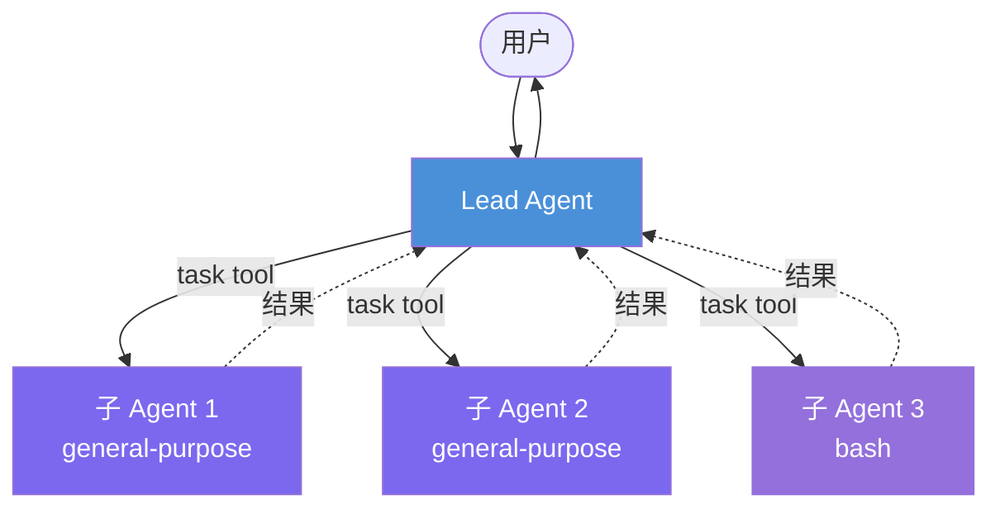
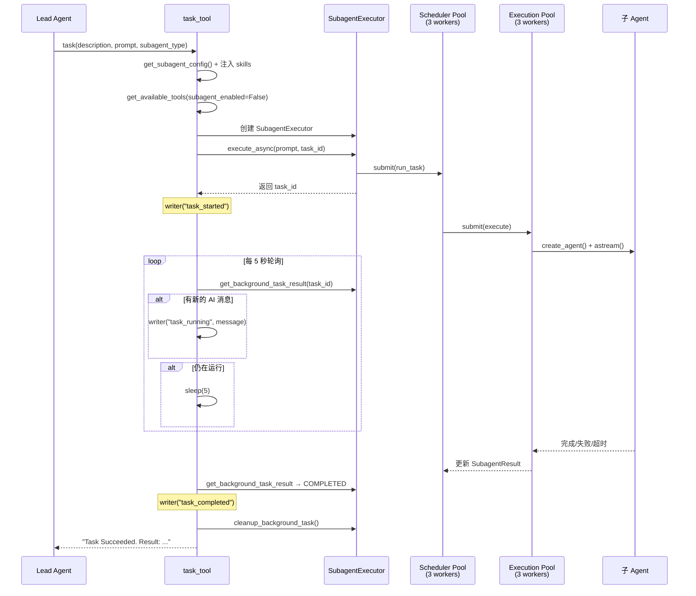

> **DeerFlow 源码解析系列目录**
>
> - [导读：AI Agent 框架的选择与 DeerFlow 的定位](/posts/deerflow-00-introduction)
> - [第一篇：一个 Chat 请求的完整生命周期](/posts/deerflow-01-chat-request-lifecycle)
> - [第二篇：系统提示词工程与上下文架构](/posts/deerflow-02-prompt-engineering-context)
> - **第三篇（本文）**：主从 Agent 协作与安全边界
> - [第四篇：Skills、MCP 与工具生态](/posts/deerflow-04-skills-mcp-tools)
> - [第五篇：沙箱隔离与代码执行](/posts/deerflow-05-sandbox-isolation)
> - [第六篇：长期记忆、IM 通道与多端接入](/posts/deerflow-06-memory-im-channels)
> - [第七篇：Harness Engineering 工程实践](/posts/deerflow-07-harness-engineering)

---

上一篇分析了系统提示词的动态组装和上下文压缩策略。这篇聚焦 DeerFlow 的多 Agent 架构：主 Agent 如何把任务委派给子 Agent，两者之间有哪些隔离机制，以及 7 层纵深防御如何阻止失控的循环调用。

## 两层扁平架构，不是递归树

DeerFlow 的 Agent 拓扑是严格的两层结构：一个主 Agent（Lead Agent）协调零到多个子 Agent（Subagent）。子 Agent 不能再创建子 Agent。



为什么不用递归多层？因为递归 Agent 调用有三个实际问题：

1. **上下文爆炸**：每一层嵌套都要完整传递对话历史，token 消耗指数级增长。
2. **调试困难**：三层以上的嵌套，trace 日志几乎不可读。
3. **超时不可控**：每层加一个超时，总耗时的上限变成乘法关系。

DeerFlow 用一行代码就封死了递归的可能性：

```python
# backend/packages/harness/deerflow/tools/builtins/task_tool.py:102
tools = get_available_tools(model_name=parent_model, subagent_enabled=False)
```

`subagent_enabled=False` 意味着子 Agent 拿到的工具列表里不包含 `task` 工具本身。同时在子 Agent 配置层面也有显式声明：

```python
# backend/packages/harness/deerflow/subagents/builtins/general_purpose.py:44
disallowed_tools=["task", "ask_clarification", "present_files"],
```

双重保险：代码层面移除 + 配置层面拒绝。即使有人修改了 `get_available_tools` 的逻辑，`disallowed_tools` 还是会在 `_filter_tools()` 中过滤掉 `task`。

## 主/子 Agent 的五重隔离

主 Agent 和子 Agent 表面上共用同一个 `create_agent()` 接口，但实际运行时的差异覆盖了 5 个维度。

### 1. 对话历史隔离

子 Agent 每次启动都是一个全新的对话，只有一条 `HumanMessage`：

```python
# backend/packages/harness/deerflow/subagents/executor.py:191-193
state: dict[str, Any] = {
    "messages": [HumanMessage(content=task)],
}
```

主 Agent 积累的几十轮对话、工具调用结果、系统消息——子 Agent 一概看不到。这不是偷懒，而是刻意设计：子 Agent 的上下文窗口只需要容纳当前任务的信息，不会被无关历史污染。

但有两个状态会被继承——`sandbox` 和 `thread_data`：

```python
# backend/packages/harness/deerflow/subagents/executor.py:196-199
if self.sandbox_state is not None:
    state["sandbox"] = self.sandbox_state
if self.thread_data is not None:
    state["thread_data"] = self.thread_data
```

`sandbox` 携带的是沙箱容器信息（容器 ID、工作目录映射等），保证子 Agent 能操作同一个沙箱文件系统。`thread_data` 携带的是线程级元数据。两者都是基础设施状态，不是对话语义状态。

### 2. 系统提示词隔离

主 Agent 的系统提示词由 `apply_prompt_template()` 动态组装，通常超过 300 行，包含 12 个条件 section（角色设定、工具使用规范、安全指令、Skills 描述、子 Agent 调度策略等等）。

子 Agent 的提示词只有 26 行（general-purpose）或类似量级：

```python
# backend/packages/harness/deerflow/subagents/builtins/general_purpose.py:16-42
system_prompt="""You are a general-purpose subagent working on a delegated task.
Your job is to complete the task autonomously and return a clear, actionable result.

<guidelines>
- Focus on completing the delegated task efficiently
- Use available tools as needed to accomplish the goal
- Think step by step but act decisively
- If you encounter issues, explain them clearly in your response
- Return a concise summary of what you accomplished
- Do NOT ask for clarification - work with the information provided
</guidelines>
...
"""
```

注意最后一条："Do NOT ask for clarification"。子 Agent 不能也不应该向用户提问，它只对主 Agent 负责。`ask_clarification` 工具被显式禁止，从提示词和工具两个层面都封死了这条路。

不过子 Agent 的提示词不是完全固定的。`task_tool` 会在创建子 Agent 前检查是否有 Skills 提示词需要追加：

```python
# backend/packages/harness/deerflow/tools/builtins/task_tool.py:68-70
skills_section = get_skills_prompt_section()
if skills_section:
    overrides["system_prompt"] = config.system_prompt + "\n\n" + skills_section
```

这样子 Agent 也能感知到当前可用的 Skills，调用 Skill 相关的工具。

### 3. 工具集隔离

主 Agent 拥有全量工具（包括 `task`、`ask_clarification`、`present_files` 等交互工具）。子 Agent 的工具集经过两轮过滤：

第一轮在 `task_tool` 中，`subagent_enabled=False` 会从全局工具列表中移除 `task` 工具：

```python
# backend/packages/harness/deerflow/tools/builtins/task_tool.py:102
tools = get_available_tools(model_name=parent_model, subagent_enabled=False)
```

第二轮在 `SubagentExecutor.__init__()` 中，根据 `SubagentConfig` 的 `tools`（白名单）和 `disallowed_tools`（黑名单）进一步裁剪：

```python
# backend/packages/harness/deerflow/subagents/executor.py:156-160
self.tools = _filter_tools(
    tools,
    config.tools,        # 白名单，None 表示全部继承
    config.disallowed_tools,  # 黑名单
)
```

两种内置子 Agent 的工具配置截然不同：

| 子 Agent | tools（白名单） | disallowed_tools（黑名单） |
|----------|----------------|--------------------------|
| general-purpose | `None`（继承全部） | `task`, `ask_clarification`, `present_files` |
| bash | `bash`, `ls`, `read_file`, `write_file`, `str_replace` | `task`, `ask_clarification`, `present_files` |

`bash` 子 Agent 被限制在只有 5 个文件系统和命令行工具，连 `web_search` 都不让用。这是最小权限原则的体现。

### 4. 中间件隔离

主 Agent 和子 Agent 的中间件栈差异巨大。先看两者的构建函数：

```python
# backend/packages/harness/deerflow/agents/middlewares/tool_error_handling_middleware.py:122-137
def build_lead_runtime_middlewares(*, lazy_init=True):
    return _build_runtime_middlewares(
        include_uploads=True,                    # 有文件上传处理
        include_dangling_tool_call_patch=True,   # 修复中断的工具调用
        lazy_init=lazy_init,
    )

def build_subagent_runtime_middlewares(*, lazy_init=True):
    return _build_runtime_middlewares(
        include_uploads=False,                   # 无文件上传
        include_dangling_tool_call_patch=False,  # 不需要修复（全新对话）
        lazy_init=lazy_init,
    )
```

主 Agent 在基础中间件之上还会追加十余个：Summarization、Todo、TokenUsage、Title、Memory、ViewImage、DeferredToolFilter、SubagentLimit、LoopDetection、Clarification。子 Agent 只有基础的 4 个：ThreadData、Sandbox、Guardrail（如配置）、ToolErrorHandling。

为什么子 Agent 不需要 `DanglingToolCallMiddleware`？因为子 Agent 每次都从空白对话开始，不存在上一轮被中断的工具调用。为什么不需要 `SummarizationMiddleware`？因为子 Agent 的对话不会累积到需要压缩的程度——有 `max_turns` 和超时兜底。

### 5. Thinking 模式强制关闭

主 Agent 的 thinking 模式由用户配置决定（可以开启 Claude 的 extended thinking）。子 Agent 硬编码关闭：

```python
# backend/packages/harness/deerflow/subagents/executor.py:167
model = create_chat_model(name=model_name, thinking_enabled=False)
```

原因是成本。子 Agent 可能被并行创建多个，每个都开 extended thinking 会让 token 消耗翻倍。而且子 Agent 执行的是分解后的子任务，不需要主 Agent 那种全局推理能力。

## task_tool 的完整执行流程

当主 Agent 决定委派任务时，它会在一次回复中生成一个或多个 `task` 工具调用。下面是 `task_tool` 从收到调用到返回结果的完整流程：



### 双线程池模型

子 Agent 的异步执行使用两个独立的线程池：

```python
# backend/packages/harness/deerflow/subagents/executor.py:71-75
_scheduler_pool = ThreadPoolExecutor(max_workers=3, thread_name_prefix="subagent-scheduler-")
_execution_pool = ThreadPoolExecutor(max_workers=3, thread_name_prefix="subagent-exec-")
```

为什么要分两个池？看 `execute_async` 的实现：

```python
# backend/packages/harness/deerflow/subagents/executor.py:418-444
def run_task():
    # ... 更新状态为 RUNNING
    try:
        execution_future: Future = _execution_pool.submit(self.execute, task, result_holder)
        try:
            exec_result = execution_future.result(timeout=self.config.timeout_seconds)
            # ... 更新结果
        except FuturesTimeoutError:
            # ... 标记超时
            execution_future.cancel()
    except Exception as e:
        # ... 标记失败

_scheduler_pool.submit(run_task)
```

`_scheduler_pool` 负责调度——它提交任务到 `_execution_pool` 并用 `future.result(timeout=...)` 等待。如果只有一个池，调度线程占用的 worker 会导致实际执行的并发度下降。分成两个池后，调度和执行互不阻塞。

超时机制也很巧妙：`_scheduler_pool` 中的 `run_task` 通过 `execution_future.result(timeout=config.timeout_seconds)` 实现超时检测。默认超时 900 秒（15 分钟），可通过 `config.yaml` 按子 Agent 类型覆盖。超时后调用 `execution_future.cancel()`，但这只是 best-effort——Python 的 `ThreadPoolExecutor` 无法强制终止正在运行的线程。

### 5 秒轮询与流式进度

`task_tool` 不是 fire-and-forget，它会在主 Agent 的工具调用上下文中阻塞等待子 Agent 完成。轮询间隔 5 秒：

```python
# backend/packages/harness/deerflow/tools/builtins/task_tool.py:132-182
while True:
    result = get_background_task_result(task_id)
    # ... 检查新的 AI 消息 → writer("task_running")
    if result.status == SubagentStatus.COMPLETED:
        writer({"type": "task_completed", ...})
        cleanup_background_task(task_id)
        return f"Task Succeeded. Result: {result.result}"
    elif result.status in (SubagentStatus.FAILED, SubagentStatus.TIMED_OUT):
        # ... 返回错误
    time.sleep(5)
    poll_count += 1
    if poll_count > max_poll_count:
        return f"Task polling timed out..."
```

每次轮询除了检查完成状态，还会检测子 Agent 是否产生了新的 AI 消息。如果有，通过 `writer()` 发送 `task_running` 事件给前端，实现实时进度展示。这就是为什么用户在前端能看到子 Agent 的中间思考过程。

轮询本身也有超时保护：`max_poll_count = (config.timeout_seconds + 60) // 5`，即执行超时 + 60 秒缓冲。这是双重超时的外层——防止线程池的超时机制失效时，轮询无限循环。

## 七层纵深防御

Agent 系统最危险的失败模式是死循环：Agent 反复调用同一个工具，消耗 token 和计算资源，直到超时或者账单爆炸。DeerFlow 对此建立了七层防线，从检测到阻断覆盖了不同粒度。

### 第一层：LoopDetectionMiddleware（哈希滑窗）

这是最精细的检测层。工作原理：

```python
# backend/packages/harness/deerflow/agents/middlewares/loop_detection_middleware.py:36-61
def _hash_tool_calls(tool_calls: list[dict]) -> str:
    normalized = []
    for tc in tool_calls:
        normalized.append({
            "name": tc.get("name", ""),
            "args": tc.get("args", {}),
        })
    normalized.sort(key=lambda tc: (
        tc["name"],
        json.dumps(tc["args"], sort_keys=True, default=str),
    ))
    blob = json.dumps(normalized, sort_keys=True, default=str)
    return hashlib.md5(blob.encode()).hexdigest()[:12]
```

每次 Agent 返回包含 `tool_calls` 的响应，中间件都会对工具调用做确定性哈希（名称 + 参数，排序后 MD5），然后在一个长度 20 的滑窗中计数。

两级响应策略：

- **第 3 次重复**（`warn_threshold=3`）：注入一条警告消息："你在重复相同的操作，请停下来给出最终答案。"
- **第 5 次重复**（`hard_limit=5`）：直接从 AI 消息中删除所有 `tool_calls`，强制 Agent 只能输出文本。

```python
# loop_detection_middleware.py:185-208
def _apply(self, state, runtime):
    warning, hard_stop = self._track_and_check(state, runtime)
    if hard_stop:
        # 删除 tool_calls，强制文本输出
        stripped_msg = last_msg.model_copy(
            update={"tool_calls": [], "content": (last_msg.content or "") + f"\n\n{_HARD_STOP_MSG}"}
        )
        return {"messages": [stripped_msg]}
    if warning:
        return {"messages": [HumanMessage(content=warning)]}
```

注意警告用的是 `HumanMessage` 而不是 `SystemMessage`——因为 Anthropic 的 API 要求 `SystemMessage` 只能出现在对话开头，中间插入会报错。

跟踪状态是按 `thread_id` 隔离的，使用 `OrderedDict` 实现 LRU 淘汰，最多追踪 100 个线程。

### 第二层：recursion_limit

LangGraph 层面的硬限制，限制 Agent 的总 turn 数：

```python
# backend/packages/harness/deerflow/subagents/executor.py:232
run_config: RunnableConfig = {
    "recursion_limit": self.config.max_turns,
}
```

主 Agent 的 `recursion_limit` 取决于 LangGraph Server 配置。子 Agent 默认 50 turns（general-purpose）或 30 turns（bash）。到达限制后 LangGraph 直接抛异常终止执行。

这是一个粗粒度的"拉闸"机制。LoopDetection 检测的是**相同调用的重复**，recursion_limit 检测的是**总步数**。两者互补。

### 第三层：SubagentLimitMiddleware（并发截断）

防止主 Agent 在单次回复中创建过多子 Agent：

```python
# backend/packages/harness/deerflow/agents/middlewares/subagent_limit_middleware.py:54-66
task_indices = [i for i, tc in enumerate(tool_calls) if tc.get("name") == "task"]
if len(task_indices) <= self.max_concurrent:
    return None
# 保留前 N 个，丢弃其余
indices_to_drop = set(task_indices[self.max_concurrent:])
truncated_tool_calls = [tc for i, tc in enumerate(tool_calls) if i not in indices_to_drop]
```

默认上限 3，可配置范围 [2, 4]。超出的 `task` 调用被静默丢弃。系统提示词中也明确告知 Agent 这个限制存在，所以 Agent 知道要分批执行：

```
⛔ HARD CONCURRENCY LIMIT: MAXIMUM 3 `task` CALLS PER RESPONSE. THIS IS NOT OPTIONAL.
```

提示词层面的"请遵守"和中间件层面的"强制执行"形成双保险。

### 第四层：双重超时

**内层**（线程池超时）：`_scheduler_pool` 中的 `run_task` 函数等待 `execution_future.result(timeout=config.timeout_seconds)`，默认 900 秒。

**外层**（轮询超时）：`task_tool` 的轮询循环有 `max_poll_count = (timeout_seconds + 60) // 5` 的上限。即使线程池超时机制失效（比如 Python GIL 导致 cancel 不生效），轮询最终也会放弃。

两层超时的缓冲区是 60 秒。外层比内层多等一分钟，给内层的超时处理留时间。

### 第五层：ToolErrorHandlingMiddleware

当工具执行抛异常时，这个中间件不会让异常冒泡到 Agent 循环外部，而是把它转成一条 `ToolMessage`：

```python
# backend/packages/harness/deerflow/agents/middlewares/tool_error_handling_middleware.py:43-50
def wrap_tool_call(self, request, handler):
    try:
        return handler(request)
    except GraphBubbleUp:
        raise  # 保留 LangGraph 控制流信号
    except Exception as exc:
        return self._build_error_message(request, exc)
```

错误消息格式固定："Error: Tool 'X' failed with Y: Z. Continue with available context, or choose an alternative tool."

这看起来是容错机制，但它也有防循环的作用：如果某个工具持续报错，Agent 会在上下文中看到连续的错误消息，配合 LoopDetection 的哈希检测（同样的工具 + 同样的参数 = 同样的哈希），循环会被更快触发。

注意 `GraphBubbleUp` 是特殊处理的——这是 LangGraph 的内部控制流信号（interrupt/pause/resume），必须原样抛出。

### 第六层：嵌套禁止（递归切断）

前面已经详细分析过。`subagent_enabled=False` + `disallowed_tools=["task"]` 从代码和配置两个层面阻止子 Agent 创建子子 Agent。这消除了一整类递归失控的可能性。

### 第七层：DanglingToolCallMiddleware

严格来说这不是"防循环"，而是防止因中断导致的格式错误触发无限重试：

```python
# backend/packages/harness/deerflow/agents/middlewares/dangling_tool_call_middleware.py:69-85
for msg in messages:
    patched.append(msg)
    if getattr(msg, "type", None) != "ai":
        continue
    for tc in getattr(msg, "tool_calls", None) or []:
        tc_id = tc.get("id")
        if tc_id and tc_id not in existing_tool_msg_ids and tc_id not in patched_ids:
            patched.append(ToolMessage(
                content="[Tool call was interrupted and did not return a result.]",
                tool_call_id=tc_id,
                name=tc.get("name", "unknown"),
                status="error",
            ))
```

如果用户中断了一次对话，AI 消息中可能包含 `tool_calls` 但没有对应的 `ToolMessage`。下一次 LLM 调用时，这种"悬空"的工具调用会导致 API 报错，Agent 可能陷入反复重试。这个中间件在调用 LLM 之前扫描历史，给每个缺失响应的工具调用补上一条合成的错误 `ToolMessage`。

它使用 `wrap_model_call` 钩子而不是 `before_model`，因为需要在消息列表的正确位置（紧跟在对应 AIMessage 之后）插入补丁，而 `before_model` 只能把消息追加到末尾。

## 任务描述的生成：LLM 自主撰写

一个容易忽略的设计点：子 Agent 接收到的 `prompt` 不是用户的原始输入，而是主 Agent 的 LLM 自主生成的任务描述。看 `task_tool` 的参数签名：

```python
# backend/packages/harness/deerflow/tools/builtins/task_tool.py:22-28
@tool("task", parse_docstring=True)
def task_tool(
    runtime: ToolRuntime[ContextT, ThreadState],
    description: str,   # 短标签，3-5 词
    prompt: str,         # 详细任务描述，LLM 撰写
    subagent_type: Literal["general-purpose", "bash"],
    tool_call_id: Annotated[str, InjectedToolCallId],
    max_turns: int | None = None,
) -> str:
```

`description` 是给日志和前端展示的短标签，`prompt` 是子 Agent 实际执行的任务描述。两者都由 LLM 在生成工具调用时填写。系统提示词中给出了丰富的示例引导 LLM 如何撰写高质量的任务描述：

```
# 提示词中的示例（简化）
task(description="Tencent financial data",
     prompt="Research Tencent's recent financial reports, quarterly earnings...",
     subagent_type="general-purpose")
```

这意味着任务分解的质量完全依赖 LLM 的推理能力。DeerFlow 通过 336 行的系统提示词（包含 `<subagent_system>` section 的 147 行）来引导分解策略，但最终的决策是 LLM 自己做的。

## 模型继承

子 Agent 的模型选择遵循"继承"策略：

```python
# backend/packages/harness/deerflow/subagents/executor.py:108-120
def _get_model_name(config: SubagentConfig, parent_model: str | None) -> str | None:
    if config.model == "inherit":
        return parent_model
    return config.model
```

```python
# backend/packages/harness/deerflow/subagents/config.py:25
model: str = "inherit"
```

默认所有子 Agent 都继承主 Agent 的模型。这意味着如果主 Agent 用的是 Claude Opus，子 Agent 也用 Claude Opus。代价是高但质量有保证。如果想降低成本，可以在自定义子 Agent 配置中指定更便宜的模型。

模型名称通过 `runtime.config["metadata"]["model_name"]` 从主 Agent 的运行时上下文中提取：

```python
# backend/packages/harness/deerflow/tools/builtins/task_tool.py:92-93
metadata = runtime.config.get("metadata", {})
parent_model = metadata.get("model_name")
```

## 全局状态管理

子 Agent 的执行结果存储在模块级全局字典中：

```python
# backend/packages/harness/deerflow/subagents/executor.py:67-68
_background_tasks: dict[str, SubagentResult] = {}
_background_tasks_lock = threading.Lock()
```

所有写入操作都在 `_background_tasks_lock` 保护下执行。`SubagentResult` 是一个 dataclass，包含状态（PENDING → RUNNING → COMPLETED/FAILED/TIMED_OUT）、结果文本、错误信息、时间戳和中间 AI 消息列表。

完成后的清理由 `task_tool` 负责：

```python
# backend/packages/harness/deerflow/subagents/executor.py:482-509
def cleanup_background_task(task_id: str) -> None:
    with _background_tasks_lock:
        result = _background_tasks.get(task_id)
        if result is None:
            return
        is_terminal_status = result.status in {
            SubagentStatus.COMPLETED,
            SubagentStatus.FAILED,
            SubagentStatus.TIMED_OUT,
        }
        if is_terminal_status or result.completed_at is not None:
            del _background_tasks[task_id]
```

只清理终态任务，避免与仍在运行的后台线程产生竞态条件。这个细节说明作者考虑过一个边界场景：轮询超时后 `task_tool` 返回了错误，但后台线程可能仍在执行，此时不应该删除结果条目。

## 分布式追踪

整个调用链通过 `trace_id` 串联：

```python
# backend/packages/harness/deerflow/tools/builtins/task_tool.py:95
trace_id = metadata.get("trace_id") or str(uuid.uuid4())[:8]
```

`trace_id` 从主 Agent 的 metadata 中获取，如果没有就生成一个新的。所有日志都以 `[trace=xxxx]` 为前缀：

```
[trace=a1b2c3d4] Started background task call_xxx (subagent=general-purpose, timeout=900s)
[trace=a1b2c3d4] Subagent general-purpose starting async execution
[trace=a1b2c3d4] Subagent general-purpose captured AI message #1
[trace=a1b2c3d4] Task call_xxx completed after 12 polls
```

主 Agent 和子 Agent 的日志用同一个 `trace_id`，在生产环境中可以直接用这个 ID 搜索整条调用链。

## 设计取舍

DeerFlow 的多 Agent 架构做了几个务实的取舍：

**选择扁平而非递归**。放弃了理论上更强大的递归 Agent（如 AutoGPT 的无限层嵌套），换来可预测的性能和可调试的执行路径。

**选择阻塞轮询而非事件驱动**。`task_tool` 在主 Agent 的工具调用上下文中阻塞 sleep(5)，而不是用 asyncio 事件或 callback。代价是 5 秒的响应延迟粒度。好处是实现简单，不需要改变 LangGraph 的同步工具调用语义。

**选择全局字典而非消息队列**。子 Agent 结果存在进程内存里，不走 Redis 或数据库。这限制了水平扩展能力（多进程/多机器部署时子 Agent 结果不能跨进程共享），但避免了额外基础设施依赖。

**选择模型继承而非降级**。默认让子 Agent 用和主 Agent 同样的模型，不做自动降级。这保证了子任务的执行质量，但成本更高。如果有 3 个并行子 Agent，token 消耗大约是不用子 Agent 时的 4 倍。

这些取舍是否合理？取决于使用场景。对于 DeerFlow 的目标定位——AI 工程师的开发工具——可预测性和可调试性比极致的并发效率更重要。

---

下一篇将深入 Skills 系统和 MCP 集成：DeerFlow 如何发现、加载和执行外部能力扩展，以及它对 MCP（Model Context Protocol）三种传输协议的支持细节。
