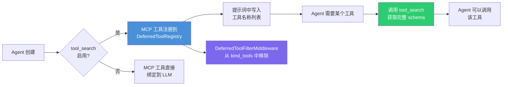
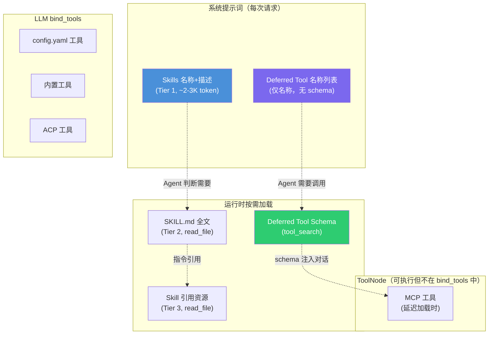

> **DeerFlow 源码解析系列目录**
>
> - [导读：AI Agent 框架的选择与 DeerFlow 的定位](/posts/deerflow-00-introduction)
> - [第一篇：一个 Chat 请求的完整生命周期](/posts/deerflow-01-chat-request-lifecycle)
> - [第二篇：系统提示词工程与上下文架构](/posts/deerflow-02-prompt-engineering-context)
> - [第三篇：主从 Agent 协作与安全边界](/posts/deerflow-03-multi-agent-collaboration)
> - **第四篇（本文）**：Skills、MCP 与工具生态
> - [第五篇：沙箱隔离与代码执行](/posts/deerflow-05-sandbox-isolation)
> - [第六篇：长期记忆、IM 通道与多端接入](/posts/deerflow-06-memory-im-channels)
> - [第七篇：Harness Engineering 工程实践](/posts/deerflow-07-harness-engineering)

---

上一篇分析了主/子 Agent 的协作模型和安全边界。这篇转向 Agent 的"手脚"：DeerFlow 如何发现、加载和管理外部工具，包括 Skills 系统的三层渐进加载、MCP 协议的多传输支持，以及工具延迟发现机制。

## 工具的四个来源

当主 Agent 被创建时，`get_available_tools()` 会汇集来自四个不同来源的工具：

```python
# backend/packages/harness/deerflow/tools/tools.py:113-114
logger.info(f"Total tools loaded: {len(loaded_tools)}, built-in tools: {len(builtin_tools)}, "
            f"MCP tools: {len(mcp_tools)}, ACP tools: {len(acp_tools)}")
return loaded_tools + builtin_tools + mcp_tools + acp_tools
```

| 来源 | 说明 | 典型工具 |
|------|------|---------|
| `loaded_tools` | `config.yaml` 中声明的工具（通过反射加载） | `web_search`, `bash`, `read_file`, `write_file` |
| `builtin_tools` | 代码中硬编码的内置工具 | `present_file`, `ask_clarification`, `task`, `view_image`, `tool_search` |
| `mcp_tools` | MCP 服务器暴露的工具 | 取决于配置的 MCP 服务器 |
| `acp_tools` | ACP Agent 调用工具 | `invoke_acp_agent` |

其中 `builtin_tools` 的组成是动态的，根据运行时配置决定哪些工具被包含：

```python
# backend/packages/harness/deerflow/tools/tools.py:47-62
builtin_tools = BUILTIN_TOOLS.copy()  # [present_file, ask_clarification]

if subagent_enabled:
    builtin_tools.extend(SUBAGENT_TOOLS)  # + [task]

model_config = config.get_model_config(model_name)
if model_config is not None and model_config.supports_vision:
    builtin_tools.append(view_image_tool)  # + [view_image]

if config.tool_search.enabled:
    # ... 注册延迟工具
    builtin_tools.append(tool_search_tool)  # + [tool_search]
```

这种按需组装的设计避免了给 Agent 提供它不需要的工具。不支持视觉的模型看不到 `view_image`，未开启子 Agent 模式时没有 `task` 工具。

## Skills 系统：三层渐进加载

Skills 是 DeerFlow 对"可复用 Agent 工作流"的抽象。它不是工具——Skill 不作为 LangChain Tool 注册——而是一段结构化的指令文本，告诉 Agent 在特定场景下应该怎么做。

### 目录结构

Skills 存放在项目根目录的 `skills/` 下，分 `public`（随项目发布）和 `custom`（用户自定义）两个目录：

```
skills/
├── public/
│   ├── deep-research/
│   │   └── SKILL.md
│   ├── data-analysis/
│   │   ├── SKILL.md
│   │   └── templates/
│   ├── image-generation/
│   │   └── SKILL.md
│   └── ... (共 17 个内置 Skill)
└── custom/
    └── (用户自定义 Skill)
```

每个 Skill 就是一个包含 `SKILL.md` 的目录。`SKILL.md` 有 YAML frontmatter 和 Markdown 正文：

```markdown
---
name: deep-research
description: Use this skill instead of WebSearch for ANY question requiring 
  web research. Trigger on queries like "what is X", "explain X"...
---

# Deep Research Skill

## When to Use This Skill
...

## Research Methodology
### Phase 1: Broad Exploration
...
```

### Tier 1：名称和描述进入系统提示词

`get_skills_prompt_section()` 在组装系统提示词时被调用。它加载所有启用的 Skill，但只把名称、描述和文件路径写入提示词：

```python
# backend/packages/harness/deerflow/agents/lead_agent/prompt.py:393-396
skill_items = "\n".join(
    f"    <skill>\n        <name>{skill.name}</name>\n"
    f"        <description>{skill.description}</description>\n"
    f"        <location>{skill.get_container_file_path(container_base_path)}</location>\n"
    f"    </skill>" for skill in skills
)
```

注入到系统提示词中的格式是 XML 标签：

```xml
<skill_system>
You have access to skills that provide optimized workflows...

<available_skills>
    <skill>
        <name>deep-research</name>
        <description>Use this skill instead of WebSearch for ANY question...</description>
        <location>/mnt/skills/public/deep-research/SKILL.md</location>
    </skill>
    <skill>
        <name>data-analysis</name>
        <description>...</description>
        <location>/mnt/skills/public/data-analysis/SKILL.md</location>
    </skill>
    ...
</available_skills>
</skill_system>
```

这是 Tier 1——Agent 能看到每个 Skill 的存在和用途描述，但看不到具体的执行指令。17 个 Skill 的名称和描述大约占用 2000-3000 token，远小于把所有 SKILL.md 全文塞进提示词的开销。

### Tier 2：按需读取 SKILL.md

提示词中明确指示了"渐进加载模式"：

```
Progressive Loading Pattern:
1. When a user query matches a skill's use case, immediately call `read_file` 
   on the skill's main file using the path attribute
2. Read and understand the skill's workflow and instructions
3. The skill file contains references to external resources under the same folder
4. Load referenced resources only when needed during execution
5. Follow the skill's instructions precisely
```

当 Agent 判断某个 Skill 适用于当前任务时，它会调用 `read_file` 工具读取对应的 `SKILL.md` 文件。比如用户问"帮我分析这个数据集"，Agent 会读取 `/mnt/skills/public/data-analysis/SKILL.md`，获取完整的数据分析流程指令。

这是 Tier 2——按需加载，只在确认需要时才消耗上下文窗口。

### Tier 3：执行时加载引用资源

SKILL.md 内部可以引用同目录下的其他文件（模板、参考数据等）。Agent 在执行过程中，根据 Skill 指令的要求，再按需读取这些资源。

比如 `data-analysis` Skill 的目录下可能有 `templates/` 子目录，存放报告模板。Agent 在生成分析报告时才去读取模板文件。

三层架构的本质是一个 token 经济学问题：

| 层级 | 加载时机 | token 开销 | 每次请求都付出？ |
|------|---------|-----------|----------------|
| Tier 1 | Agent 创建时 | ~2-3K | 是 |
| Tier 2 | Agent 判断需要时 | 变长，取决于 SKILL.md | 否 |
| Tier 3 | Skill 执行过程中 | 变长，取决于引用资源 | 否 |

### Skill 的加载实现

`load_skills()` 的实现遍历 `public/` 和 `custom/` 两个目录，找到所有包含 `SKILL.md` 的子目录：

```python
# backend/packages/harness/deerflow/skills/loader.py:58-74
for category in ["public", "custom"]:
    category_path = skills_path / category
    for current_root, dir_names, file_names in os.walk(category_path, followlinks=True):
        dir_names[:] = sorted(name for name in dir_names if not name.startswith("."))
        if "SKILL.md" not in file_names:
            continue
        skill_file = Path(current_root) / "SKILL.md"
        relative_path = skill_file.parent.relative_to(category_path)
        skill = parse_skill_file(skill_file, category=category, relative_path=relative_path)
        if skill:
            skills.append(skill)
```

几个实现细节展开看：

1. **`followlinks=True`**：支持符号链接，允许用户把 Skill 目录链接到其他位置。
2. **`sorted(name for name in dir_names if not name.startswith("."))`**：排序保证遍历顺序确定性，跳过隐藏目录（`.git` 等）。
3. **`os.walk` 而非 `Path.glob`**：因为需要修改 `dir_names` 来控制遍历行为，`os.walk` 更适合。

解析器 `parse_skill_file()` 只做最简单的 YAML frontmatter 提取（不依赖完整的 YAML 解析库）：

```python
# backend/packages/harness/deerflow/skills/parser.py:26-41
front_matter_match = re.match(r"^---\s*\n(.*?)\n---\s*\n", content, re.DOTALL)
# 简单的 key: value 逐行解析
for line in front_matter.split("\n"):
    if ":" in line:
        key, value = line.split(":", 1)
        metadata[key.strip()] = value.strip()
```

这是有意为之——Skill 的 frontmatter 只需要 `name` 和 `description` 两个字段，不需要复杂的 YAML 特性。

### 启用/禁用状态

Skill 的启用状态不是由 SKILL.md 自身决定的，而是通过单独的配置文件 `ExtensionsConfig` 管理：

```python
# backend/packages/harness/deerflow/skills/loader.py:81-89
extensions_config = ExtensionsConfig.from_file()
for skill in skills:
    skill.enabled = extensions_config.is_skill_enabled(skill.name, skill.category)
```

这里用 `ExtensionsConfig.from_file()` 而不是缓存的 `get_extensions_config()`——注释解释了原因：Gateway API 运行在独立进程中，用户通过 Gateway 修改配置后，LangGraph Server 需要读取磁盘上的最新文件才能感知变化。

## MCP 集成：三种传输协议

MCP（Model Context Protocol）是 Anthropic 提出的标准化工具协议。DeerFlow 通过 `langchain-mcp-adapters` 库集成 MCP，支持三种传输协议。

### 协议适配

`build_server_params()` 根据 `type` 字段构建不同协议的连接参数：

```python
# backend/packages/harness/deerflow/mcp/client.py:21-41
transport_type = config.type or "stdio"
params: dict[str, Any] = {"transport": transport_type}

if transport_type == "stdio":
    params["command"] = config.command
    params["args"] = config.args
    if config.env:
        params["env"] = config.env
elif transport_type in ("sse", "http"):
    params["url"] = config.url
    if config.headers:
        params["headers"] = config.headers
```

| 协议 | 通信方式 | 适用场景 |
|------|---------|---------|
| `stdio` | 子进程的 stdin/stdout | 本地工具，如 Node.js/Python 实现的 MCP server |
| `sse` | Server-Sent Events over HTTP | 远程服务，需要服务端推送 |
| `http` | HTTP POST（Streamable HTTP） | 远程服务，MCP 2025 标准传输 |

### 缓存与热更新

MCP 工具的初始化是昂贵的（需要启动子进程或建立连接），所以 DeerFlow 实现了带过期检测的缓存：

```python
# backend/packages/harness/deerflow/mcp/cache.py:11-14
_mcp_tools_cache: list[BaseTool] | None = None
_cache_initialized = False
_initialization_lock = asyncio.Lock()
_config_mtime: float | None = None  # Track config file modification time
```

缓存的过期检测基于配置文件的修改时间（`mtime`）：

```python
# backend/packages/harness/deerflow/mcp/cache.py:31-53
def _is_cache_stale() -> bool:
    current_mtime = _get_config_mtime()
    if _config_mtime is None or current_mtime is None:
        return False
    if current_mtime > _config_mtime:
        logger.info(f"MCP config file has been modified "
                    f"(mtime: {_config_mtime} -> {current_mtime}), cache is stale")
        return True
    return False
```

每次 `get_cached_mcp_tools()` 被调用时（即每次创建 Agent 时），都会检查配置文件是否被修改过。如果 `mtime` 变了，说明用户通过 Gateway API 修改了 MCP 配置，缓存会被重置并重新初始化。

初始化过程本身是异步的，但可能在同步上下文中被调用（比如 LangGraph 的同步工具调用）。缓存层处理了这个兼容性问题：

```python
# backend/packages/harness/deerflow/mcp/cache.py:103-121
if not _cache_initialized:
    try:
        loop = asyncio.get_event_loop()
        if loop.is_running():
            # 已有事件循环运行中，用线程池避免嵌套循环
            with concurrent.futures.ThreadPoolExecutor() as executor:
                future = executor.submit(asyncio.run, initialize_mcp_tools())
                future.result()
        else:
            loop.run_until_complete(initialize_mcp_tools())
    except RuntimeError:
        asyncio.run(initialize_mcp_tools())
```

三种初始化路径覆盖了所有可能的调用环境：直接同步调用、已有事件循环的异步上下文、完全没有事件循环的环境。

### 同步/异步桥接

MCP 工具天然是异步的（因为涉及网络通信或子进程 I/O），但 DeerFlow 的 Agent 执行在同步上下文中。`_make_sync_tool_wrapper()` 负责桥接：

```python
# backend/packages/harness/deerflow/mcp/tools.py:36-52
def sync_wrapper(*args, **kwargs):
    try:
        loop = asyncio.get_running_loop()
    except RuntimeError:
        loop = None

    try:
        if loop is not None and loop.is_running():
            # 用全局线程池避免嵌套事件循环
            future = _SYNC_TOOL_EXECUTOR.submit(asyncio.run, coro(*args, **kwargs))
            return future.result()
        else:
            return asyncio.run(coro(*args, **kwargs))
    except Exception as e:
        logger.error(f"Error invoking MCP tool '{tool_name}' via sync wrapper: {e}")
        raise
```

关键在于检测当前是否已有事件循环在运行。如果有，不能直接 `asyncio.run()`（会报 "event loop already running"），需要在独立线程中创建新的事件循环。全局线程池 `_SYNC_TOOL_EXECUTOR` 有 10 个 worker，注册了 `atexit` 清理钩子。

工具加载完成后，每个只有 `coroutine` 没有 `func` 的工具都会被打上同步包装：

```python
# backend/packages/harness/deerflow/mcp/tools.py:105-107
for tool in tools:
    if getattr(tool, "func", None) is None and getattr(tool, "coroutine", None) is not None:
        tool.func = _make_sync_tool_wrapper(tool.coroutine, tool.name)
```

### OAuth 支持

MCP 远程服务器可能需要 OAuth 认证。DeerFlow 实现了完整的 token 管理：

```python
# backend/packages/harness/deerflow/mcp/oauth.py:25-26
class OAuthTokenManager:
    """Acquire/cache/refresh OAuth tokens for MCP servers."""
```

支持两种 OAuth grant type：

- **`client_credentials`**：机器对机器认证，需要 `client_id` 和 `client_secret`。
- **`refresh_token`**：用刷新令牌获取新的访问令牌。

Token 缓存和刷新机制：

```python
# backend/packages/harness/deerflow/mcp/oauth.py:47-65
async def get_authorization_header(self, server_name: str) -> str | None:
    token = self._tokens.get(server_name)
    if token and not self._is_expiring(token, oauth):
        return f"{token.token_type} {token.access_token}"

    lock = self._locks[server_name]
    async with lock:
        # 双重检查：加锁后再查一次
        token = self._tokens.get(server_name)
        if token and not self._is_expiring(token, oauth):
            return f"{token.token_type} {token.access_token}"
        fresh = await self._fetch_token(oauth)
        self._tokens[server_name] = fresh
```

经典的双重检查锁模式（double-checked locking）。每个 MCP server 有独立的 `asyncio.Lock`，避免并发请求同时刷新同一个 token。

过期判断有一个可配置的提前量（`refresh_skew_seconds`），在 token 实际过期前就提前刷新：

```python
# backend/packages/harness/deerflow/mcp/oauth.py:68-70
@staticmethod
def _is_expiring(token: _OAuthToken, oauth: McpOAuthConfig) -> bool:
    now = datetime.now(UTC)
    return token.expires_at <= now + timedelta(seconds=max(oauth.refresh_skew_seconds, 0))
```

OAuth 认证分两个阶段注入：

1. **连接阶段**：`get_initial_oauth_headers()` 在建立 MCP 连接前获取初始 token，注入到连接请求头中。
2. **调用阶段**：`build_oauth_tool_interceptor()` 创建一个拦截器，在每次工具调用时检查并刷新 token。

```python
# backend/packages/harness/deerflow/mcp/oauth.py:128-135
async def oauth_interceptor(request, handler):
    header = await token_manager.get_authorization_header(request.server_name)
    if not header:
        return await handler(request)
    updated_headers = dict(request.headers or {})
    updated_headers["Authorization"] = header
    return await handler(request.override(headers=updated_headers))
```

## 工具延迟发现：Deferred Tools

当 MCP 服务器暴露大量工具时（比如 50+ 个），把所有工具的完整 schema 都塞进 LLM 的工具列表会消耗大量 token。DeerFlow 的解决方案是"延迟发现"（Deferred Tools）。

### 架构



### 注册流程

当 `tool_search` 功能启用时，所有 MCP 工具不直接绑定到 LLM，而是进入延迟注册表：

```python
# backend/packages/harness/deerflow/tools/tools.py:85-94
if config.tool_search.enabled:
    registry = DeferredToolRegistry()
    for t in mcp_tools:
        registry.register(t)
    set_deferred_registry(registry)
    builtin_tools.append(tool_search_tool)
    logger.info(f"Tool search active: {len(mcp_tools)} tools deferred")
```

注册表使用 `ContextVar` 存储，保证并发请求之间互不干扰：

```python
# backend/packages/harness/deerflow/tools/builtins/tool_search.py:121-123
_registry_var: contextvars.ContextVar[DeferredToolRegistry | None] = contextvars.ContextVar(
    "deferred_tool_registry", default=None
)
```

### 系统提示词中的工具列表

延迟工具的名称（不含 schema）会被写入系统提示词的 `<available-deferred-tools>` 标签：

```python
# backend/packages/harness/deerflow/agents/lead_agent/prompt.py:440-445
registry = get_deferred_registry()
names = "\n".join(e.name for e in registry.entries)
return f"<available-deferred-tools>\n{names}\n</available-deferred-tools>"
```

Agent 看到的类似这样：

```xml
<available-deferred-tools>
slack_send_message
slack_list_channels
github_create_issue
github_search_code
...
</available-deferred-tools>
```

### 从 LLM 绑定中移除

`DeferredToolFilterMiddleware` 在每次调用 LLM 前，把延迟工具的 schema 从工具列表中移除：

```python
# backend/packages/harness/deerflow/agents/middlewares/deferred_tool_filter_middleware.py:31-44
def _filter_tools(self, request: ModelRequest) -> ModelRequest:
    registry = get_deferred_registry()
    if not registry:
        return request
    deferred_names = {e.name for e in registry.entries}
    active_tools = [t for t in request.tools if getattr(t, "name", None) not in deferred_names]
    return request.override(tools=active_tools)
```

但工具仍然注册在 ToolNode 中用于实际执行。也就是说：LLM 看不到延迟工具的参数定义（节省 token），但 ToolNode 可以执行它们（一旦 Agent 通过 `tool_search` 获取了 schema）。

### 搜索语法

`tool_search` 工具支持三种搜索语法：

```python
# backend/packages/harness/deerflow/tools/builtins/tool_search.py:65-94
if query.startswith("select:"):
    # 精确匹配：select:Read,Edit,Grep
    names = {n.strip() for n in query[7:].split(",")}
    return [e.tool for e in self._entries if e.name in names][:MAX_RESULTS]

if query.startswith("+"):
    # 强制前缀匹配：+slack send → 名称必须包含 "slack"
    parts = query[1:].split(None, 1)
    required = parts[0].lower()
    candidates = [e for e in self._entries if required in e.name.lower()]
    ...

# 通用正则搜索
regex = re.compile(query, re.IGNORECASE)
scored = []
for entry in self._entries:
    searchable = f"{entry.name} {entry.description}"
    if regex.search(searchable):
        score = 2 if regex.search(entry.name) else 1
        scored.append((score, entry))
```

搜索结果是完整的 OpenAI Function 格式 JSON schema：

```python
# tool_search.py:174
tool_defs = [convert_to_openai_function(t) for t in matched_tools[:MAX_RESULTS]]
return json.dumps(tool_defs, indent=2, ensure_ascii=False)
```

返回的 schema 被插入到对话历史中，后续 LLM 调用时就能看到这些工具的完整定义并调用它们。每次搜索最多返回 5 个工具。

## 工具注册的反射机制

`config.yaml` 中声明的工具通过反射（`resolve_variable`）加载：

```python
# backend/packages/harness/deerflow/tools/tools.py:44
loaded_tools = [resolve_variable(tool.use, BaseTool) for tool in config.tools
                if groups is None or tool.group in groups]
```

`config.yaml` 中的工具声明类似：

```yaml
tools:
  - use: "deerflow.tools.builtins.web_search:web_search"
    group: "default"
  - use: "deerflow.sandbox.tools:bash"
    group: "default"
```

`resolve_variable` 解析 `module:attribute` 格式的字符串，动态 import 模块并获取属性。这样新增工具只需要在配置文件中添加一行，不需要修改代码。

工具组（`group`）的概念允许不同的 Agent 配置使用不同的工具子集。`make_lead_agent()` 可以传入 `groups` 参数过滤：

```python
# backend/packages/harness/deerflow/agents/lead_agent/agent.py:339
tools=get_available_tools(
    model_name=model_name,
    groups=agent_config.tool_groups if agent_config else None,
    subagent_enabled=subagent_enabled
),
```

## Skills 与子 Agent 的交叉

前面第三篇提到 `task_tool` 在创建子 Agent 前会注入 Skills 提示词：

```python
# backend/packages/harness/deerflow/tools/builtins/task_tool.py:68-70
skills_section = get_skills_prompt_section()
if skills_section:
    overrides["system_prompt"] = config.system_prompt + "\n\n" + skills_section
```

这意味着子 Agent 也能感知 Skills 的存在，可以按需读取和执行 Skill 指令。但子 Agent 的工具集可能受限（比如 `bash` 子 Agent 只有 5 个工具），某些 Skill 的执行可能会在子 Agent 中失败。

这是一个有趣的设计张力：让子 Agent 知道 Skills 的存在提高了它的能力，但受限的工具集可能导致部分 Skill 无法完整执行。实际上这不太会成问题——`general-purpose` 子 Agent 继承了除 `task`/`ask_clarification`/`present_files` 之外的全部工具，足以执行大部分 Skill。

## 跨进程配置同步

Skills 和 MCP 的配置都需要处理一个架构层面的问题：Gateway 和 LangGraph Server 运行在不同进程中，通过文件系统共享配置。

代码中反复出现这样的注释：

```python
# NOTE: We use ExtensionsConfig.from_file() instead of get_extensions_config()
# to always read the latest configuration from disk. This ensures that changes
# made through the Gateway API (which runs in a separate process) are immediately
# reflected in the LangGraph Server when loading skills.
```

`get_extensions_config()` 是带进程内缓存的，读一次就不再访问磁盘。`ExtensionsConfig.from_file()` 每次都读文件。在需要实时感知配置变更的地方（Skill 加载、MCP 初始化），必须用后者。

MCP 缓存层在此基础上加了一层优化：不是每次都重新初始化（那太昂贵了），而是比较 `mtime`——如果文件没变就用缓存，变了才重新初始化。

## 整体工具生态架构

把上述各部分串起来，DeerFlow 的工具生态可以这样理解：



核心设计原则是渐进式 token 消耗：先让 Agent 知道有什么可用（低成本），需要时再加载详情（按需付费），执行时才加载具体资源（最终成本）。这在工具数量大时（几十个 MCP 工具 + 十几个 Skills）能显著降低每次请求的基础 token 开销。

---

下一篇将深入沙箱系统：DeerFlow 如何在本地和 Docker 两种模式下安全地执行用户代码，以及虚拟路径系统如何在代码和容器之间建立安全的文件访问映射。
