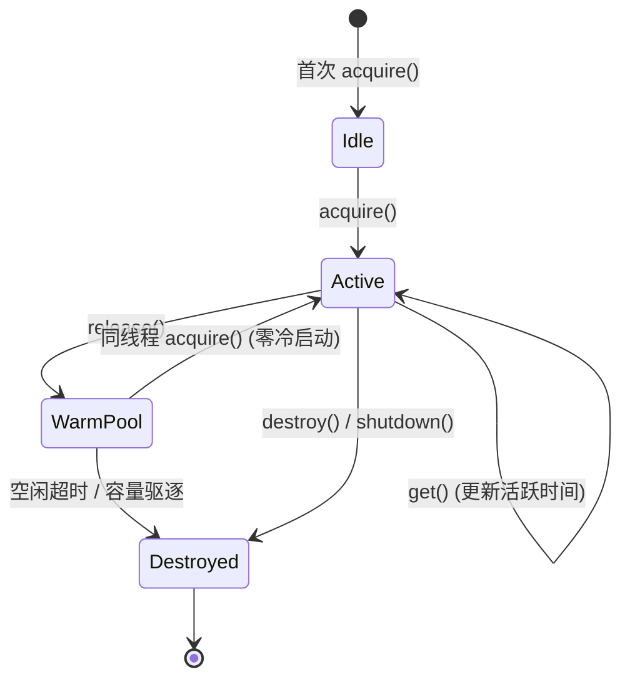

> **DeerFlow 源码解析系列目录**
>
> - [导读：AI Agent 框架的选择与 DeerFlow 的定位](/posts/deerflow-00-introduction)
> - [第一篇：一个 Chat 请求的完整生命周期](/posts/deerflow-01-chat-request-lifecycle)
> - [第二篇：系统提示词工程与上下文架构](/posts/deerflow-02-prompt-engineering-context)
> - [第三篇：主从 Agent 协作与安全边界](/posts/deerflow-03-multi-agent-collaboration)
> - [第四篇：Skills、MCP 与工具生态](/posts/deerflow-04-skills-mcp-tools)
> - **第五篇（本文）**：沙箱隔离与代码执行
> - [第六篇：长期记忆、IM 通道与多端接入](/posts/deerflow-06-memory-im-channels)
> - [第七篇：Harness Engineering 工程实践](/posts/deerflow-07-harness-engineering)

---

上一篇分析了 Skills 和 MCP 的加载机制。这篇聚焦沙箱系统——Agent 执行 bash 命令、读写文件时，底层的安全隔离是如何实现的，以及虚拟路径系统如何在 Agent 感知和主机文件系统之间建立一层安全的翻译层。

## 双 Provider 架构

DeerFlow 的沙箱系统围绕两个核心抽象建立：`Sandbox`（执行环境）和 `SandboxProvider`（环境管理器）。

```python
# backend/packages/harness/deerflow/sandbox/sandbox.py:4-6
class Sandbox(ABC):
    """Abstract base class for sandbox environments"""
    # 四个核心操作：execute_command, read_file, list_dir, write_file
```

```python
# backend/packages/harness/deerflow/sandbox/sandbox_provider.py:8-10
class SandboxProvider(ABC):
    """Abstract base class for sandbox providers"""
    # 三个生命周期方法：acquire, get, release
```

目前有两个实现：

| Provider | 隔离级别 | 适用场景 |
|----------|---------|---------|
| `LocalSandboxProvider` | 无隔离（直接在宿主执行） | 本地开发 |
| `AioSandboxProvider` | Docker 容器隔离 | 生产环境 |

Provider 的选择由 `config.yaml` 中的 `sandbox.use` 字段决定，通过反射加载：

```python
# backend/packages/harness/deerflow/sandbox/sandbox_provider.py:52-56
def get_sandbox_provider(**kwargs) -> SandboxProvider:
    global _default_sandbox_provider
    if _default_sandbox_provider is None:
        config = get_app_config()
        cls = resolve_class(config.sandbox.use, SandboxProvider)
        _default_sandbox_provider = cls(**kwargs)
    return _default_sandbox_provider
```

全局单例模式，一个进程只有一个 Provider 实例。

## LocalSandboxProvider：开发者模式

本地 Provider 的实现很简单——它只有一个全局单例 `LocalSandbox`，ID 固定为 `"local"`：

```python
# backend/packages/harness/deerflow/sandbox/local/local_sandbox_provider.py:45-49
def acquire(self, thread_id: str | None = None) -> str:
    global _singleton
    if _singleton is None:
        _singleton = LocalSandbox("local", path_mappings=self._path_mappings)
    return _singleton.id
```

所有线程共享同一个沙箱实例。`release()` 是空操作——本地模式下没有什么需要释放的。

命令执行直接调用 `subprocess.run()`：

```python
# backend/packages/harness/deerflow/sandbox/local/local_sandbox.py:154-174
def execute_command(self, command: str) -> str:
    resolved_command = self._resolve_paths_in_command(command)
    result = subprocess.run(
        resolved_command,
        executable=self._get_shell(),
        shell=True,
        capture_output=True,
        text=True,
        timeout=600,
    )
    output = result.stdout
    if result.stderr:
        output += f"\nStd Error:\n{result.stderr}"
    return self._reverse_resolve_paths_in_output(output)
```

Shell 选择顺序是 `zsh → bash → sh → PATH 中的 sh`，600 秒超时。注意它在执行前做了路径翻译（`_resolve_paths_in_command`），在返回前做了逆向翻译（`_reverse_resolve_paths_in_output`）。这是虚拟路径系统的一部分，下面详细分析。

**没有任何进程隔离**。Agent 的命令和你本地终端执行的命令拥有完全相同的权限。这意味着本地模式下，Agent 理论上可以 `rm -rf /`。安全完全依赖 Agent 自身的"自律"和路径验证层。

## AioSandboxProvider：容器化隔离

这是生产环境使用的 Provider，每个线程分配独立的 Docker 容器。架构比本地模式复杂得多。

### 容器生命周期



三个关键状态：

- **Active**：正在服务某个线程，存储在 `_sandboxes` 字典中。
- **Warm Pool**：已释放但容器仍在运行，存储在 `_warm_pool` 字典中。下次同线程请求可以直接复用，避免容器冷启动。
- **Destroyed**：容器已停止，所有资源已清理。

### 确定性 ID

沙箱 ID 不是随机生成的，而是由 `thread_id` 确定性地推导：

```python
# backend/packages/harness/deerflow/community/aio_sandbox/aio_sandbox_provider.py:181-187
@staticmethod
def _deterministic_sandbox_id(thread_id: str) -> str:
    return hashlib.sha256(thread_id.encode()).hexdigest()[:8]
```

同一个 `thread_id` 永远对应同一个沙箱 ID。这让跨进程发现成为可能——另一个进程可以根据 `thread_id` 计算出沙箱 ID，然后通过 backend 发现已有容器，而不需要进程间共享状态。

### 三层获取策略

`_acquire_internal()` 实现了三层获取策略：

```python
# aio_sandbox_provider.py:375-418 (简化)
def _acquire_internal(self, thread_id):
    # 层 1：进程内缓存（最快）
    if thread_id in self._thread_sandboxes:
        return self._thread_sandboxes[thread_id]
    
    # 层 1.5：Warm Pool（容器仍在运行，无冷启动）
    if sandbox_id in self._warm_pool:
        info, _ = self._warm_pool.pop(sandbox_id)
        # ... 重新注册为 Active
        return sandbox_id
    
    # 层 2：Backend 发现 + 创建（跨进程文件锁保护）
    return self._discover_or_create_with_lock(thread_id, sandbox_id)
```

层 2 使用文件锁（`fcntl.flock`）序列化跨进程的容器创建操作：

```python
# aio_sandbox_provider.py:420-469 (简化)
def _discover_or_create_with_lock(self, thread_id, sandbox_id):
    lock_path = paths.thread_dir(thread_id) / f"{sandbox_id}.lock"
    with open(lock_path, "a") as lock_file:
        _lock_file_exclusive(lock_file)
        # 加锁后再次检查缓存和 warm pool（双重检查）
        # 尝试 backend 发现
        discovered = self._backend.discover(sandbox_id)
        if discovered is not None:
            return discovered.sandbox_id
        # 都没有，创建新容器
        return self._create_sandbox(thread_id, sandbox_id)
```

### 容量管理和驱逐

容器数量受 `replicas` 配置限制（默认 3）。当达到上限时，优先驱逐 Warm Pool 中最旧的容器：

```python
# aio_sandbox_provider.py:508-519
replicas = self._config.get("replicas", DEFAULT_REPLICAS)
with self._lock:
    total = len(self._sandboxes) + len(self._warm_pool)
if total >= replicas:
    evicted = self._evict_oldest_warm()
    if evicted:
        logger.info(f"Evicted warm-pool sandbox {evicted}")
    else:
        # 所有槽位都是活跃的——不强制停止，允许超出软限制
        logger.warning(f"All {replicas} replica slots are in active use; "
                       f"creating sandbox {sandbox_id} beyond the soft limit")
```

`replicas` 是软限制——如果所有容器都在活跃使用，不会为了创建新容器而强制停止正在服务的容器。这是可用性优先于资源限制的设计选择。

### 空闲超时

后台守护线程每 60 秒扫描一次活跃沙箱和 Warm Pool，超过空闲阈值（默认 600 秒）的容器会被销毁：

```python
# aio_sandbox_provider.py:262-268
def _idle_checker_loop(self):
    idle_timeout = self._config.get("idle_timeout", DEFAULT_IDLE_TIMEOUT)
    while not self._idle_checker_stop.wait(timeout=IDLE_CHECK_INTERVAL):
        self._cleanup_idle_sandboxes(idle_timeout)
```

清理前会再次检查活跃时间戳（double-check），避免竞态条件：在快照和清理之间，沙箱可能已被重新获取。

### 挂载配置

每个容器的文件挂载分为两类：

**线程级挂载**（读写）：

```python
# aio_sandbox_provider.py:221-228
return [
    (str(host_paths.sandbox_work_dir(thread_id)),    "/mnt/user-data/workspace", False),
    (str(host_paths.sandbox_uploads_dir(thread_id)), "/mnt/user-data/uploads",   False),
    (str(host_paths.sandbox_outputs_dir(thread_id)), "/mnt/user-data/outputs",   False),
    (str(host_paths.acp_workspace_dir(thread_id)),   "/mnt/acp-workspace",       True),
]
```

**Skills 挂载**（只读）：

```python
# aio_sandbox_provider.py:242-245
if skills_path.exists():
    host_skills = os.environ.get("DEER_FLOW_HOST_SKILLS_PATH") or str(skills_path)
    return (host_skills, container_path, True)  # Read-only for security
```

注意 `DEER_FLOW_HOST_SKILLS_PATH` 环境变量——当 DeerFlow 本身运行在 Docker 中（Docker-outside-of-Docker 模式），宿主 Docker daemon 解析挂载路径时使用的是宿主路径，不是容器内路径。这个环境变量让用户指定宿主侧的 Skills 目录位置。

## 虚拟路径系统

这是整个沙箱架构中值得仔细看的部分。Agent 感知到的文件系统是一个虚拟的、统一的路径空间：

```
/mnt/user-data/
├── workspace/   ← Agent 的工作目录
├── uploads/     ← 用户上传的文件
└── outputs/     ← Agent 输出的文件

/mnt/skills/
├── public/      ← 内置 Skills（只读）
└── custom/      ← 自定义 Skills（只读）

/mnt/acp-workspace/   ← ACP Agent 的输出（只读）
```

无论底层是本地文件系统还是 Docker 容器，Agent 看到的路径完全一样。这层抽象由 `tools.py` 中的路径翻译系统实现。

### 路径翻译

Docker 模式下，虚拟路径直接对应容器内路径（因为挂载点就是 `/mnt/user-data/*`），不需要额外翻译。本地模式下，虚拟路径需要翻译成宿主文件系统上的实际路径：

```python
# backend/packages/harness/deerflow/sandbox/tools.py:241-271
def replace_virtual_path(path: str, thread_data: ThreadDataState | None) -> str:
    mappings = _thread_virtual_to_actual_mappings(thread_data)
    # 最长前缀优先匹配
    for virtual_base, actual_base in sorted(mappings.items(), 
                                             key=lambda item: len(item[0]), reverse=True):
        if path == virtual_base:
            return actual_base
        if path.startswith(f"{virtual_base}/"):
            rest = path[len(virtual_base):].lstrip("/")
            return _join_path_preserving_style(actual_base, rest)
    return path
```

映射关系：

```
/mnt/user-data/workspace → ~/.deer-flow/threads/{thread_id}/user-data/workspace
/mnt/user-data/uploads   → ~/.deer-flow/threads/{thread_id}/user-data/uploads
/mnt/user-data/outputs   → ~/.deer-flow/threads/{thread_id}/user-data/outputs
/mnt/user-data           → ~/.deer-flow/threads/{thread_id}/user-data
```

最长前缀优先的排序保证 `/mnt/user-data/workspace/foo.py` 不会被 `/mnt/user-data` 的映射错误匹配。

### 反向掩码

命令的输出可能包含真实的宿主路径。如果这些路径被返回给 Agent 或用户，会泄露服务器的文件系统布局。`mask_local_paths_in_output()` 负责把所有真实路径替换回虚拟路径：

```python
# backend/packages/harness/deerflow/sandbox/tools.py:304-373
def mask_local_paths_in_output(output: str, thread_data: ThreadDataState | None) -> str:
    result = output
    # 1. 掩码 Skills 宿主路径 → /mnt/skills/
    # 2. 掩码 ACP 宿主路径 → /mnt/acp-workspace/
    # 3. 掩码 user-data 宿主路径 → /mnt/user-data/
    ...
```

掩码处理了多种路径变体（原始路径、resolved 路径、正斜杠/反斜杠变体），通过正则表达式批量替换。这也意味着即使 Agent 在 bash 命令中无意间暴露了真实路径，用户也看不到。

## 四层路径安全

DeerFlow 对文件访问的安全校验分成四层，逐层加固。

### 第一层：路径遍历拒绝

最基础的防御——禁止 `..` 段：

```python
# backend/packages/harness/deerflow/sandbox/tools.py:376-382
def _reject_path_traversal(path: str) -> None:
    normalised = path.replace("\\", "/")
    for segment in normalised.split("/"):
        if segment == "..":
            raise PermissionError("Access denied: path traversal detected")
```

这是第一道门，在任何路径处理之前执行。

### 第二层：虚拟路径白名单

`validate_local_tool_path()` 检查路径是否属于允许的虚拟路径家族：

```python
# backend/packages/harness/deerflow/sandbox/tools.py:385-428
def validate_local_tool_path(path, thread_data, *, read_only=False):
    _reject_path_traversal(path)
    
    if _is_skills_path(path):
        if not read_only:
            raise PermissionError("Write access to skills path is not allowed")
        return
    
    if _is_acp_workspace_path(path):
        if not read_only:
            raise PermissionError("Write access to ACP workspace is not allowed")
        return
    
    if path.startswith(f"{VIRTUAL_PATH_PREFIX}/"):
        return
    
    raise PermissionError("Only paths under /mnt/user-data/, /mnt/skills/, "
                          "or /mnt/acp-workspace/ are allowed")
```

三个规则：
- `/mnt/user-data/*`：读写都允许
- `/mnt/skills/*`：只允许读
- `/mnt/acp-workspace/*`：只允许读
- 其他路径：一律拒绝

### 第三层：解析后路径验证

虚拟路径翻译成实际路径后，再验证结果没有逃逸到允许的根目录之外：

```python
# backend/packages/harness/deerflow/sandbox/tools.py:431-456
def _validate_resolved_user_data_path(resolved: Path, thread_data):
    allowed_roots = [
        Path(p).resolve()
        for p in (
            thread_data.get("workspace_path"),
            thread_data.get("uploads_path"),
            thread_data.get("outputs_path"),
        ) if p is not None
    ]
    for root in allowed_roots:
        try:
            resolved.relative_to(root)
            return
        except ValueError:
            continue
    raise PermissionError("Access denied: path traversal detected")
```

使用 `Path.resolve()` + `relative_to()` 做最终的 containment 检查。即使前面的路径遍历检测被绕过（比如通过符号链接），这层检查仍然能捕获逃逸。

### 第四层：Bash 命令路径扫描

Bash 命令的路径验证比单文件操作更复杂，因为命令字符串中可能包含多个路径：

```python
# backend/packages/harness/deerflow/sandbox/tools.py:470-507
def validate_local_bash_command_paths(command, thread_data):
    unsafe_paths = []
    for absolute_path in _ABSOLUTE_PATH_PATTERN.findall(command):
        # /mnt/user-data/* → 允许（检查遍历后）
        # /mnt/skills/* → 允许（检查遍历后）
        # /mnt/acp-workspace/* → 允许（检查遍历后）
        # /bin/*, /usr/bin/* 等系统路径 → 允许
        # 其他绝对路径 → 拒绝
        ...
    if unsafe_paths:
        raise PermissionError(f"Unsafe absolute paths in command: {unsafe_paths}")
```

系统路径白名单包括 `/bin/`、`/usr/bin/`、`/usr/sbin/`、`/sbin/`、`/opt/homebrew/bin/`、`/dev/`。这些是常见的可执行文件��设备路径，Agent 需要引用它们来执行基本命令。

正则表达式 `_ABSOLUTE_PATH_PATTERN = re.compile(r"(?<![:\w])/(?:[^\s\"'` + "`" + `;&|<>()]+)")` 用负向后行断言排除 URL 中的路径（`http://` 中的 `//`）。

## 工具函数中的安全流程

以 `bash_tool` 为例，看完整的安全流程：

```python
# backend/packages/harness/deerflow/sandbox/tools.py:701-729
@tool("bash", parse_docstring=True)
def bash_tool(runtime, description, command):
    sandbox = ensure_sandbox_initialized(runtime)     # 1. 获取沙箱
    ensure_thread_directories_exist(runtime)           # 2. 确保目录存在
    thread_data = get_thread_data(runtime)
    if is_local_sandbox(runtime):
        validate_local_bash_command_paths(command, thread_data)  # 3. 扫描路径
        command = replace_virtual_paths_in_command(command, thread_data)  # 4. 翻译路径
        output = sandbox.execute_command(command)       # 5. 执行
        return mask_local_paths_in_output(output, thread_data)  # 6. 掩码输出
    return sandbox.execute_command(command)             # Docker 模式直接执行
```

Docker 模式下步骤 3、4、6 都不需要——容器本身就是隔离边界，路径已经通过挂载映射好了。

`read_file_tool` 的流程类似但更细致，因为它需要处理 Skills 和 ACP 路径的特殊解析：

```python
# tools.py:787-795 (简化)
if is_local_sandbox(runtime):
    validate_local_tool_path(path, thread_data, read_only=True)
    if _is_skills_path(path):
        path = _resolve_skills_path(path)      # Skills 路径单独解析
    elif _is_acp_workspace_path(path):
        path = _resolve_acp_workspace_path(path, thread_id)  # ACP 路径单独解析
    else:
        path = _resolve_and_validate_user_data_path(path, thread_data)
```

`write_file_tool` 不传 `read_only=True`，所以写 Skills 或 ACP 路径会被第二层白名单拒绝。

## 沙箱的懒初始化

沙箱不是在 Agent 创建时就分配的，而是在第一次工具调用时懒初始化：

```python
# backend/packages/harness/deerflow/sandbox/tools.py:609-661
def ensure_sandbox_initialized(runtime):
    # 检查 state 中是否已有沙箱
    sandbox_state = runtime.state.get("sandbox")
    if sandbox_state is not None:
        sandbox_id = sandbox_state.get("sandbox_id")
        if sandbox_id is not None:
            sandbox = get_sandbox_provider().get(sandbox_id)
            if sandbox is not None:
                return sandbox
    
    # 懒获取
    thread_id = runtime.context.get("thread_id")
    provider = get_sandbox_provider()
    sandbox_id = provider.acquire(thread_id)
    runtime.state["sandbox"] = {"sandbox_id": sandbox_id}
    
    sandbox = provider.get(sandbox_id)
    runtime.context["sandbox_id"] = sandbox_id
    return sandbox
```

`SandboxMiddleware` 配合这个设计，默认 `lazy_init=True`：

```python
# backend/packages/harness/deerflow/sandbox/middleware.py:51-55
def before_agent(self, state, runtime):
    if self._lazy_init:
        return super().before_agent(state, runtime)  # 跳过，什么都不做
    # eager 模式才在 before_agent 获取沙箱
```

`after_agent` 负责释放：

```python
# sandbox/middleware.py:67-83
def after_agent(self, state, runtime):
    sandbox = state.get("sandbox")
    if sandbox is not None:
        sandbox_id = sandbox["sandbox_id"]
        get_sandbox_provider().release(sandbox_id)
```

对于 `AioSandboxProvider`，`release()` 是把容器放入 Warm Pool，不是停止容器。对于 `LocalSandboxProvider`，`release()` 是空操作。

## 线程 ID 安全

`Paths` 类对 `thread_id` 做了格式验证，防止路径注入：

```python
# backend/packages/harness/deerflow/config/paths.py:106-108
_SAFE_THREAD_ID_RE = re.compile(r"^[A-Za-z0-9_\-]+$")

def thread_dir(self, thread_id: str) -> Path:
    if not _SAFE_THREAD_ID_RE.match(thread_id):
        raise ValueError(f"Invalid thread_id {thread_id!r}: only alphanumeric, "
                         "hyphens, and underscores are allowed.")
    return self.base_dir / "threads" / thread_id
```

如果 `thread_id` 包含 `../`、空格或其他特殊字符，会直接抛出 `ValueError`。这从源头阻止了通过伪造 `thread_id` 进行路径遍历的攻击。

目录创建时使用 `0o777` 权限：

```python
# paths.py:166-173
def ensure_thread_dirs(self, thread_id):
    for d in [sandbox_work_dir, sandbox_uploads_dir, sandbox_outputs_dir, acp_workspace_dir]:
        d.mkdir(parents=True, exist_ok=True)
        d.chmod(0o777)
```

注释解释了原因：Docker 容器内的进程可能以不同于宿主的 UID 运行，如果目录权限不够宽松，容器内的写操作会报 "Permission denied"。这是安全性和可用性之间的妥协——更精细的做法是用 UID 映射，但 `0o777` 在开发和小规模部署场景下更实用。

## 设计评估

DeerFlow 的沙箱系统在本地和 Docker 两种模式下做了明显不同的安全投入：

**Docker 模式**下安全性很强——容器隔离是内核级的，Agent 只能访问挂载进来的目录，无法触及宿主文件系统。Warm Pool 和确定性 ID 的设计在安全和性能之间做了好的平衡。

**本地模式**下安全性完全依赖路径验证。四层校验在正常使用场景下足够，但无法防御恶意构造的命令（比如通过环境变量间接引用宿主路径，或者通过 Python 代码直接访问文件系统）。本地模式的定位是"开发便利"，不是"生产安全"，这个取舍是合理的。

虚拟路径系统是这个设计中最核心的抽象——它让 Agent 的所有文件操作都基于统一的虚拟路径，无论底层实现如何变化，Agent 的行为不需要修改。同时反向掩码确保了即使在本地模式下，用户也不会在 Agent 输出中看到真实的文件系统路径。

---

下一篇将分析 DeerFlow 的长期记忆系统和 IM 频道集成：Agent 如何在对话之间持久化用户偏好，以及飞书、Slack、Telegram 三个 IM 平台的接入架构。
