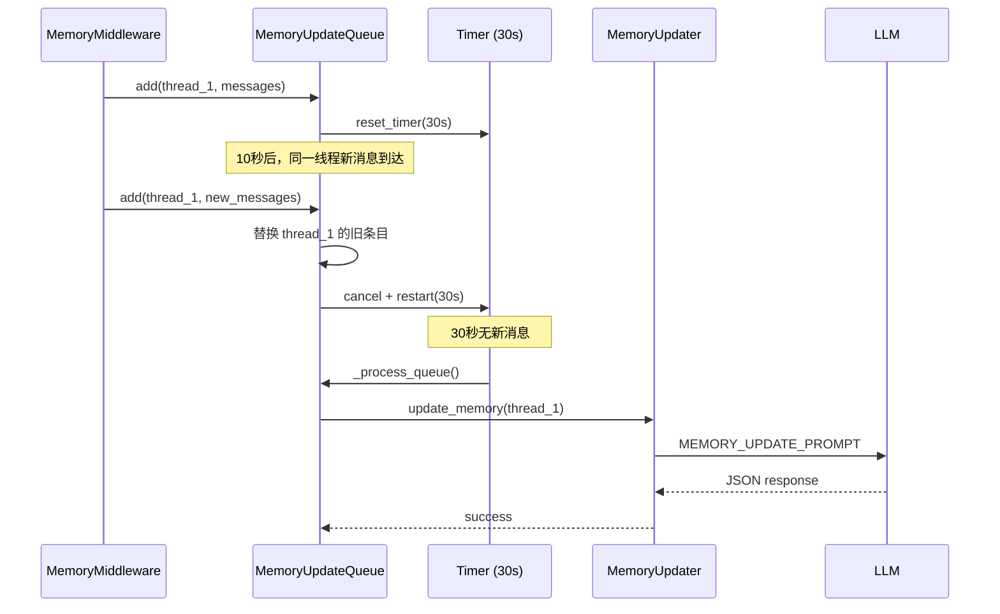
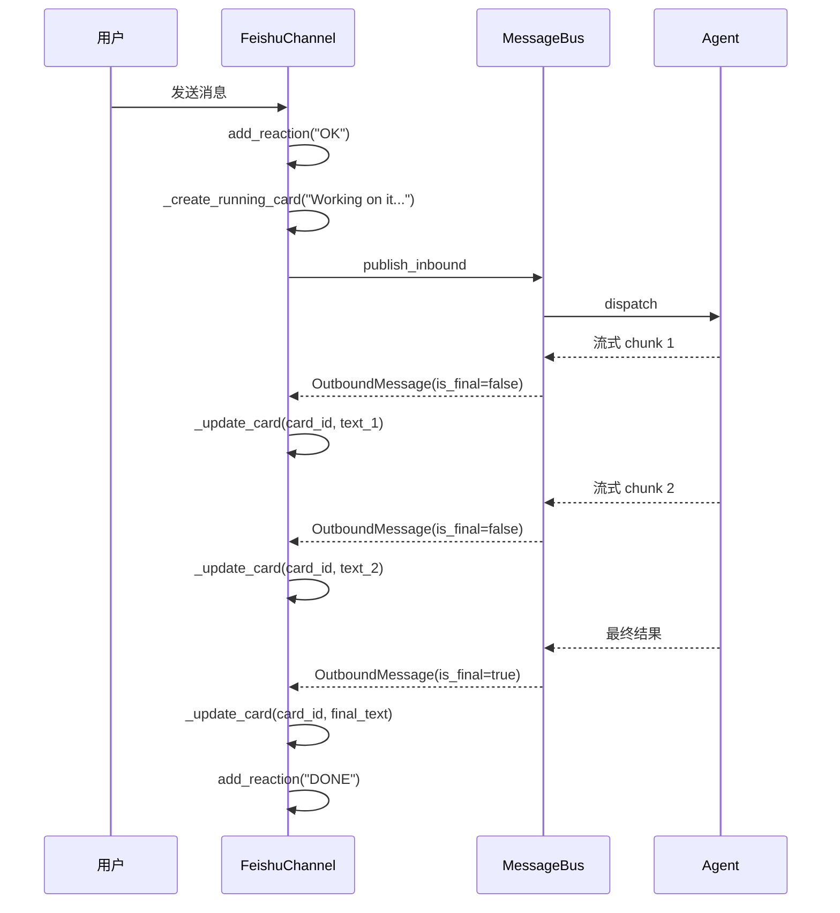
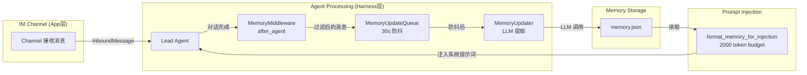

> **DeerFlow 源码解析系列目录**
>
> - [导读：AI Agent 框架的选择与 DeerFlow 的定位](/posts/deerflow-00-introduction)
> - [第一篇：一个 Chat 请求的完整生命周期](/posts/deerflow-01-chat-request-lifecycle)
> - [第二篇：系统提示词工程与上下文架构](/posts/deerflow-02-prompt-engineering-context)
> - [第三篇：主从 Agent 协作与安全边界](/posts/deerflow-03-multi-agent-collaboration)
> - [第四篇：Skills、MCP 与工具生态](/posts/deerflow-04-skills-mcp-tools)
> - [第五篇：沙箱隔离与代码执行](/posts/deerflow-05-sandbox-isolation)
> - **第六篇（本文）**：长期记忆、IM 通道与多端接入
> - [第七篇：Harness Engineering 工程实践](/posts/deerflow-07-harness-engineering)

---

> 前五篇分别覆盖了请求生命周期、提示词工程、主从 Agent 协作、Skills/MCP 工具生态和沙箱隔离。本篇拆解两个相对独立但直接决定"能不能日常用"的子系统——长期记忆（Memory）和 IM 通道（Channels）。

一个 AI Agent 要从"演示品"走向"日常使用的工具"，需要解决两个根本问题：**记住用户**和**触达用户**。DeerFlow 的 Memory 子系统负责前者，Channels 子系统负责后者。它们在代码层面分别位于 Harness 层和 App 层，依赖方向严格单向，但在功能上形成了一个完整的闭环——Agent 通过 IM 通道接收消息、处理请求，处理完成后将对话摘要写入长期记忆，下次任何通道上的对话都能受益于这些记忆。

## 一、长期记忆系统架构

### 1.1 存储格式

DeerFlow 的记忆存储在一个 JSON 文件中（默认路径 `backend/.deer-flow/memory.json`），结构由 `_create_empty_memory()` 定义（`updater.py:43-59`）：

```python
def _create_empty_memory() -> dict[str, Any]:
    return {
        "version": "1.0",
        "lastUpdated": datetime.utcnow().isoformat() + "Z",
        "user": {
            "workContext":      {"summary": "", "updatedAt": ""},
            "personalContext":  {"summary": "", "updatedAt": ""},
            "topOfMind":        {"summary": "", "updatedAt": ""},
        },
        "history": {
            "recentMonths":       {"summary": "", "updatedAt": ""},
            "earlierContext":     {"summary": "", "updatedAt": ""},
            "longTermBackground": {"summary": "", "updatedAt": ""},
        },
        "facts": [],
    }
```

这个设计将记忆分为三个维度：

| 维度 | Section | 用途 | 更新频率 |
|------|---------|------|---------|
| **User Context** | `workContext` | 职业角色、项目、技术栈（2-3 句） | 低 |
| | `personalContext` | 语言、沟通偏好、兴趣（1-2 句） | 低 |
| | `topOfMind` | 当前多个并行关注点（3-5 句） | 高 |
| **History** | `recentMonths` | 近 1-3 月活动详情（4-6 句） | 中 |
| | `earlierContext` | 3-12 月前的模式（3-5 句） | 低 |
| | `longTermBackground` | 不变的基础背景（2-4 句） | 极低 |
| **Facts** | `facts[]` | 离散事实条目，带置信度、分类、来源 | 每次对话 |

Facts 的数据结构比 summary 更有意思：

```json
{
  "id": "fact_a1b2c3d4",
  "content": "User works with LangGraph and LangChain",
  "category": "knowledge",
  "confidence": 0.9,
  "createdAt": "2026-03-20T10:00:00Z",
  "source": "thread_abc123"
}
```

`category` 支持五种分类：`preference`、`knowledge`、`context`、`behavior`、`goal`。`source` 记录了这个事实来自哪个 thread，支持溯源。

### 1.2 记忆缓存与失效

记忆数据不是每次都从磁盘读取。`updater.py:62-95` 实现了一个基于 mtime 的内存缓存：

```python
_memory_cache: dict[str | None, tuple[dict[str, Any], float | None]] = {}

def get_memory_data(agent_name: str | None = None) -> dict[str, Any]:
    file_path = _get_memory_file_path(agent_name)
    current_mtime = file_path.stat().st_mtime if file_path.exists() else None
    cached = _memory_cache.get(agent_name)
    if cached is None or cached[1] != current_mtime:
        memory_data = _load_memory_from_file(agent_name)
        _memory_cache[agent_name] = (memory_data, current_mtime)
        return memory_data
    return cached[0]
```

缓存 key 是 `agent_name`（`None` 表示全局记忆），value 是 `(data, mtime)` 元组。每次读取时比对文件 mtime，如果磁盘文件被外部修改（比如用户手动编辑或另一个进程更新），缓存自动失效。这个模式在 DeerFlow 中反复出现——MCP 工具缓存、Config 缓存都使用了相同的 mtime 失效策略。

### 1.3 LLM 驱动的记忆提取

记忆更新的核心是 `MemoryUpdater.update_memory()`（`updater.py:284-348`）。它不是简单的关键词提取，而是将完整对话交给 LLM，由 LLM 判断哪些信息值得记住。

整个流程：

```
对话消息 → format_conversation_for_update() → 拼接到 MEMORY_UPDATE_PROMPT
         → LLM 调用 → 解析 JSON 响应 → _apply_updates() → 上传文件清洗
         → 原子写入磁盘
```

#### MEMORY_UPDATE_PROMPT 的设计

`prompt.py:15-117` 定义了一个 117 行的详细提示词，相当于记忆管理系统的 SOUL 文件。几个关键设计决策：

**shouldUpdate 机制**：LLM 不是每次都更新所有 section。它必须为每个 section 返回 `shouldUpdate: true/false`，只有标记为 true 的才会被覆盖。这避免了"信息损耗"——如果这次对话没有涉及 `workContext`，就不要碰它。

```json
{
  "user": {
    "workContext": { "summary": "...", "shouldUpdate": false },
    "topOfMind": { "summary": "...", "shouldUpdate": true }
  }
}
```

**置信度分级**：提示词明确定义了三个置信度区间：
- 0.9-1.0：用户明确陈述（"I work on X"）
- 0.7-0.8：从行为/讨论中强推断
- 0.5-0.6：推断出的模式（谨慎使用）

**多语言保留**：提示词要求保留专有名词和技术术语的原始语言形式，不做翻译。

**上传文件免疫**：提示词末尾的 `IMPORTANT` 规则明确禁止将文件上传事件记入记忆，因为上传文件是会话级别的资源，在后续会话中不可访问。

#### 更新应用逻辑

`_apply_updates()`（`updater.py:350-427`）的实现有几个精妙之处：

1. **事实去重**：通过 `_fact_content_key()` 对 content 做 strip 后比较，防止重复事实累积：

```python
existing_fact_keys = {
    fact_key
    for fact_key in (
        _fact_content_key(fact.get("content"))
        for fact in current_memory.get("facts", [])
    )
    if fact_key is not None
}
```

2. **置信度门槛**：新事实必须达到 `fact_confidence_threshold`（默认 0.7）才能入库。这意味着 LLM 推断的低置信度信息会被丢弃：

```python
if confidence >= config.fact_confidence_threshold:
    # ... 添加事实
```

3. **数量上限与淘汰**：当 facts 超过 `max_facts`（默认 100）时，按置信度排序保留 top N：

```python
if len(current_memory["facts"]) > config.max_facts:
    current_memory["facts"] = sorted(
        current_memory["facts"],
        key=lambda f: f.get("confidence", 0),
        reverse=True,
    )[: config.max_facts]
```

4. **事实删除**：LLM 可以返回 `factsToRemove` 列表，用于删除被新信息否定的旧事实。

### 1.4 上传文件清洗

`_strip_upload_mentions_from_memory()`（`updater.py:193-213`）是一个有意思的"事后补救"机制。即使 MEMORY_UPDATE_PROMPT 已经明确要求 LLM 不要记录上传事件，LLM 仍可能"手滑"。这个函数作为最后一道防线，用正则表达式从所有 summary 和 facts 中移除上传相关的句子：

```python
_UPLOAD_SENTENCE_RE = re.compile(
    r"[^.!?]*\b(?:"
    r"upload(?:ed|ing)?(?:\s+\w+){0,3}\s+(?:file|files?|document|...)"
    r"|file\s+upload"
    r"|/mnt/user-data/uploads/"
    r"|<uploaded_files>"
    r")[^.!?]*[.!?]?\s*",
    re.IGNORECASE,
)
```

正则故意设计得很窄——只匹配描述"上传事件"的句子，而不是所有涉及"文件"的句子。注释中明确说明了这一点："`User works with CSV files`" 和 "`prefers PDF export`" 这样的事实不会被误删。

### 1.5 原子写入

`_save_memory_to_file()`（`updater.py:225-264`）使用了经典的"写临时文件 + rename"模式确保原子性：

```python
temp_path = file_path.with_suffix(".tmp")
with open(temp_path, "w", encoding="utf-8") as f:
    json.dump(memory_data, f, indent=2, ensure_ascii=False)
temp_path.replace(file_path)  # 原子操作（大多数文件系统）
```

写完后立即更新内存缓存的 mtime，避免下次读取时不必要的磁盘 I/O。

## 二、防抖队列

### 2.1 问题与方案

如果每次对话结束都立即调用 LLM 更新记忆，在快速连续对话时会产生大量不必要的 LLM 调用。`MemoryUpdateQueue`（`queue.py:22-166`）通过 30 秒防抖解决这个问题。



### 2.2 关键实现细节

**同 thread 替换**：当同一个 thread 在防抖窗口内多次提交时，只保留最新的消息快照：

```python
def add(self, thread_id, messages, agent_name=None):
    with self._lock:
        self._queue = [c for c in self._queue if c.thread_id != thread_id]
        self._queue.append(context)
        self._reset_timer()
```

**线程安全**：`_lock` 保护所有队列操作。Timer 是 daemon 线程，不会阻止进程退出。

**处理互斥**：`_processing` 标志防止并发处理。如果 timer 触发时已在处理中，会重新调度而不是跳过：

```python
def _process_queue(self):
    with self._lock:
        if self._processing:
            self._reset_timer()  # 重新调度
            return
        self._processing = True
        contexts_to_process = self._queue.copy()
        self._queue.clear()
```

**批量间延迟**：多个 thread 的更新之间有 0.5 秒间隔，避免 LLM API 限流。

**全局单例**：`get_memory_queue()` 返回进程级单例，通过 `_queue_lock` 保证线程安全的惰性初始化。

## 三、记忆中间件——from Agent to Queue

`MemoryMiddleware`（`memory_middleware.py:86-149`）是连接 Agent 执行和记忆更新的桥梁，它挂载在 `after_agent` 钩子上。

### 3.1 消息过滤

不是所有消息都值得送进记忆系统。`_filter_messages_for_memory()`（`memory_middleware.py:20-83`）做了精细的过滤：

**保留**：
- Human messages（用户输入）
- AI messages without tool_calls（最终回复）

**丢弃**：
- Tool messages（中间工具调用结果）
- AI messages with tool_calls（中间推理步骤）
- `<uploaded_files>` 标签（会话级别的文件路径）

上传文件处理的逻辑特别细致。如果一个 human message 在去掉 `<uploaded_files>` 标签后还有文本，保留清洗后的版本；如果只剩空字符串（纯上传消息），连带其配对的 AI 回复一起跳过：

```python
if "<uploaded_files>" in content_str:
    stripped = _UPLOAD_BLOCK_RE.sub("", content_str).strip()
    if not stripped:
        skip_next_ai = True  # 跳过这个 turn 和配对的 AI 回复
        continue
    clean_msg = copy(msg)
    clean_msg.content = stripped
    filtered.append(clean_msg)
```

### 3.2 最小对话要求

中间件要求至少存在一个 human message 和一个 AI message 才会入队：

```python
user_messages = [m for m in filtered if getattr(m, "type", None) == "human"]
assistant_messages = [m for m in filtered if getattr(m, "type", None) == "ai"]
if not user_messages or not assistant_messages:
    return None
```

这避免了对"空对话"或"只有系统消息"的场景触发无意义的记忆更新。

## 四、记忆注入——from Storage to Prompt

记忆的另一端是注入。`format_memory_for_injection()`（`prompt.py:186-294`）将存储的记忆数据格式化为系统提示词中的文本。

### 4.1 Token 预算控制

核心约束是 `max_tokens=2000`（可配置）。函数使用 tiktoken 进行精确的 token 计数，而不是粗略的字符数估算：

```python
def _count_tokens(text: str, encoding_name: str = "cl100k_base") -> int:
    if not TIKTOKEN_AVAILABLE:
        return len(text) // 4  # fallback
    encoding = tiktoken.get_encoding(encoding_name)
    return len(encoding.encode(text))
```

### 4.2 增量 Token 计算

性能优化点：函数不是每添加一条 fact 就重新计算整个文本的 token 数，而是增量计算：

```python
base_tokens = _count_tokens(base_text) if base_text else 0
running_tokens = base_tokens + separator_tokens

for fact in ranked_facts:
    line_text = ("\n" + line) if fact_lines else line
    line_tokens = _count_tokens(line_text)
    if running_tokens + line_tokens <= max_tokens:
        fact_lines.append(line)
        running_tokens += line_tokens
    else:
        break
```

### 4.3 按置信度排序截断

Facts 按 confidence 降序排列后逐条添加，直到 token 预算耗尽。这意味着低置信度的事实可能被截断，但高置信度的关键信息始终保留。`_coerce_confidence()` 还处理了 NaN、inf 等边界情况，防止非法值影响排序。

### 4.4 最终安全截断

即使增量计算通过了，函数最后仍做一次全文 token 检查。如果因浮点精度累积等原因超限，进行字符级截断并附加 `\n...` 标记。

## 五、IM 通道——Hub-and-Spoke 消息总线

### 5.1 架构概览

DeerFlow 的 IM 通道采用经典的 Hub-and-Spoke（轮辐式）架构：

```mermaid
graph TB
    subgraph Channels
        F[Feishu<br>WebSocket]
        S[Slack<br>Socket Mode]
        T[Telegram<br>Long Polling]
    end

    subgraph MessageBus
        IQ[Inbound Queue<br>asyncio.Queue]
        OL[Outbound Listeners<br>Callback List]
    end

    subgraph Dispatcher
        CM[ChannelManager<br>消费/路由/调度]
    end

    subgraph Backend
        LG[LangGraph Server<br>Agent 执行]
    end

    F -->|InboundMessage| IQ
    S -->|InboundMessage| IQ
    T -->|InboundMessage| IQ

    IQ -->|get_inbound()| CM
    CM -->|runs.stream / runs.wait| LG
    LG -->|结果| CM
    CM -->|OutboundMessage| OL

    OL -->|callback| F
    OL -->|callback| S
    OL -->|callback| T
```

所有平台的消息都被标准化为 `InboundMessage`，通过 `asyncio.Queue` 传递给 Dispatcher；Dispatcher 处理完成后，将 `OutboundMessage` 通过回调列表分发给目标通道。

### 5.2 消息数据模型

`message_bus.py` 定义了三个核心数据类：

**InboundMessage**（`message_bus.py:30-58`）：

```python
@dataclass
class InboundMessage:
    channel_name: str          # "feishu" | "slack" | "telegram"
    chat_id: str               # 平台级别的会话 ID
    user_id: str               # 平台级别的用户 ID
    text: str                  # 消息文本
    msg_type: InboundMessageType  # CHAT | COMMAND
    thread_ts: str | None      # 平台线程标识（用于回复定位）
    topic_id: str | None       # 映射到 DeerFlow thread 的 key
    files: list[dict]          # 文件附件
    metadata: dict             # 平台特定的额外数据
    created_at: float          # Unix 时间戳
```

`topic_id` 是一个关键设计。不同平台对"同一个话题"的表示方式不同——Feishu 用 `root_id`，Slack 用 `thread_ts`，Telegram 在私聊中没有线程概念。`topic_id` 将这些差异统一为一个字符串，用于映射到 DeerFlow 的 thread_id。

**OutboundMessage**（`message_bus.py:82-107`）：多了 `artifacts` 和 `attachments` 字段，支持将 Agent 产出的文件回传给用户。

**ResolvedAttachment**（`message_bus.py:62-79`）：将虚拟路径（如 `/mnt/user-data/outputs/report.pdf`）解析为宿主机实际路径，包含 MIME 类型、文件大小、是否为图片等元数据。

### 5.3 MessageBus 实现

`MessageBus`（`message_bus.py:117-173`）出奇地简洁——不到 60 行代码：

```python
class MessageBus:
    def __init__(self):
        self._inbound_queue: asyncio.Queue[InboundMessage] = asyncio.Queue()
        self._outbound_listeners: list[OutboundCallback] = []

    async def publish_inbound(self, msg):
        await self._inbound_queue.put(msg)

    async def get_inbound(self):
        return await self._inbound_queue.get()

    def subscribe_outbound(self, callback):
        self._outbound_listeners.append(callback)

    async def publish_outbound(self, msg):
        for callback in self._outbound_listeners:
            await callback(msg)
```

入站用 Queue（多生产者单消费者），出站用回调列表（单生产者多消费者）。没有复杂的路由规则，因为出站路由在 `Channel._on_outbound()` 中通过 `channel_name` 过滤实现。

### 5.4 Channel 基类

`Channel`（`base.py:14-108`）定义了所有通道的生命周期协议：

```python
class Channel(ABC):
    @abstractmethod
    async def start(self) -> None: ...
    @abstractmethod
    async def stop(self) -> None: ...
    @abstractmethod
    async def send(self, msg: OutboundMessage) -> None: ...
    async def send_file(self, msg, attachment) -> bool:
        return False  # 默认不支持文件上传
```

`_on_outbound()` 回调（`base.py:87-108`）的路由逻辑有个细节：文本消息发送失败时，跳过后续的文件上传，避免"有文件没正文"的怪异体验：

```python
async def _on_outbound(self, msg):
    if msg.channel_name == self.name:
        try:
            await self.send(msg)
        except Exception:
            return  # 文本失败，跳过文件上传
        for attachment in msg.attachments:
            await self.send_file(msg, attachment)
```

## 六、三个平台的接入差异

### 6.1 Feishu——最复杂的实现

`FeishuChannel`（`feishu.py:17-536`）是三个平台中实现最复杂的，536 行代码。

**连接方式**：WebSocket 长连接，通过 `lark-oapi` SDK。不需要公网 IP。

**线程模型**：SDK 在自己的线程中运行，需要一个独立的事件循环。由于 lark-oapi 在导入时缓存了模块级别的事件循环引用，而主线程已经在运行 uvloop，直接在主线程创建 WS 客户端会导致 `RuntimeError`。解决方案是在独立线程中创建新的事件循环，并替换 SDK 的模块级引用（`feishu.py:118-153`）：

```python
def _run_ws(self, app_id, app_secret):
    loop = asyncio.new_event_loop()
    asyncio.set_event_loop(loop)
    import lark_oapi.ws.client as _ws_client_mod
    _ws_client_mod.loop = loop  # 替换 SDK 的模块级 loop
    # ... 创建并启动 WS 客户端
```

**渐进式卡片更新**：Feishu 的杀手级特性是 Interactive Card 的原地更新。当 Agent 开始处理时，先创建一个"Working on it..."卡片，然后随着 Agent 流式输出不断 patch 同一张卡片：



卡片 JSON 设置了 `"update_multi": True`（`feishu.py:277`），这是 Feishu patch API 的必要配置。`_running_card_ids` 字典缓存了每个源消息对应的卡片 message_id，确保更新操作命中正确的卡片。

**Emoji Reaction 状态指示**：
- 收到消息：添加 "OK" reaction
- 处理完成：添加 "DONE" reaction

**富文本解析**（`feishu.py:468-494`）：支持两种消息格式——纯文本（`text` 字段）和富文本（`content` 列表）。富文本中的 `text` 和 `at` 标签会被提取拼接：

```python
for element in paragraph:
    if element.get("tag") in ("text", "at"):
        text_value = element.get("text", "")
        if text_value:
            paragraph_text_parts.append(text_value)
```

**文件上传限制**（`feishu.py:201-234`）：图片 10MB，文件 30MB。上传时根据文件后缀判断类型（xls/ppt/pdf/doc/stream）。

**Topic ID 映射**：使用 `root_id`（回复的根消息 ID）作为 topic_id。新消息使用自己的 `msg_id`。这意味着 Feishu 话题中的所有回复共享同一个 DeerFlow thread。

### 6.2 Slack——简洁有效

`SlackChannel`（`slack.py:19-244`）使用 Socket Mode，244 行。

**连接方式**：通过 `slack-sdk` 的 `SocketModeClient`，WebSocket 连接，不需要公网 IP。

**Markdown 转换**：Slack 使用自己的 mrkdwn 格式，不兼容标准 Markdown。通过 `markdown-to-mrkdwn` 库做自动转换：

```python
from markdown_to_mrkdwn import SlackMarkdownConverter
_slack_md_converter = SlackMarkdownConverter()

async def send(self, msg):
    kwargs = {"text": _slack_md_converter.convert(msg.text)}
```

**用户白名单**：支持 `allowed_users` 配置，只允许指定用户与 Bot 交互：

```python
if self._allowed_users and user_id not in self._allowed_users:
    logger.debug("Ignoring message from non-allowed user: %s", user_id)
    return
```

**状态 Emoji**：
- 收到消息：`eyes` reaction
- 处理成功：`white_check_mark` reaction
- 处理失败：`x` reaction

**Topic ID 映射**：直接使用 Slack 的 `thread_ts`。线程内的消息共享同一个 thread_ts（根消息的时间戳），非线程消息使用自己的 ts。

### 6.3 Telegram——独立事件循环

`TelegramChannel`（`telegram.py:16-315`）使用长轮询，315 行。

**连接方式**：通过 `python-telegram-bot` 库的长轮询。独立线程 + 独立事件循环，原因与 Feishu 类似——SDK 的 `run_polling()` 会调用 `add_signal_handler()`，而这只能在主线程中使用。解决方案是手动初始化 application 并启动 updater（`telegram.py:199-222`）：

```python
def _run_polling(self):
    self._tg_loop = asyncio.new_event_loop()
    asyncio.set_event_loop(self._tg_loop)
    self._tg_loop.run_until_complete(self._application.initialize())
    self._tg_loop.run_until_complete(self._application.start())
    self._tg_loop.run_until_complete(self._application.updater.start_polling())
    self._tg_loop.run_forever()
```

**命令处理器**：注册了 `/start`、`/new`、`/status`、`/models`、`/memory`、`/help` 六个命令。`/start` 本地处理，其余通过 `_cmd_generic` 转发到 ChannelManager。

**私聊 vs 群聊的线程映射**（`telegram.py:288-300`）：
- **私聊**：`topic_id = None`，所有消息共享一个 DeerFlow thread（持续对话）
- **群聊**：使用 reply-to 消息 ID 作为 topic_id，不同回复链是不同 thread

```python
if update.effective_chat.type == "private":
    topic_id = None
else:
    reply_to = update.message.reply_to_message
    topic_id = str(reply_to.message_id) if reply_to else msg_id
```

**文件上传限制**：图片 10MB（用 `send_photo`），文件 50MB（用 `send_document`）。超过 10MB 的图片降级为 document 上传。

### 6.4 三平台对比

| 特性 | Feishu | Slack | Telegram |
|------|--------|-------|----------|
| 连接协议 | WebSocket | Socket Mode (WS) | Long Polling |
| SDK | lark-oapi | slack-sdk | python-telegram-bot |
| 线程模型 | 独立线程 + 独立 loop | 主 loop + executor | 独立线程 + 独立 loop |
| 消息格式 | Interactive Card (MD) | mrkdwn (转换) | 纯文本 |
| 渐进更新 | 卡片原地 patch | 不支持 | 不支持 |
| 处理方式 | runs.stream() | runs.wait() | runs.wait() |
| 接收状态 | OK emoji | eyes emoji | - |
| 完成状态 | DONE emoji | check_mark emoji | - |
| 失败状态 | - | x emoji | - |
| 文件限制 | 图片10MB/文件30MB | 无显式限制 | 图片10MB/文件50MB |
| 用户过滤 | 不支持 | allowed_users | allowed_users |
| Topic 映射 | root_id | thread_ts | reply_to / None |
| 代码行数 | 536 | 244 | 315 |

### 6.5 跨线程通信模式

三个通道在跨线程通信上采用了相同的模式：

1. **SDK 线程**：接收平台消息，解析内容
2. **`asyncio.run_coroutine_threadsafe()`**：将协程投递到主事件循环
3. **主事件循环**：执行 `publish_inbound()`，触发 Dispatcher

```python
# Feishu (feishu.py:529-532)
fut = asyncio.run_coroutine_threadsafe(
    self._prepare_inbound(msg_id, inbound), self._main_loop
)

# Telegram (telegram.py:311-313)
fut = asyncio.run_coroutine_threadsafe(
    self._process_incoming_with_reply(chat_id, msg_id, inbound), self._main_loop
)
```

每个 `fut` 都附加了 `add_done_callback` 来记录异常，避免跨线程异常被静默吞掉。

### 6.6 重试机制

三个通道的 `send()` 方法都实现了相同的指数退避重试（`_max_retries=3`，延迟 1s → 2s）：

```python
for attempt in range(_max_retries):
    try:
        # ... 发送消息
        return
    except Exception as exc:
        if attempt < _max_retries - 1:
            delay = 2 ** attempt
            await asyncio.sleep(delay)
raise last_exc
```

## 七、记忆 + 通道 = 完整闭环

将两个子系统放在一起看，就能理解它们如何形成闭环：



1. 用户通过 Feishu/Slack/Telegram 发送消息
2. Agent 处理请求，MemoryMiddleware 在 `after_agent` 阶段过滤对话
3. 过滤后的消息进入防抖队列，30 秒后 LLM 提取记忆
4. 记忆写入 memory.json
5. 下次任何通道的请求到来时，记忆被注入系统提示词
6. Agent 带着对用户的"了解"处理新请求

关键约束：
- 记忆存储在 Harness 层（`deerflow.agents.memory`），跨平台共享
- 通道在 App 层（`app.channels`），平台特定
- 依赖方向始终是 App → Harness，记忆系统对通道的存在完全无感知

## 八、值得思考的设计权衡

**JSON 文件 vs 数据库**：当前的 JSON 文件存储在多实例部署时会有并发写入问题。但对于单实例场景（个人使用、小团队），这是最简单、最可调试的方案。用户可以直接编辑 memory.json 来修正 Agent 的"记忆"。

**LLM 提取 vs 规则提取**：用 LLM 做记忆提取成本不低（每次对话结束后一次额外调用），但效果远超关键词匹配。LLM 能理解语义、归纳模式、判断重要性——这是规则引擎做不到的。

**防抖窗口 30 秒**：这个值是可配置的（`debounce_seconds`），但默认 30 秒意味着快速对话不会触发频繁更新，而正常使用节奏（一个问题讨论几分钟）中的每轮对话都会被及时记录。

**Feishu 的渐进更新 vs Slack/Telegram 的一次性回复**：这不是懒——而是因为 Feishu 的 Interactive Card 原生支持 patch 更新，而 Slack/Telegram 不支持（或支持但体验不好）。DeerFlow 根据平台能力选择了最佳策略。

---

> **下一篇预告**：[DeerFlow 源码解析（七）：Harness Engineering 工程实践](/posts/deerflow-07-harness-engineering)——作为收尾，我们将跳出具体子系统，审视 DeerFlow 项目的工程基础设施：CLAUDE.md 如何指导 AI Agent 协作、Harness/App 分层如何通过架构边界测试强制执行、CI/CD 管线的设计，以及对整个项目工程实践的综合评估。
