## 1. 核心数据结构

| 层次       | 核心结构                                                                                   | 职责             |
| -------- | -------------------------------------------------------------------------------------- | -------------- |
| **接口层**  | `Agent`, `ResumableAgent`, `OnSubAgents`                                               | 定义 Agent 契约    |
| **实现层**  | `ChatModelAgent`, `workflowAgent`, `flowAgent`, `agentTool`, `deterministicTransferTo` | 具体 Agent 实现    |
| **事件层**  | `AgentEvent` → `AgentOutput` → `MessageVariant`                                        | Agent 执行产物     |
| **动作层**  | `AgentAction` → `TransferToAgent` / `Interrupt` / `BreakLoop` / `Exit`                 | 控制流指令          |
| **状态层**  | `State`, `ChatModelAgentState`, `sequentialWorkflowState` 等                            | ReAct/工作流运行时状态 |
| **上下文层** | `Runner` → `runContext` → `runSession` → `agentEventWrapper` / `laneEvents`            | 执行上下文与会话管理     |
| **中断层**  | `InterruptInfo`, `ResumeInfo`, `serialization`, `bridgeStore`                          | 中断持久化与恢复       |
| **通信层**  | `AsyncIterator` / `AsyncGenerator` → `UnboundedChan`                                   | 异步事件流          |

### 1.1 Agent 接口与实现类层次图

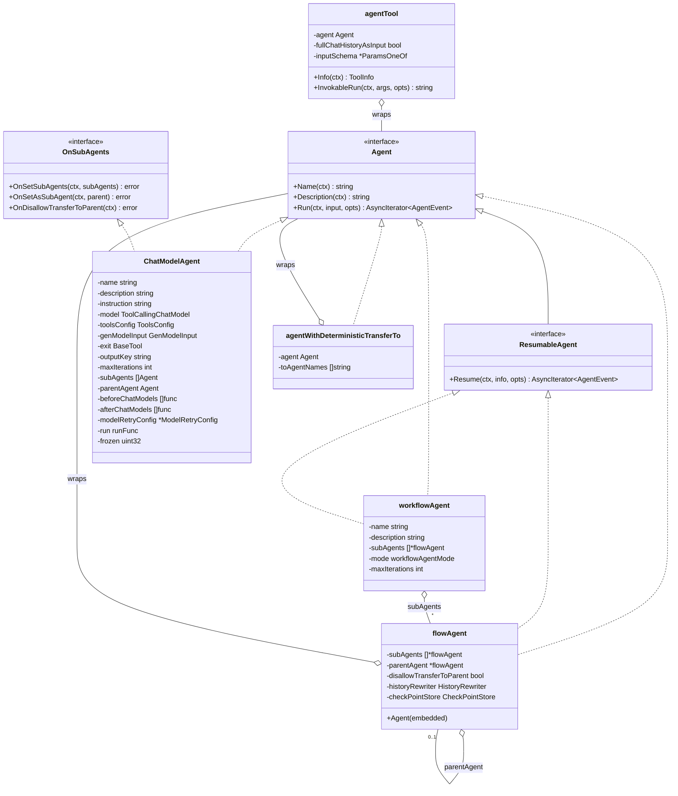
```mermaid
classDiagram
    class Agent {
        <<interface>>
        +Name(ctx) string
        +Description(ctx) string
        +Run(ctx, input, opts) AsyncIterator~AgentEvent~
    }

    class ResumableAgent {
        <<interface>>
        +Resume(ctx, info, opts) AsyncIterator~AgentEvent~
    }

    class OnSubAgents {
        <<interface>>
        +OnSetSubAgents(ctx, subAgents) error
        +OnSetAsSubAgent(ctx, parent) error
        +OnDisallowTransferToParent(ctx) error
    }

    Agent <|-- ResumableAgent

    class ChatModelAgent {
        -name string
        -description string
        -instruction string
        -model ToolCallingChatModel
        -toolsConfig ToolsConfig
        -genModelInput GenModelInput
        -exit BaseTool
        -outputKey string
        -maxIterations int
        -subAgents []Agent
        -parentAgent Agent
        -beforeChatModels []func
        -afterChatModels []func
        -modelRetryConfig *ModelRetryConfig
        -run runFunc
        -frozen uint32
    }

    class flowAgent {
        +Agent (embedded)
        -subAgents []*flowAgent
        -parentAgent *flowAgent
        -disallowTransferToParent bool
        -historyRewriter HistoryRewriter
        -checkPointStore CheckPointStore
    }

    class workflowAgent {
        -name string
        -description string
        -subAgents []*flowAgent
        -mode workflowAgentMode
        -maxIterations int
    }

    class agentWithDeterministicTransferTo {
        -agent Agent
        -toAgentNames []string
    }

    class agentTool {
        -agent Agent
        -fullChatHistoryAsInput bool
        -inputSchema *ParamsOneOf
        +Info(ctx) ToolInfo
        +InvokableRun(ctx, args, opts) string
    }

    Agent <|.. ChatModelAgent
    OnSubAgents <|.. ChatModelAgent
    Agent <|.. flowAgent
    ResumableAgent <|.. flowAgent
    Agent <|.. workflowAgent
    ResumableAgent <|.. workflowAgent
    Agent <|.. agentWithDeterministicTransferTo

    flowAgent o-- Agent : wraps
    flowAgent o-- "*" flowAgent : subAgents
    flowAgent o-- "0..1" flowAgent : parentAgent
    workflowAgent o-- "*" flowAgent : subAgents
    agentWithDeterministicTransferTo o-- Agent : wraps
    agentTool o-- Agent : wraps
```

---

### 1.2 AgentEvent 事件体系图

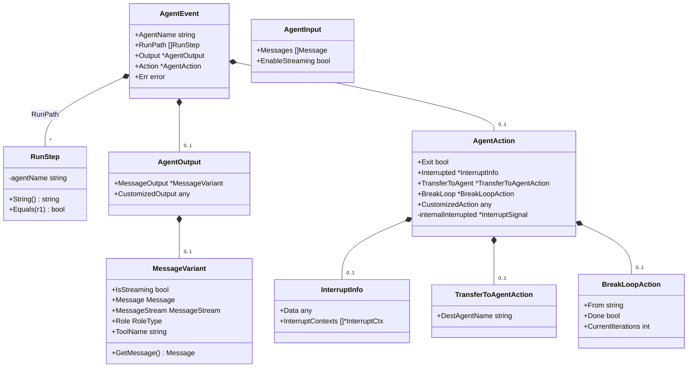
```mermaid
classDiagram
    class AgentEvent {
        +AgentName string
        +RunPath []RunStep
        +Output *AgentOutput
        +Action *AgentAction
        +Err error
    }

    class RunStep {
        -agentName string
        +String() string
        +Equals(r1) bool
    }

    class AgentOutput {
        +MessageOutput *MessageVariant
        +CustomizedOutput any
    }

    class MessageVariant {
        +IsStreaming bool
        +Message Message
        +MessageStream MessageStream
        +Role RoleType
        +ToolName string
        +GetMessage() Message
    }

    class AgentAction {
        +Exit bool
        +Interrupted *InterruptInfo
        +TransferToAgent *TransferToAgentAction
        +BreakLoop *BreakLoopAction
        +CustomizedAction any
        -internalInterrupted *InterruptSignal
    }

    class TransferToAgentAction {
        +DestAgentName string
    }

    class BreakLoopAction {
        +From string
        +Done bool
        +CurrentIterations int
    }

    class InterruptInfo {
        +Data any
        +InterruptContexts []*InterruptCtx
    }

    class AgentInput {
        +Messages []Message
        +EnableStreaming bool
    }

    AgentEvent *-- "0..1" AgentOutput
    AgentEvent *-- "0..1" AgentAction
    AgentEvent *-- "*" RunStep : RunPath

    AgentOutput *-- "0..1" MessageVariant

    AgentAction *-- "0..1" InterruptInfo
    AgentAction *-- "0..1" TransferToAgentAction
    AgentAction *-- "0..1" BreakLoopAction
```

---

### 1.3 运行时上下文与会话状态图

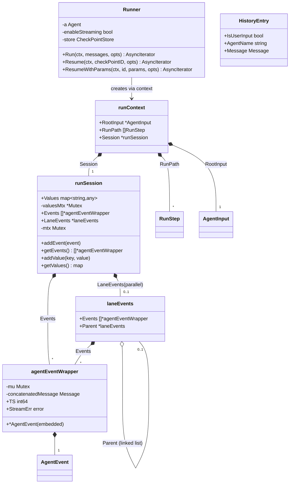
```mermaid
classDiagram
    class Runner {
        -a Agent
        -enableStreaming bool
        -store CheckPointStore
        +Run(ctx, messages, opts) AsyncIterator
        +Resume(ctx, checkPointID, opts) AsyncIterator
        +ResumeWithParams(ctx, id, params, opts) AsyncIterator
    }

    class runContext {
        +RootInput *AgentInput
        +RunPath []RunStep
        +Session *runSession
    }

    class runSession {
        +Values map~string,any~
        -valuesMtx *Mutex
        +Events []*agentEventWrapper
        +LaneEvents *laneEvents
        -mtx Mutex
        +addEvent(event)
        +getEvents() []*agentEventWrapper
        +addValue(key, value)
        +getValues() map
    }

    class laneEvents {
        +Events []*agentEventWrapper
        +Parent *laneEvents
    }

    class agentEventWrapper {
        +*AgentEvent (embedded)
        -mu Mutex
        -concatenatedMessage Message
        +TS int64
        +StreamErr error
    }

    class HistoryEntry {
        +IsUserInput bool
        +AgentName string
        +Message Message
    }

    Runner --> runContext : creates via context
    runContext *-- "1" runSession : Session
    runContext *-- "*" RunStep : RunPath
    runContext *-- "1" AgentInput : RootInput

    runSession *-- "*" agentEventWrapper : Events
    runSession *-- "0..1" laneEvents : LaneEvents(parallel)

    laneEvents *-- "*" agentEventWrapper : Events
    laneEvents o-- "0..1" laneEvents : Parent (linked list)

    agentEventWrapper *-- "1" AgentEvent
```

---

### 1.4 ReAct 循环与 ChatModelAgent 内部状态图

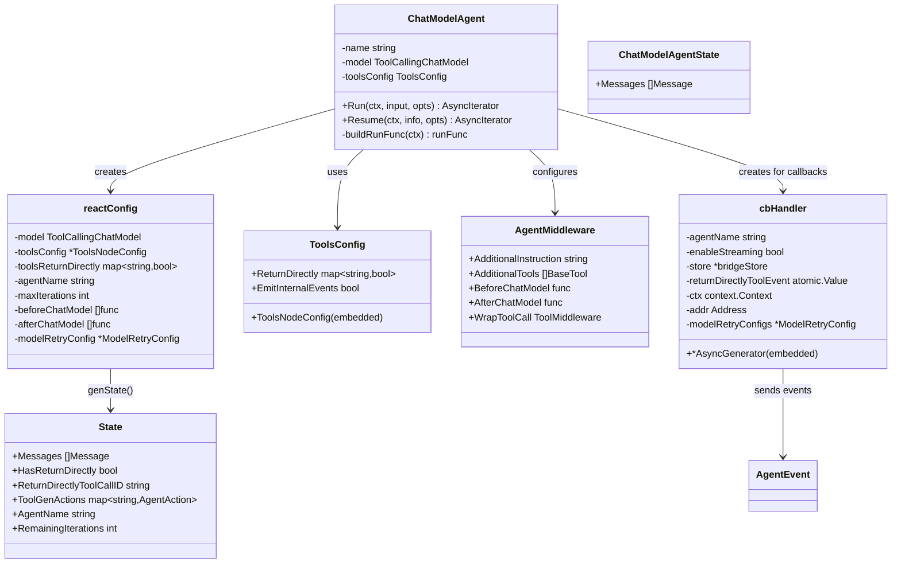
```mermaid
classDiagram
    class ChatModelAgent {
        -name string
        -model ToolCallingChatModel
        -toolsConfig ToolsConfig
        +Run(ctx, input, opts) AsyncIterator
        +Resume(ctx, info, opts) AsyncIterator
        -buildRunFunc(ctx) runFunc
    }

    class reactConfig {
        -model ToolCallingChatModel
        -toolsConfig *ToolsNodeConfig
        -toolsReturnDirectly map~string,bool~
        -agentName string
        -maxIterations int
        -beforeChatModel []func
        -afterChatModel []func
        -modelRetryConfig *ModelRetryConfig
    }

    class State {
        +Messages []Message
        +HasReturnDirectly bool
        +ReturnDirectlyToolCallID string
        +ToolGenActions map~string,AgentAction~
        +AgentName string
        +RemainingIterations int
    }

    class ChatModelAgentState {
        +Messages []Message
    }

    class ToolsConfig {
        +ToolsNodeConfig (embedded)
        +ReturnDirectly map~string,bool~
        +EmitInternalEvents bool
    }

    class AgentMiddleware {
        +AdditionalInstruction string
        +AdditionalTools []BaseTool
        +BeforeChatModel func
        +AfterChatModel func
        +WrapToolCall ToolMiddleware
    }

    class cbHandler {
        +*AsyncGenerator (embedded)
        -agentName string
        -enableStreaming bool
        -store *bridgeStore
        -returnDirectlyToolEvent atomic.Value
        -ctx context.Context
        -addr Address
        -modelRetryConfigs *ModelRetryConfig
    }

    ChatModelAgent --> reactConfig : creates
    ChatModelAgent --> ToolsConfig : uses
    ChatModelAgent --> AgentMiddleware : configures
    reactConfig --> State : genState()
    ChatModelAgent --> cbHandler : creates for callbacks
    cbHandler --> AgentEvent : sends events
```

---

### 1.5 中断与恢复（Interrupt/Resume）流程图

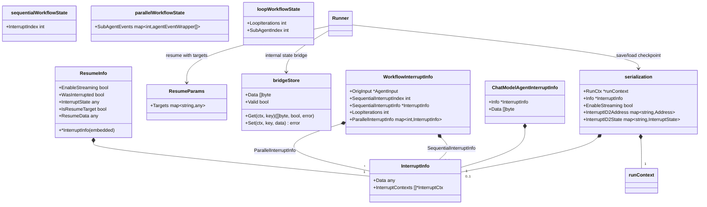
```mermaid
classDiagram
    class InterruptInfo {
        +Data any
        +InterruptContexts []*InterruptCtx
    }

    class ResumeInfo {
        +EnableStreaming bool
        +*InterruptInfo (embedded)
        +WasInterrupted bool
        +InterruptState any
        +IsResumeTarget bool
        +ResumeData any
    }

    class serialization {
        +RunCtx *runContext
        +Info *InterruptInfo
        +EnableStreaming bool
        +InterruptID2Address map~string,Address~
        +InterruptID2State map~string,InterruptState~
    }

    class bridgeStore {
        +Data []byte
        +Valid bool
        +Get(ctx, key) ([]byte, bool, error)
        +Set(ctx, key, data) error
    }

    class WorkflowInterruptInfo {
        +OrigInput *AgentInput
        +SequentialInterruptIndex int
        +SequentialInterruptInfo *InterruptInfo
        +LoopIterations int
        +ParallelInterruptInfo map~int,InterruptInfo~
    }

    class sequentialWorkflowState {
        +InterruptIndex int
    }

    class parallelWorkflowState {
        +SubAgentEvents map~int,agentEventWrapper[]~
    }

    class loopWorkflowState {
        +LoopIterations int
        +SubAgentIndex int
    }

    class ChatModelAgentInterruptInfo {
        +Info *InterruptInfo
        +Data []byte
    }

    class ResumeParams {
        +Targets map~string,any~
    }

    ResumeInfo *-- "1" InterruptInfo
    serialization *-- "1" runContext
    serialization *-- "0..1" InterruptInfo

    WorkflowInterruptInfo *-- "0..1" InterruptInfo : SequentialInterruptInfo
    WorkflowInterruptInfo *-- "*" InterruptInfo : ParallelInterruptInfo

    ChatModelAgentInterruptInfo *-- "1" InterruptInfo

    Runner --> serialization : save/load checkpoint
    Runner --> bridgeStore : internal state bridge
    Runner --> ResumeParams : resume with targets
```

---

### 1.6 异步通信与事件流转全景图

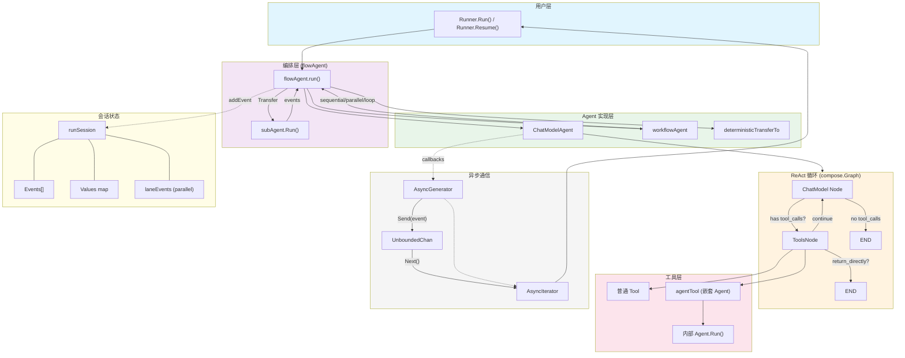
```mermaid
flowchart TB
    subgraph User["用户层"]
        RunnerRun["Runner.Run() / Runner.Resume()"]
    end

    subgraph FlowLayer["编排层 (flowAgent)"]
        FA["flowAgent.run()"]
        FA -->|"Transfer"| SubFA["subAgent.Run()"]
        SubFA -->|events| FA
    end

    subgraph AgentImpl["Agent 实现层"]
        CMA["ChatModelAgent"]
        WA["workflowAgent"]
        DT["deterministicTransferTo"]
    end

    subgraph ReactLoop["ReAct 循环 (compose.Graph)"]
        CM["ChatModel Node"]
        TN["ToolsNode"]
        CM -->|"has tool_calls?"| TN
        TN -->|"return_directly?"| END1["END"]
        TN -->|"continue"| CM
        CM -->|"no tool_calls"| END2["END"]
    end

    subgraph ToolLayer["工具层"]
        T1["普通 Tool"]
        AT["agentTool (嵌套 Agent)"]
        AT --> NestedAgent["内部 Agent.Run()"]
    end

    subgraph AsyncComm["异步通信"]
        GEN["AsyncGenerator"]
        ITER["AsyncIterator"]
        GEN -->|"Send(event)"| CH["UnboundedChan"]
        CH -->|"Next()"| ITER
    end

    subgraph SessionState["会话状态"]
        RS["runSession"]
        EV["Events[]"]
        VAL["Values map"]
        LE["laneEvents (parallel)"]
        RS --- EV
        RS --- VAL
        RS --- LE
    end

    RunnerRun --> FA
    FA --> CMA
    FA --> WA
    FA --> DT
    CMA --> ReactLoop
    TN --> T1
    TN --> AT
    CMA -.->|"callbacks"| GEN
    WA -->|"sequential/parallel/loop"| FA
    GEN -.-> ITER
    ITER --> RunnerRun
    FA -.->|"addEvent"| RS

    style User fill:#e1f5fe
    style FlowLayer fill:#f3e5f5
    style AgentImpl fill:#e8f5e9
    style ReactLoop fill:#fff3e0
    style ToolLayer fill:#fce4ec
    style AsyncComm fill:#f5f5f5
    style SessionState fill:#fffde7
```


## 2. 整体执行逻辑

### 2.1 全局执行流程总览

Eino ADK 的执行链路可以用一句话概括：**用户调用 → Runner 入口 → flowAgent 编排层 → 具体 Agent 实现层 → ReAct 循环 → 事件流回传**。整个过程是 **纯异步、流式、事件驱动** 的架构。

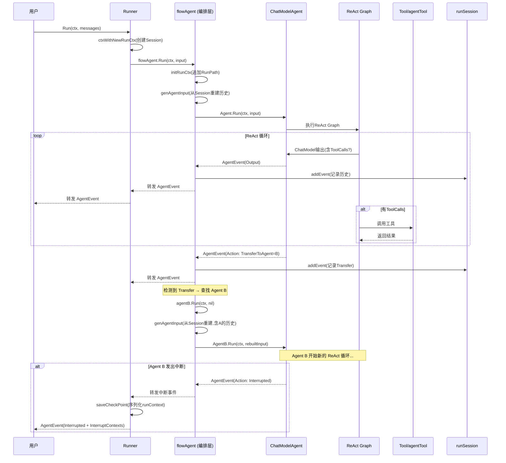
```mermaid
sequenceDiagram
    participant User as 用户
    participant Runner as Runner
    participant FA as flowAgent (编排层)
    participant CMA as ChatModelAgent
    participant React as ReAct Graph
    participant Tool as Tool/agentTool
    participant Session as runSession

    User->>Runner: Run(ctx, messages)
    Runner->>Runner: ctxWithNewRunCtx(创建Session)
    Runner->>FA: flowAgent.Run(ctx, input)
    
    FA->>FA: initRunCtx(追加RunPath)
    FA->>FA: genAgentInput(从Session重建历史)
    FA->>CMA: Agent.Run(ctx, input)
    
    CMA->>React: 执行ReAct Graph
    
    loop ReAct 循环
        React->>CMA: ChatModel输出(含ToolCalls?)
        CMA-->>FA: AgentEvent(Output)
        FA->>Session: addEvent(记录历史)
        FA-->>Runner: 转发 AgentEvent
        Runner-->>User: 转发 AgentEvent
        
        alt 有ToolCalls
            React->>Tool: 调用工具
            Tool-->>React: 返回结果
        end
    end
    
    CMA-->>FA: AgentEvent(Action: TransferToAgent=B)
    FA->>Session: addEvent(记录Transfer)
    FA-->>Runner: 转发 AgentEvent
    
    Note over FA: 检测到 Transfer → 查找 Agent B
    
    FA->>FA: agentB.Run(ctx, nil)
    FA->>FA: genAgentInput(从Session重建,含A的历史)
    FA->>CMA: AgentB.Run(ctx, rebuiltInput)
    
    Note over CMA,React: Agent B 开始新的 ReAct 循环...
    
    alt Agent B 发出中断
        CMA-->>FA: AgentEvent(Action: Interrupted)
        FA-->>Runner: 转发中断事件
        Runner->>Runner: saveCheckPoint(序列化runContext)
        Runner-->>User: AgentEvent(Interrupted + InterruptContexts)
    end
```


下面按调用顺序逐层剖析：
### 2.2 第一层：Runner — 用户态入口

`Runner` 是 ADK 暴露给用户的唯一入口，它的职责非常清晰：
#### 2.2.1 Run 方法（首次执行）

```
用户调用 Runner.Run(ctx, messages)
│
├─ 1. 将 Agent 包装为 flowAgent（toFlowAgent）
│     └─ 确保所有 Agent 都通过统一的 flowAgent 壳来编排
│
├─ 2. 构建 AgentInput（messages + enableStreaming）
│
├─ 3. 创建全新的 runContext（ctxWithNewRunCtx）
│     └─ 内含一个全新的 runSession（Events=[], Values={}）
│     └─ 将 RootInput 绑定到 context
│
├─ 4. 注入 SessionValues 到 context
│
├─ 5. 调用 flowAgent.Run()，获取 AsyncIterator<AgentEvent>
│
└─ 6. 如果有 CheckPointStore：
      ├─ 创建一个新的 AsyncIterator/Generator 对
      ├─ 启动 goroutine handleIter 做事件中转
      │   └─ 逐个转发事件，同时监听 Interrupt 信号
      │   └─ 一旦发现 Interrupt → 先 saveCheckPoint → 再转发给用户
      └─ 返回新的 iterator 给用户
```

**关键设计点**：

1. **Runner 是无状态的**：每次 `Run()` 都创建全新的 `runContext`，状态不在 Runner 上驻留。
2. **中断检查点的保存时机**：在 `handleIter` 中，当检测到 `event.Action.internalInterrupted != nil` 时，**先保存检查点，再发送事件给用户**。这保证了用户收到中断事件时，检查点已经持久化完成，可以立即 Resume。
3. **单中断断言**：Runner 级别的 `handleIter` 通过 `panic("multiple interrupt actions should not happen in Runner")` 断言最多只有一个中断事件。这是因为底层的 `CompositeInterrupt` 机制已经将所有嵌套中断合并为了一个。

> 问题1：AsyncIterator/Generator 是用来做什么的？如何实现的异步通信？

#### 2.2.2 Resume 方法（恢复执行）

```
用户调用 Runner.Resume(ctx, checkPointID) 或 Runner.ResumeWithParams(ctx, id, params)
│
├─ 1. 从 CheckPointStore 加载检查点
│     └─ loadCheckPoint → 反序列化出 runContext + ResumeInfo
│     └─ 恢复 Session 的完整历史事件和 Values
│
├─ 2. 如果有 resumeData（ResumeWithParams 传入的 Targets map）：
│     └─ 调用 core.BatchResumeWithData(ctx, resumeData)
│     └─ 将目标地址和恢复数据注入 context
│
├─ 3. 重新包装 flowAgent（toFlowAgent）
│
├─ 4. 调用 flowAgent.Resume(ctx, resumeInfo)
│
└─ 5. 同样通过 handleIter 做事件中转（处理可能的二次中断）
```

**关键设计点**：

- `Resume` 和 `ResumeWithParams` 的区别仅在于 `resumeData` 是否为空。`Resume` 是"隐式全部恢复"，`ResumeWithParams` 允许用户精确指定要恢复的中断点及其数据。


### 2.3 第二层：flowAgent — 编排调度核心

`flowAgent` 是整个多 Agent 协作的 **调度枢纽**。它不自己执行业务逻辑，而是负责：
#### 2.3.1 flowAgent.Run() — 启动执行

```go
func (a *flowAgent) Run(ctx, input, opts) *AsyncIterator {
    // 1. 初始化 runContext，将当前 agent 名称追加到 RunPath
    ctx, runCtx = initRunCtx(ctx, agentName, input)
    ctx = AppendAddressSegment(ctx, AddressSegmentAgent, agentName)
    
    // 2. 生成当前 agent 的输入（从 session 历史中重建 messages）
    input = a.genAgentInput(ctx, runCtx, skipTransferMessages)
    
    // 3. 特殊分支：workflowAgent 直接委托
    if wf, ok := a.Agent.(*workflowAgent); ok {
        return wf.Run(ctx, input, opts...)
    }
    
    // 4. 调用被包装 Agent 的 Run 方法
    aIter := a.Agent.Run(ctx, input, opts...)
    
    // 5. 启动 goroutine 进入事件处理循环 a.run()
    go a.run(ctx, runCtx, aIter, generator, opts...)
    
    return iterator
}
```

比较有意思的是`AppendAddressSegemnt` 这个函数 ，`AppendAddressSegment` 的核心作用是**在 context 中维护一条层级地址链（Address）**，用来唯一标识当前执行点在整个 Agent 嵌套结构中的位置。

**具体机制**

从 `internal/core/address.go` 的源码可以看出：

```
Address = []AddressSegment

AddressSegment {
    Type  AddressSegmentType   // "agent" 或 "tool"
    ID    string               // agent 名称或 tool 名称
    SubID string               // 可选，用于区分同名并行调用
}
```

每次调用 `AppendAddressSegment(ctx, "agent", "AgentA")`，就会：

1. **从 context 取出当前 Address**（如 `[]`）
2. **追加一个新段**（变成 `[agent:AgentA]`）
3. **查找恢复信息**：如果当前处于 Resume 流程，检查 `globalResumeInfo` 中是否有与新地址匹配的中断状态（`interruptState`）和恢复数据（`resumeData`），如果有就绑定到新 context 上
4. **返回新 context**

**为什么需要它？**

Address 解决的是 **"在嵌套执行中，精确定位某个组件"** 的问题。假设有如下嵌套：

```
Runner
  └─ flowAgent("Orchestrator")           Address: [agent:Orchestrator]
       └─ ChatModelAgent("Planner")      Address: [agent:Orchestrator; agent:Planner]
            └─ agentTool("WebSearch")    Address: [agent:Orchestrator; agent:Planner; tool:WebSearch]
                 └─ Agent("Searcher")    Address: [agent:Orchestrator; agent:Planner; tool:WebSearch; agent:Searcher]
```

Address 有两个核心用途：
- **中断时**：记录每个中断点的精确地址，存入检查点
- **恢复时**：根据地址找到对应的中断状态和用户提供的恢复数据，精确投递到正确的组件

> **一句话总结**：`AppendAddressSegment` 是 ADK 中断/恢复机制的寻址基础设施，它在执行树中为每个组件建立唯一坐标。

另外一个问题是`为什么当前 agent 的输入要从 session 历史中重建？` 应该有三个原因：

**原因一：Transfer 场景下，目标 Agent 需要看到完整上下文**

```
Agent A 执行 → 输出消息 M1 → Transfer to Agent B
```

此时 Agent B 需要知道：
- 用户原始输入
- Agent A 说了什么（M1）
- 为什么被 Transfer 过来

如果直接传参数，调用方需要知道目标 Agent 需要什么格式的输入——这违反了 Agent 的封装性。

**实际代码中**，Transfer 时传入的 input 就是 `nil`：

```go
// flow.go line 438
subAIter := agentToRun.Run(ctx, nil /*subagents get input from runCtx*/, opts...)
```

Agent 自己通过 `genAgentInput` 从 session 历史中重建输入。

**原因二：不同 Agent 看同一段历史的"视角"不同**

`genAgentInput` 中有一个 `historyRewriter` 机制：

```go
// 默认的 historyRewriter
func buildDefaultHistoryRewriter(agentName string) HistoryRewriter {
    return func(ctx context.Context, entries []*HistoryEntry) ([]Message, error) {
        for _, entry := range entries {
            if !entry.IsUserInput {
                msg = genMsg(entry, agentName)  // ← 关键：改写其他 Agent 的消息
            }
        }
    }
}
```

改写规则是：**如果一条消息不是自己产生的，就转换为 User 角色的上下文消息**：

```
// Agent A 的 Assistant 消息 "Hello"
// 在 Agent B 看来变成：
"For context: [AgentA] said: Hello."
```

这解决了一个关键问题：**LLM 只能理解 `user/assistant/tool` 角色，不能理解"另一个 Agent 的 assistant 消息"。** 通过改写，让每个 Agent 都觉得自己是唯一的 assistant。

**原因三：Resume 后恢复上下文**

中断恢复时，`runSession.Events` 被序列化到检查点中。Resume 时反序列化恢复 session，Agent 通过 `genAgentInput` 就能自动获得中断前的完整对话历史，无需额外处理。

> **一句话总结**：Session 历史是多 Agent 之间的 **共享记忆**，每个 Agent 通过 `genAgentInput + historyRewriter` 从中构建属于自己视角的输入，实现了解耦、持久化和上下文传递的三重目标。

#### 2.3.2 flowAgent.run() — 事件处理与 Transfer 循环

这是整个 ADK 最关键的函数之一，它实现了 **Agent 间转移（Transfer）** 的核心循环：

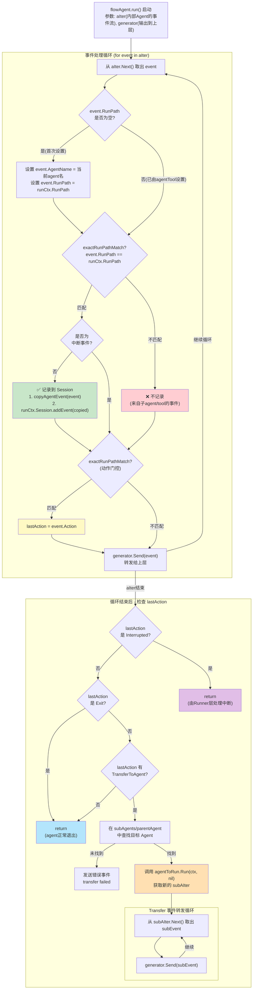
```mermaid
flowchart TB
    START["flowAgent.run() 启动<br/>参数: aIter(内部Agent的事件流), generator(输出到上层)"]

    subgraph EventLoop["事件处理循环 (for event in aIter)"]
        RECV["从 aIter.Next() 取出 event"]

        CHECK_PATH{"event.RunPath<br/>是否为空?"}
        SET_PATH["设置 event.AgentName = 当前agent名<br/>设置 event.RunPath = runCtx.RunPath"]

        CHECK_MATCH{"exactRunPathMatch?<br/>event.RunPath == runCtx.RunPath"}

        IS_INTERRUPT{"是否为<br/>中断事件?"}

        RECORD["✅ 记录到 Session<br/>1. copyAgentEvent(event)<br/>2. runCtx.Session.addEvent(copied)"]

        SKIP_RECORD["❌ 不记录<br/>(来自子agent/tool的事件)"]

        CHECK_ACTION_MATCH{"exactRunPathMatch?<br/>(动作门控)"}
        SAVE_ACTION["lastAction = event.Action"]

        FORWARD["generator.Send(event)<br/>转发给上层"]
    end

    subgraph PostLoop["循环结束后 - 检查 lastAction"]
        CHECK_INTERRUPT{"lastAction<br/>是 Interrupted?"}
        CHECK_EXIT{"lastAction<br/>是 Exit?"}
        CHECK_TRANSFER{"lastAction 有<br/>TransferToAgent?"}

        RETURN_INT["return<br/>(由Runner层处理中断)"]
        RETURN_EXIT["return<br/>(agent正常退出)"]

        FIND_AGENT["在 subAgents/parentAgent<br/>中查找目标 Agent"]
        NOT_FOUND["发送错误事件<br/>transfer failed"]
        RUN_SUB["调用 agentToRun.Run(ctx, nil)<br/>获取新的 subAIter"]

        subgraph TransferLoop["Transfer 事件转发循环"]
            RECV_SUB["从 subAIter.Next() 取出 subEvent"]
            FWD_SUB["generator.Send(subEvent)"]
        end
    end

    START --> RECV
    RECV --> CHECK_PATH
    CHECK_PATH -->|"是(首次设置)"| SET_PATH --> CHECK_MATCH
    CHECK_PATH -->|"否(已由agentTool设置)"| CHECK_MATCH

    CHECK_MATCH -->|"匹配"| IS_INTERRUPT
    IS_INTERRUPT -->|"否"| RECORD --> CHECK_ACTION_MATCH
    IS_INTERRUPT -->|"是"| CHECK_ACTION_MATCH

    CHECK_MATCH -->|"不匹配"| SKIP_RECORD --> CHECK_ACTION_MATCH

    CHECK_ACTION_MATCH -->|"匹配"| SAVE_ACTION --> FORWARD
    CHECK_ACTION_MATCH -->|"不匹配"| FORWARD

    FORWARD -->|"继续循环"| RECV
    FORWARD -->|"aIter结束"| CHECK_INTERRUPT

    CHECK_INTERRUPT -->|"是"| RETURN_INT
    CHECK_INTERRUPT -->|"否"| CHECK_EXIT
    CHECK_EXIT -->|"是"| RETURN_EXIT
    CHECK_EXIT -->|"否"| CHECK_TRANSFER
    CHECK_TRANSFER -->|"否"| RETURN_EXIT
    CHECK_TRANSFER -->|"是"| FIND_AGENT
    FIND_AGENT -->|"未找到"| NOT_FOUND
    FIND_AGENT -->|"找到"| RUN_SUB

    RUN_SUB --> RECV_SUB
    RECV_SUB --> FWD_SUB
    FWD_SUB -->|"继续"| RECV_SUB

    style RECORD fill:#c8e6c9
    style SKIP_RECORD fill:#ffcdd2
    style SAVE_ACTION fill:#fff9c4
    style RETURN_INT fill:#e1bee7
    style RETURN_EXIT fill:#b3e5fc
    style RUN_SUB fill:#ffe0b2
```


**阶段一：事件处理循环**

`flowAgent.run()` 的输入是一个 `aIter`——由被包装的 Agent（如 ChatModelAgent）产出的事件迭代器。循环逐个处理每个事件：

| 步骤 | 代码关键行 | 作用 |
|------|-----------|------|
| **① 设置 RunPath** | `if len(event.RunPath) == 0` (L389) | 如果事件还没有 RunPath（说明是当前 Agent 直接产出的），就打上当前 agent 的 RunPath 标记。如果已经有 RunPath（说明来自嵌套的 agentTool），则不覆盖。 |
| **② 事件记录** | `exactRunPathMatch && 非中断` (L395) | **只记录属于自己层级的事件**。子 Agent 或 tool 内部的事件虽然也会流经这里，但因为 RunPath 不匹配，不会被记录到 session。这就是 RunPath 隔离机制。 |
| **③ 动作门控** | `exactRunPathMatch` (L408) | 同理，只有自己层级的 Action 才会影响控制流（exit/transfer/interrupt）。子 agent 的 transfer 不会被父 flowAgent 错误处理。 |
| **④ 转发** | `generator.Send(event)` (L411) | 无论是否记录，所有事件都会被转发给上层。 |

**阶段二：循环结束后的决策**

```
lastAction 判断优先级：
  1. Interrupted → 直接 return（中断信号向上冒泡）
  2. Exit        → 直接 return（agent 明确表示"我完成了"）
  3. Transfer    → 查找目标 Agent，启动新的执行循环
  4. 无 Action   → 正常结束
```

**阶段三：Transfer 执行**

当检测到 `TransferToAgent` 动作时：
1. 在 `subAgents` 和 `parentAgent` 中查找目标 Agent（只能 transfer 到兄弟或父 Agent）
2. 调用 `agentToRun.Run(ctx, nil)`——input 传 nil，目标 Agent 会从 session 重建输入
3. 将目标 Agent 的所有事件转发给 generator
4. **如果目标 Agent 又 Transfer 了**：由于 `agentToRun.Run()` 内部又会进入一个新的 `flowAgent.run()`，Transfer 链会自然递归下去

> **一句话总结**：`flowAgent.run()` 是一个 **"事件中继站 + Transfer 调度器"**——它过滤、记录属于自己层级的事件，同时在 Agent 之间实现 Transfer 的链式跳转。

**关键设计点**：
1. **RunPath 精确匹配（exactRunPathMatch）**：这是一个精妙的设计。一个 flowAgent 只记录 **直接属于自己层级** 的事件，不记录子 agent 或 agentTool 内部产生的事件。这通过比较 `runCtx.RunPath`（当前层的路径）与 `event.RunPath`（事件携带的路径）是否完全一致来判断。
2. **输入重建（genAgentInput）**：每次 Agent 执行时，不是直接传入用户消息，而是从 `runSession.Events` 中重建完整对话历史。这使得被 Transfer 到的目标 Agent 能看到之前所有 Agent 的输出。`historyRewriter` 则负责将其他 Agent 的消息改写为当前 Agent 能理解的格式（如把 Assistant 消息转为 "For context: [AgentX] said: ..."）。
3. **Transfer 是同步递归的**：当 Agent A transfer 到 Agent B 时，flowAgent.run 不是重新调度，而是在同一个 goroutine 内直接调用 `agentToRun.Run()` 并转发事件。如果 Agent B 又 transfer 到 Agent C，会递归进入 Agent C 的 flowAgent.Run()。
#### 2.3.3 flowAgent.Resume() — 恢复逻辑

```
flowAgent.Resume(ctx, info)
│
├─ buildResumeInfo → 构建当前 agent 的恢复信息
│
├─ 如果 info.WasInterrupted == true（当前 agent 就是中断点）：
│   ├─ 检查 Agent 是否实现 ResumableAgent 接口
│   └─ 调用 ra.Resume(ctx, info)，然后进入 a.run() 事件循环
│
├─ 如果 info.WasInterrupted == false（中断点在子 agent 中）：
│   ├─ getNextResumeAgent → 从 ResumeInfo 中解析出下一个要恢复的 agent 名
│   ├─ a.getAgent(ctx, name) → 在 subAgents/parentAgent 中查找
│   └─ 递归调用 subAgent.Resume(ctx, info)
│
└─ 如果找不到且自身没有 subAgents 但实现了 ResumableAgent：
    └─ 直接委托给内部 Agent 的 Resume（处理多层包装的情况）
```

### 2.4 具体 Agent 实现

#### 2.4.1 ChatModelAgent — ReAct 循环

```
ChatModelAgent.Run(ctx, input)
│
├─ buildRunFunc(ctx) → 懒初始化，构建 compose.Graph（ReAct 图）
│   └─ 图结构：ChatModel → ToolsNode → [continue/end]
│
├─ 创建 AsyncIterator/Generator 对
│
└─ goroutine:
    └─ run(ctx, input, generator, bridgeStore, composeOptions...)
        └─ 执行编译后的 compose.Graph
        └─ 通过 callback handler（cbHandler）将中间事件 Send 给 generator
```

#### 2.4.2 workflowAgent — 工作流编排

workflowAgent 支持三种模式：`Sequential`、`Parallel`、`Loop`，它直接调度多个 flowAgent 的执行，而不是通过 Transfer 机制。

##### runSequential — 顺序执行

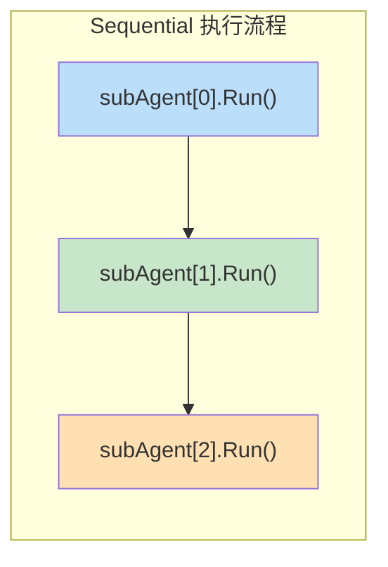
```mermaid
flowchart LR
    subgraph Sequential["Sequential 执行流程"]
        A1["subAgent[0].Run()"] --> A2["subAgent[1].Run()"] --> A3["subAgent[2].Run()"]
    end

    style A1 fill:#bbdefb
    style A2 fill:#c8e6c9
    style A3 fill:#ffe0b2
```

**实现要点**（`workflow.go` L159-256）：

```
for i = startIdx; i < len(subAgents); i++ {
    if resuming && i == startIdx:
        subIterator = subAgent.Resume(ctx, resumeInfo)    // 恢复执行
    else:
        subIterator = subAgent.Run(ctx, nil)              // 正常执行

    seqCtx = updateRunPathOnly(seqCtx, subAgent.Name())   // 累积 RunPath

    for event in subIterator:
        缓存最后一个 Action 事件（lastActionEvent）
        非 Action 事件直接转发

    if lastActionEvent:
        if Interrupted → CompositeInterrupt(state={InterruptIndex: i}) → return
        if Exit → 转发并 return
        else → 转发并继续下一个 subAgent
}
```

**关键设计**：
- 使用 `updateRunPathOnly` 而非 `AppendAddressSegment` 来追踪路径。原因是顺序执行的各个子 Agent 是**平级关系**，不应该嵌套 Address，只需要在 RunPath 中记录执行历史
- 中断时保存 `sequentialWorkflowState{InterruptIndex: i}`——记住执行到了第几个子 Agent
- 恢复时直接从 `startIdx` 开始，跳过已完成的子 Agent

##### runLoop — 循环执行

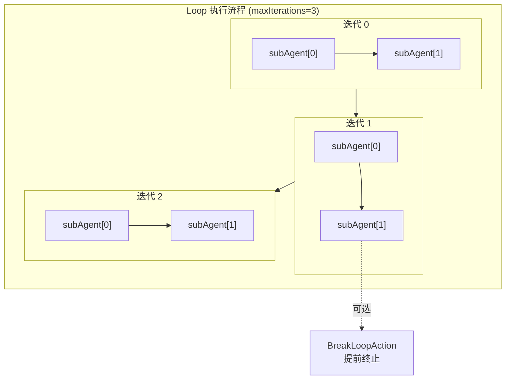
```mermaid
flowchart TB
    subgraph Loop["Loop 执行流程 (maxIterations=3)"]
        subgraph Iter0["迭代 0"]
            L0A["subAgent[0]"] --> L0B["subAgent[1]"]
        end
        subgraph Iter1["迭代 1"]
            L1A["subAgent[0]"] --> L1B["subAgent[1]"]
        end
        subgraph Iter2["迭代 2"]
            L2A["subAgent[0]"] --> L2B["subAgent[1]"]
        end
        Iter0 --> Iter1 --> Iter2
    end

    BREAK["BreakLoopAction<br/>提前终止"]
    L1B -.->|"可选"| BREAK
```

**实现要点**（`workflow.go` L297-409）：

```
for i = startIter; i < maxIterations; i++ {      // 外层：迭代轮次
    for j = startIdx; j < len(subAgents); j++ {   // 内层：顺序执行子Agent
        if resuming:
            subIterator = subAgent.Resume(...)
        else:
            subIterator = subAgent.Run(...)

        loopCtx = updateRunPathOnly(loopCtx, subAgent.Name())

        // 事件处理同 Sequential ...

        if lastActionEvent:
            if Interrupted → CompositeInterrupt(state={LoopIterations:i, SubAgentIndex:j}) → return
            if Exit → return
            if BreakLoop → doBreakLoopIfNeeded() → 标记 Done, 记录当前迭代数 → return
    }
    startIdx = 0  // 下一轮从第一个子Agent开始
}
```

**关键设计**：
- Loop = Sequential 的外层再套一个迭代循环
- 支持 `BreakLoopAction`：子 Agent 可以主动发出 BreakLoop 动作来提前终止循环
- `doBreakLoopIfNeeded` 会标记 `Done=true`，防止外层 Loop 再次处理已消费的 BreakLoop
- 中断状态保存 `loopWorkflowState{LoopIterations, SubAgentIndex}`——记住在第几轮的第几个子Agent中断

##### runParallel — 并行执行

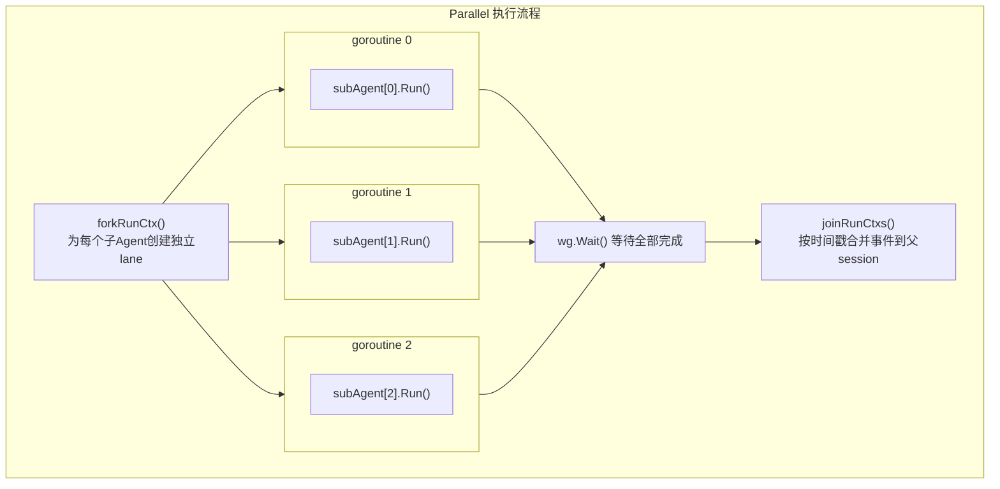
```mermaid
flowchart TB
    subgraph Parallel["Parallel 执行流程"]
        FORK["forkRunCtx()<br/>为每个子Agent创建独立lane"]

        subgraph G0["goroutine 0"]
            P0["subAgent[0].Run()"]
        end
        subgraph G1["goroutine 1"]
            P1["subAgent[1].Run()"]
        end
        subgraph G2["goroutine 2"]
            P2["subAgent[2].Run()"]
        end

        FORK --> G0 & G1 & G2

        JOIN["wg.Wait() 等待全部完成"]
        G0 & G1 & G2 --> JOIN

        MERGE["joinRunCtxs()<br/>按时间戳合并事件到父session"]
        JOIN --> MERGE
    end
```

**实现要点**（`workflow.go` L411-535）：

```
// 1. 为每个子 Agent fork 独立的运行上下文
for i := range subAgents {
    childContexts[i] = forkRunCtx(ctx)   // 创建独立的 laneEvents
}

// 2. 并发启动所有子 Agent
for i := range subAgents {
    go func(idx, agent) {
        if resuming && agent需要恢复:
            iterator = agent.Resume(childContexts[idx], resumeInfo)
        else if resuming && agent已完成:
            return  // 跳过已完成的分支
        else:
            iterator = agent.Run(childContexts[idx], nil)

        for event in iterator:
            if Interrupted:
                收集 subInterruptSignals
                break
            generator.Send(event)  // 实时转发（跨goroutine安全）
    }(i, subAgents[i])
}

// 3. 等待所有 goroutine 完成
wg.Wait()

// 4. 合并结果
if 无中断:
    joinRunCtxs(ctx, childContexts...)  // 按时间戳排序合并各lane的事件
else:
    CompositeInterrupt(state={SubAgentEvents: 各lane的事件快照})
```

**关键设计**：

| 机制 | 作用 |
|------|------|
| **`forkRunCtx`** | 为每个并行分支创建独立的 `laneEvents`，共享父 session 的 Values 但事件独立记录 |
| **`joinRunCtxs`** | 所有分支完成后，将各 lane 的事件按时间戳（`TS`）排序合并回父 session |
| **事件实时转发** | `generator.Send(event)` 跨 goroutine 调用，用户可以实时看到所有分支的事件 |
| **部分中断** | 如果某些分支中断、某些分支完成，中断状态中会保存每个分支的 `laneEvents` 快照，Resume 时只恢复未完成的分支 |

---

##### 三种模式的对比总结

| 维度 | Sequential | Loop | Parallel |
|------|-----------|------|----------|
| **执行方式** | 按顺序逐个执行 | 按顺序循环执行 | 并发同时执行 |
| **中断状态** | `{InterruptIndex}` | `{LoopIterations, SubAgentIndex}` | `{SubAgentEvents}` |
| **Session 管理** | 共享同一 session | 共享同一 session | fork 独立 lane，完成后 join |
| **提前终止** | Exit | Exit / BreakLoop | 不支持 |
| **事件转发** | 同步转发 | 同步转发 | 跨 goroutine 实时转发 |

#### 2.4.3 agent 数据结构之间的关系

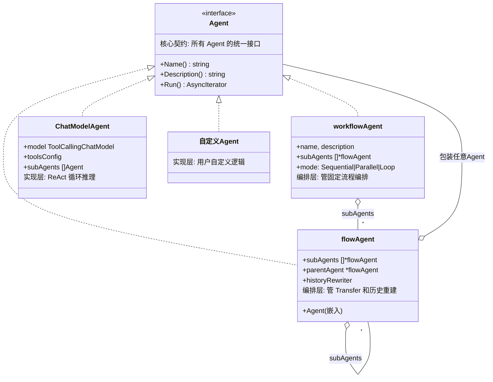
```mermaid
classDiagram
    class Agent {
        <<interface>>
        +Name() string
        +Description() string
        +Run() AsyncIterator
        核心契约: 所有 Agent 的统一接口
    }

    class flowAgent {
        +Agent (嵌入)
        +subAgents []*flowAgent
        +parentAgent *flowAgent
        +historyRewriter
        编排层: 管 Transfer 和历史重建
    }

    class workflowAgent {
        +name, description
        +subAgents []*flowAgent
        +mode: Sequential|Parallel|Loop
        编排层: 管固定流程编排
    }

    class ChatModelAgent {
        +model ToolCallingChatModel
        +toolsConfig
        +subAgents []Agent
        实现层: ReAct 循环推理
    }

    class 自定义Agent {
        实现层: 用户自定义逻辑
    }

    Agent <|.. flowAgent
    Agent <|.. workflowAgent
    Agent <|.. ChatModelAgent
    Agent <|.. 自定义Agent

    flowAgent o-- Agent : 包装任意Agent
    flowAgent o-- "*" flowAgent : subAgents
    workflowAgent o-- "*" flowAgent : subAgents
```

**各层角色对比**

| 层次 | 角色 | 职责 | 类比 |
|------|------|------|------|
| **`Agent` 接口** | 契约 | 定义统一的 `Run/Name/Description` 接口 | Java 的 Interface |
| **`flowAgent`** | **编排壳** | ① 管理父子关系树 ② 处理 Transfer 跳转 ③ 历史重建 ④ 事件过滤记录 | 进程调度器 |
| **`workflowAgent`** | **编排壳** | 固定模式编排（Sequential/Parallel/Loop），不支持 Transfer | DAG 编排器 |
| **`ChatModelAgent`** | **执行器** | 实际执行 LLM ReAct 循环（调模型、调工具） | 工作线程 |
| **自定义 Agent** | **执行器** | 用户自定义业务逻辑 | 工作线程 |

`flowAgent` **不是继承关系，而是装饰器/包装器模式**：

```
用户创建:  ChatModelAgent("Planner")
                  ↓
SetSubAgents:  flowAgent {
                   Agent: ChatModelAgent("Planner"),    ← 被包装
                   subAgents: [
                       flowAgent { Agent: ChatModelAgent("Coder") },
                       flowAgent { Agent: ChatModelAgent("Reviewer") },
                   ],
                   parentAgent: nil
               }
                  ↓
Runner.Run:   toFlowAgent() 确保最外层也是 flowAgent
```

每个参与多 Agent 协作的 Agent 都会被 `toFlowAgent()` 包一层 `flowAgent` 壳。`flowAgent` 给任意 Agent 添加了"编排能力"（Transfer、历史管理、事件过滤），而 Agent 本身只关心自己的业务逻辑。

workflowAgent vs flowAgent 的区别：

| 维度 | flowAgent | workflowAgent |
|------|-----------|--------------|
| **调度方式** | 动态 Transfer（由 LLM 决定跳到哪个 Agent） | 静态编排（Sequential/Parallel/Loop 固定流程） |
| **子 Agent 关系** | 平级兄弟 + 父子双向 Transfer | 按模式编排，不允许 Transfer（`WithDisallowTransferToParent`） |
| **事件处理** | 通过 `flowAgent.run()` 做事件中继 | 自己直接管理事件循环 |
| **Resume** | 根据 Address 向下递归查找中断点 | 根据 state 类型恢复到对应模式 |

### 2.5 核心设计原则总结

| 原则              | 体现                                                         |
| --------------- | ---------------------------------------------------------- |
| **关注点分离**       | Runner 管检查点，flowAgent 管编排，ChatModelAgent 管推理               |
| **异步流式**        | 全链路 `AsyncIterator/Generator` 对，goroutine 驱动               |
| **历史即状态**       | Session.Events 是唯一的对话状态源，每次执行都从中重建输入                       |
| **RunPath 隔离**  | 通过精确路径匹配，确保各层只记录自己产出的事件                                    |
| **Transfer 语义** | Agent 间转移不是远程调用，而是在同一个 goroutine 栈中的同步递归                   |
| **检查点优先**       | Runner 在转发中断事件给用户前，先完成检查点持久化                               |
| **输入重建**        | 每个 Agent 不接受上游的直接传参，而是通过 `genAgentInput` 从全局历史中自行构建带上下文的输入 |

## 3. ChatModelAgent 的 ReAct 循环实现原理

ChatModelAgent 的核心是一个**基于 compose.Graph 构建的 ReAct（Reasoning + Acting）循环**。整个实现分为三个层面：

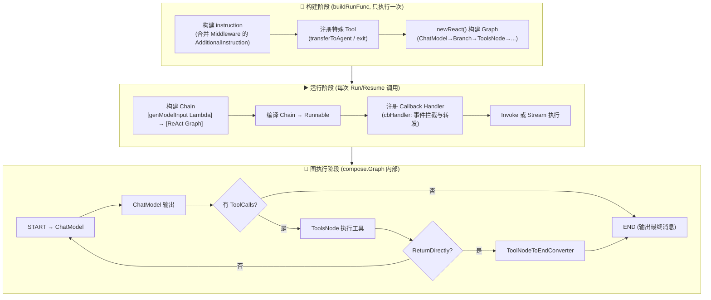
```mermaid
flowchart TB
    subgraph BuildPhase["🔧 构建阶段 (buildRunFunc, 只执行一次)"]
        B1["构建 instruction<br/>(合并 Middleware 的 AdditionalInstruction)"]
        B2["注册特殊 Tool<br/>(transferToAgent / exit)"]
        B3["newReact() 构建 Graph<br/>(ChatModel→Branch→ToolsNode→...)"]
        B1 --> B2 --> B3
    end

    subgraph RunPhase["▶️ 运行阶段 (每次 Run/Resume 调用)"]
        R1["构建 Chain<br/>[genModelInput Lambda] → [ReAct Graph]"]
        R2["编译 Chain → Runnable"]
        R3["注册 Callback Handler<br/>(cbHandler: 事件拦截与转发)"]
        R4["Invoke 或 Stream 执行"]
        R1 --> R2 --> R3 --> R4
    end

    subgraph GraphExec["🔄 图执行阶段 (compose.Graph 内部)"]
        G1["START → ChatModel"]
        G2["ChatModel 输出"]
        G3{"有 ToolCalls?"}
        G4["ToolsNode 执行工具"]
        G5{"ReturnDirectly?"}
        G6["END (输出最终消息)"]
        G7["ToolNodeToEndConverter"]

        G1 --> G2 --> G3
        G3 -->|"否"| G6
        G3 -->|"是"| G4 --> G5
        G5 -->|"否"| G1
        G5 -->|"是"| G7 --> G6
    end

    BuildPhase --> RunPhase --> GraphExec
```


### 3.1 构建阶段：buildRunFunc 深度剖析

`buildRunFunc` 通过 `sync.Once` 确保只构建一次，之后通过 `atomic.StoreUint32(&a.frozen, 1)` 冻结 Agent 配置。

#### 3.1.1 两条构建路径

```go
func (a *ChatModelAgent) buildRunFunc(ctx context.Context) runFunc {
    a.once.Do(func() {
        // ... 准备 instruction、tools ...
        
        if len(toolsNodeConf.Tools) == 0 {
            // 路径A：无工具模式 → 简单 Chain
            a.run = func(...) {
                chain := Chain[AgentInput, Message]()
                    .AppendLambda(genModelInput)
                    .AppendChatModel(chatModel)
                    .Compile()
                // 直接 Invoke/Stream
            }
        } else {
            // 路径B：有工具模式 → ReAct Graph
            g, _ := newReact(ctx, conf)
            a.run = func(...) {
                chain := Chain[AgentInput, Message]()
                    .AppendLambda(genModelInput)
                    .AppendGraph(g, name="ReAct")
                    .Compile()
                // Invoke/Stream + Callback 事件拦截
            }
        }
    })
}
```

| 路径 | 条件 | 结构 | 特点 |
|------|------|------|------|
| **路径A（无工具）** | `tools == 0` | `Chain: Lambda → ChatModel` | 简单的单次调用，无循环 |
| **路径B（有工具）** | `tools > 0` | `Chain: Lambda → Graph(ReAct循环)` | 完整的 ReAct 循环 |

#### 3.1.2 特殊 Tool 的自动注入

在构建阶段，ChatModelAgent 会自动注入两种特殊工具：

```go
// 1. transfer_to_agent 工具（当有子 Agent 或父 Agent 时）
if len(transferToAgents) > 0 {
    // 生成指令：告诉 LLM 可以转移到哪些 Agent
    instruction = concatInstructions(instruction, transferInstruction)
    // 注入 transferToAgent tool
    toolsNodeConf.Tools = append(toolsNodeConf.Tools, &transferToAgent{})
    returnDirectly[TransferToAgentToolName] = true  // ← transfer 后立即返回
}

// 2. exit 工具（当配置了 Exit 时）
if a.exit != nil {
    toolsNodeConf.Tools = append(toolsNodeConf.Tools, a.exit)
    returnDirectly[exitInfo.Name] = true  // ← exit 后立即返回
}
```

Transfer Agent 的提示词附加在系统提示词后面，内容为：
```
Available other agents:

- Agent name: planner
  Agent description: a agent planner
- Agent name: web search
  Agent description: search something  
  
Decision rule:  
- If you're best suited for the question according to your description: ANSWER  
- If another agent is better according its description: CALL 'transfer_to_agent' function with their agent name  
  
When transferring: OUTPUT ONLY THE FUNCTION CALL
```

这两个工具的 `InvokableRun` 实现都通过 `SendToolGenAction` 将 Action 写入 `State.ToolGenActions`：

```go
// transferToAgent.InvokableRun
func (tta transferToAgent) InvokableRun(ctx, args) (string, error) {
    params := parse(args)  // {"agent_name": "Coder"}
    SendToolGenAction(ctx, "transfer_to_agent", NewTransferToAgentAction(params.AgentName))
    return "successfully transferred to agent [Coder]", nil
}

// ExitTool.InvokableRun  
func (et ExitTool) InvokableRun(ctx, args) (string, error) {
    params := parse(args)  // {"final_result": "..."}
    SendToolGenAction(ctx, "exit", NewExitAction())
    return params.FinalResult, nil
}
```

### 3.2 ReAct Graph 的构建（newReact）

这是整个 ReAct 循环的核心图结构：

#### 3.2.1 图的节点与边

```go
func newReact(ctx context.Context, config *reactConfig) (reactGraph, error) {
    g := compose.NewGraph[[]Message, Message](
        compose.WithGenLocalState(genState),  // 关联 State
    )
    
    // 节点1: ChatModel
    g.AddChatModelNode("ChatModel", chatModel,
        WithStatePreHandler(modelPreHandle),
        WithStatePostHandler(modelPostHandle))
    
    // 节点2: ToolsNode
    g.AddToolsNode("ToolNode", toolsNode,
        WithStatePreHandler(toolPreHandle))
    
    // 边: START → ChatModel
    g.AddEdge(START, "ChatModel")
    
    // 条件分支: ChatModel → {END | ToolNode}
    branch := NewStreamGraphBranch(toolCallCheck, {END, "ToolNode"})
    g.AddBranch("ChatModel", branch)
    
    // 回边 or ReturnDirectly 分支
    if 无 ReturnDirectly:
        g.AddEdge("ToolNode", "ChatModel")      // 简单回边
    else:
        // ToolNode → {ChatModel | ToolNodeToEndConverter → END}
        g.AddBranch("ToolNode", checkReturnDirect)
}
```

#### 3.2.2 图结构可视化

**无 ReturnDirectly 的情况（简单循环）：**

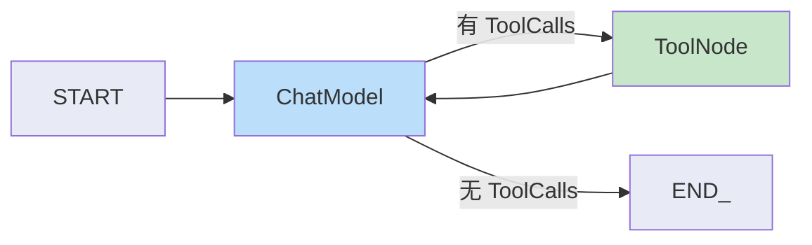
```mermaid
graph LR
    START --> ChatModel
    ChatModel -->|"有 ToolCalls"| ToolNode
    ChatModel -->|"无 ToolCalls"| END_
    ToolNode --> ChatModel

    style START fill:#e8eaf6
    style END_ fill:#e8eaf6
    style ChatModel fill:#bbdefb
    style ToolNode fill:#c8e6c9
```

**有 ReturnDirectly 的情况（含 transfer/exit）：**

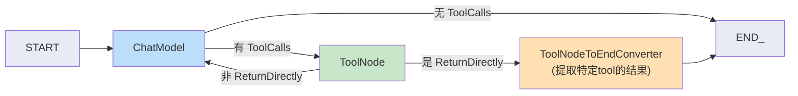
```mermaid
graph LR
    START --> ChatModel
    ChatModel -->|"有 ToolCalls"| ToolNode
    ChatModel -->|"无 ToolCalls"| END_

    ToolNode -->|"非 ReturnDirectly"| ChatModel
    ToolNode -->|"是 ReturnDirectly"| Converter["ToolNodeToEndConverter<br/>(提取特定tool的结果)"]
    Converter --> END_

    style START fill:#e8eaf6
    style END_ fill:#e8eaf6
    style ChatModel fill:#bbdefb
    style ToolNode fill:#c8e6c9
    style Converter fill:#ffe0b2
```

#### 3.2.3 State 驱动的循环控制

`State` 是贯穿整个 ReAct 循环的 **可变共享状态**：

```go
type State struct {
    Messages             []Message                    // 累积的消息历史
    HasReturnDirectly    bool                         // 是否触发了 ReturnDirectly
    ReturnDirectlyToolCallID string                   // 哪个 tool call 触发的
    ToolGenActions       map[string]*AgentAction       // 工具产生的 Action
    AgentName            string                        // 当前 Agent 名称
    RemainingIterations  int                           // 剩余迭代次数
}
```

**State 在各节点间的流转**：

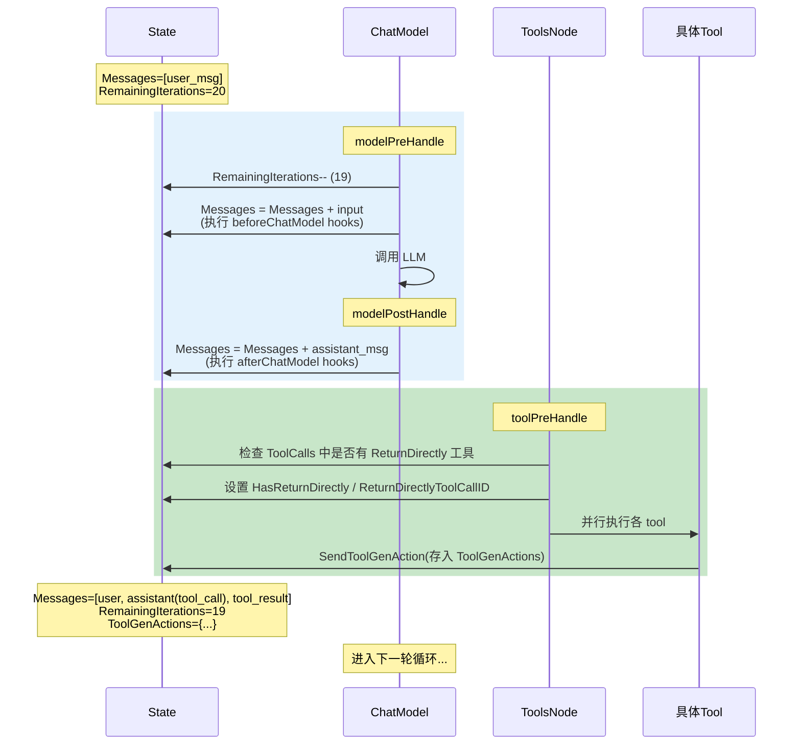
```mermaid
sequenceDiagram
    participant S as State
    participant CM as ChatModel
    participant TN as ToolsNode
    participant Tool as 具体Tool

    Note over S: Messages=[user_msg]<br/>RemainingIterations=20

    rect rgb(227, 242, 253)
        Note over CM: modelPreHandle
        CM->>S: RemainingIterations-- (19)
        CM->>S: Messages = Messages + input<br/>(执行 beforeChatModel hooks)
        CM->>CM: 调用 LLM
        Note over CM: modelPostHandle
        CM->>S: Messages = Messages + assistant_msg<br/>(执行 afterChatModel hooks)
    end

    rect rgb(200, 230, 201)
        Note over TN: toolPreHandle
        TN->>S: 检查 ToolCalls 中是否有 ReturnDirectly 工具
        TN->>S: 设置 HasReturnDirectly / ReturnDirectlyToolCallID
        TN->>Tool: 并行执行各 tool
        Tool->>S: SendToolGenAction(存入 ToolGenActions)
    end

    Note over S: Messages=[user, assistant(tool_call), tool_result]<br/>RemainingIterations=19<br/>ToolGenActions={...}
    
    Note over CM: 进入下一轮循环...
```

---

### 3.3 Callback 事件拦截机制（cbHandler）

ChatModelAgent 通过 compose 框架的 **Callback 机制** 将 ReAct Graph 内部的执行过程转化为 `AgentEvent` 流。这是连接 compose 层和 ADK 层的桥梁。

#### 3.3.1 cbHandler 结构

```go
type cbHandler struct {
    *AsyncGenerator[*AgentEvent]   // 嵌入 Generator，可直接 Send
    agentName         string
    enableStreaming    bool
    store             *bridgeStore  // 用于中断时获取 checkpoint 数据
    returnDirectlyToolEvent atomic.Value  // 缓存 ReturnDirectly tool 的事件
    ctx               context.Context
    addr              Address       // 当前 Agent 的地址（用于深度过滤）
    modelRetryConfigs *ModelRetryConfig
}
```

#### 3.3.2 事件拦截点与地址深度过滤

cbHandler 注册了多个 Callback 拦截点，每个拦截点都通过 `isAddressAtDepth` 做 **地址深度过滤**——确保只处理属于自己层级的事件：

```go
// 地址层级常量
const (
    addrDepthChain      = 1  // Chain 层（Agent 最外层）
    addrDepthReactGraph = 2  // ReAct Graph 层
    addrDepthChatModel  = 3  // ChatModel 节点
    addrDepthToolsNode  = 3  // ToolsNode 节点
    addrDepthTool       = 4  // 具体 Tool
)

// 深度检查：确保当前地址在 handler 地址基础上恰好深 depth 层
func isAddressAtDepth(currentAddr, handlerAddr Address, depth int) bool {
    expectedLen := len(handlerAddr) + depth
    return len(currentAddr) == expectedLen && 
           currentAddr[:len(handlerAddr)].Equals(handlerAddr)
}
```

这样即使存在嵌套 Agent（agentTool 中套着另一个 ChatModelAgent），外层 Agent 的 cbHandler 也不会错误拦截内层 Agent 的 ChatModel 回调。

#### 3.3.3 各拦截点的职责

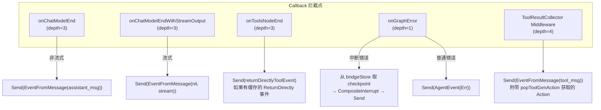
```mermaid
flowchart TB
    subgraph Callbacks["Callback 拦截点"]
        CB1["onChatModelEnd<br/>(depth=3)"]
        CB2["onChatModelEndWithStreamOutput<br/>(depth=3)"]
        CB3["onToolsNodeEnd<br/>(depth=3)"]
        CB4["onGraphError<br/>(depth=1)"]
        CB5["ToolResultCollector Middleware<br/>(depth=4)"]
    end

    CB1 -->|"非流式"| E1["Send(EventFromMessage(assistant_msg))"]
    CB2 -->|"流式"| E2["Send(EventFromMessage(nil, stream))"]
    CB3 --> E3["Send(returnDirectlyToolEvent)<br/>如果有缓存的 ReturnDirectly 事件"]
    CB4 -->|"中断错误"| E4["从 bridgeStore 取 checkpoint<br/>→ CompositeInterrupt → Send"]
    CB4 -->|"普通错误"| E5["Send(AgentEvent{Err})"]
    CB5 --> E6["Send(EventFromMessage(tool_msg))<br/>附带 popToolGenAction 获取的 Action"]
```

#### 3.3.4 Tool 结果收集：ToolResultCollector Middleware

这是一个精妙的设计。ADK 通过注入一个 **ToolMiddleware** 来拦截每个 Tool 的执行结果：

```go
func newAdkToolResultCollectorMiddleware() compose.ToolMiddleware {
    return compose.ToolMiddleware{
        Invokable: func(next InvokableToolEndpoint) InvokableToolEndpoint {
            return func(ctx, input) (output, error) {
                // 1. 获取 sender（由 cbHandler 在 Graph OnStart 时注入到 ctx）
                senders := getToolResultSendersFromCtx(ctx)
                
                // 2. 执行实际 Tool
                output, err := next(ctx, input)
                
                // 3. 弹出 Tool 在执行过程中可能写入的 Action
                prePopAction := popToolGenAction(ctx, input.Name)
                
                // 4. 通过 sender 将结果 + Action 包装为 AgentEvent 发送
                sender(ctx, input.Name, input.CallID, output.Result, prePopAction)
                
                return output, nil
            }
        },
    }
}
```

**数据流向**：

```
Tool.InvokableRun() 
  → SendToolGenAction(ctx, toolName, action)  // 写入 State.ToolGenActions
  → return result
    ↓
ToolResultCollector Middleware
  → popToolGenAction(ctx, toolName)           // 从 State.ToolGenActions 弹出
  → sender(ctx, toolName, callID, result, action)
    ↓
cbHandler.createToolResultSender()
  → EventFromMessage(tool_msg) + event.Action = action
  → Send(event)                               // 发给 AsyncGenerator
```

#### 3.3.5 ReturnDirectly 机制

当某个 Tool 被标记为 `ReturnDirectly`（如 `transfer_to_agent`、`exit`）时：

1. **toolPreHandle** 在 ToolsNode 执行前检查 ToolCalls，找到 ReturnDirectly 的 tool call ID
2. **ToolResultCollector** 检查 `getReturnDirectlyToolCallID(ctx)`，如果当前 tool 的 callID 匹配，不直接 Send，而是存入 `h.returnDirectlyToolEvent`（atomic.Value）
3. **onToolsNodeEnd** 在所有 Tool 执行完毕后，调用 `sendReturnDirectlyToolEvent()` 发送缓存的事件
4. **ToolNode 出边的 Branch** 检测到 `HasReturnDirectly`，走向 `ToolNodeToEndConverter → END`

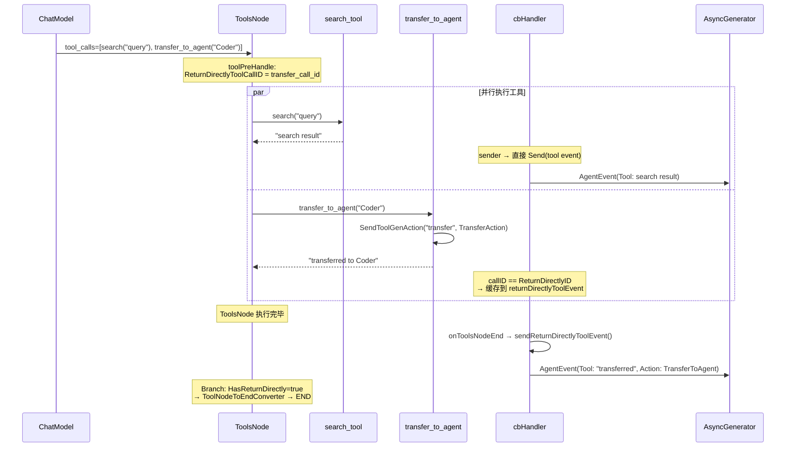
```mermaid
sequenceDiagram
    participant LLM as ChatModel
    participant TN as ToolsNode
    participant T1 as search_tool
    participant T2 as transfer_to_agent
    participant CB as cbHandler
    participant Gen as AsyncGenerator

    LLM->>TN: tool_calls=[search("query"), transfer_to_agent("Coder")]
    
    Note over TN: toolPreHandle:<br/>ReturnDirectlyToolCallID = transfer_call_id

    par 并行执行工具
        TN->>T1: search("query")
        T1-->>TN: "search result"
        Note over CB: sender → 直接 Send(tool event)
        CB->>Gen: AgentEvent(Tool: search result)
    and
        TN->>T2: transfer_to_agent("Coder")
        T2->>T2: SendToolGenAction("transfer", TransferAction)
        T2-->>TN: "transferred to Coder"
        Note over CB: callID == ReturnDirectlyID<br/>→ 缓存到 returnDirectlyToolEvent
    end

    Note over TN: ToolsNode 执行完毕
    CB->>CB: onToolsNodeEnd → sendReturnDirectlyToolEvent()
    CB->>Gen: AgentEvent(Tool: "transferred", Action: TransferToAgent)

    Note over TN: Branch: HasReturnDirectly=true<br/>→ ToolNodeToEndConverter → END
```

---

### 3.4 中断与恢复在 ReAct 层的实现

#### 3.4.1 中断的传播路径

当 ReAct 循环中某个 Tool 发生中断时，传播路径如下：

```
Tool 中调用 compose.Interrupt()
  → compose.Graph 捕获中断，保存 checkpoint 到 bridgeStore
  → compose.Graph 返回 InterruptError
    ↓
cbHandler.onGraphError(err)
  → ExtractInterruptInfo(err)       // 从错误中提取中断信息
  → bridgeStore.Get(checkpointID)   // 获取 compose 层的 checkpoint 数据
  → CompositeInterrupt(ctx, info, data, interruptSignal)
  → Send(AgentEvent{Action: Interrupted})
    ↓
flowAgent.run() 检测到 Interrupted → return（不做 Transfer）
    ↓
Runner.handleIter() 检测到 internalInterrupted
  → saveCheckPoint()   // 保存 ADK 层的 checkpoint
  → Send(AgentEvent 给用户)
```

#### 3.4.2 恢复的执行路径

```go
func (a *ChatModelAgent) Resume(ctx, info, opts) *AsyncIterator {
    // 1. info.InterruptState 是 []byte（bridgeStore 序列化的 compose checkpoint）
    stateByte := info.InterruptState.([]byte)
    
    // 2. 如果有 ResumeData，注入 HistoryModifier
    if info.ResumeData != nil {
        resumeData := info.ResumeData.(*ChatModelAgentResumeData)
        opts = append(opts, compose.WithStateModifier(...))
    }
    
    // 3. 用恢复数据构建 bridgeStore
    store := newResumeBridgeStore(stateByte)
    
    // 4. 执行同样的 runFunc，但传入恢复的 store
    //    compose.Graph 会从 store 中加载 checkpoint，恢复 State，从断点继续
    run(ctx, &AgentInput{EnableStreaming: info.EnableStreaming}, 
        generator, store, opts...)
}
```

关键在于 **bridgeStore** 的角色：它是 ChatModelAgent 和 compose.Graph 之间的桥梁。

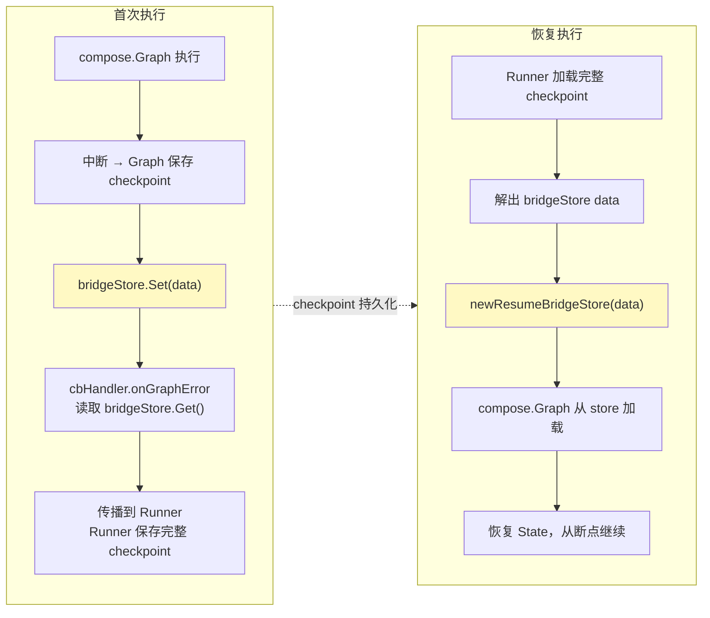
```mermaid
flowchart LR
    subgraph Run["首次执行"]
        R1["compose.Graph 执行"]
        R2["中断 → Graph 保存 checkpoint"]
        R3["bridgeStore.Set(data)"]
        R4["cbHandler.onGraphError<br/>读取 bridgeStore.Get()"]
        R5["传播到 Runner<br/>Runner 保存完整 checkpoint"]
        R1 --> R2 --> R3 --> R4 --> R5
    end

    subgraph Resume["恢复执行"]
        S1["Runner 加载完整 checkpoint"]
        S2["解出 bridgeStore data"]
        S3["newResumeBridgeStore(data)"]
        S4["compose.Graph 从 store 加载"]
        S5["恢复 State，从断点继续"]
        S1 --> S2 --> S3 --> S4 --> S5
    end

    Run -.->|"checkpoint 持久化"| Resume

    style R3 fill:#fff9c4
    style S3 fill:#fff9c4
```

---

### 3.5 agentTool：在 Tool 中嵌套 Agent

`agentTool` 允许将一个 Agent 包装为 Tool，使其可以被另一个 ChatModelAgent 通过 ToolCall 调用。

#### 3.5.1 执行流程

```go
func (at *agentTool) InvokableRun(ctx, args, opts) (string, error) {
    // 1. 检查是否处于恢复流程
    wasInterrupted, hasState, state := tool.GetInterruptState[[]byte](ctx)
    
    if !wasInterrupted {
        // 2a. 首次执行：创建内部 Runner 并 Run
        ms = newBridgeStore()
        input = parseInput(args)  // 或使用 fullChatHistory
        iter = newInvokableAgentToolRunner(at.agent, ms).Run(ctx, input)
    } else {
        // 2b. 恢复执行：用保存的状态创建 bridgeStore 并 Resume
        ms = newResumeBridgeStore(state)
        iter = newInvokableAgentToolRunner(at.agent, ms).Resume(ctx, checkpointID)
    }
    
    // 3. 消费内部 Agent 的所有事件
    for event in iter:
        if EmitInternalEvents && 非中断事件:
            // 透传内部事件给用户（RunPath 需要拼接父路径）
            gen.Send(event)
        lastEvent = event
    
    // 4. 处理结果
    if lastEvent.Action.Interrupted:
        // 保存内部 checkpoint，通过 tool.CompositeInterrupt 向上传播
        return "", tool.CompositeInterrupt(ctx, "agent tool interrupt", storeData, signal)
    
    // 5. 返回最终消息的 Content 作为 tool 的 string 结果
    return lastEvent.Output.MessageOutput.GetMessage().Content, nil
}
```

#### 3.5.2 事件作用域隔离

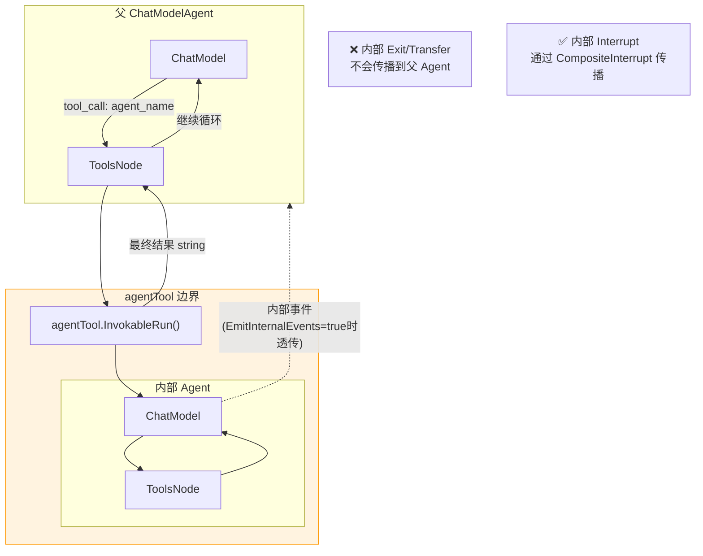
```mermaid
flowchart TB
    subgraph Parent["父 ChatModelAgent"]
        PCM["ChatModel"]
        PTN["ToolsNode"]
    end

    subgraph AgentToolBoundary["agentTool 边界"]
        AT["agentTool.InvokableRun()"]
        subgraph Inner["内部 Agent"]
            ICM["ChatModel"]
            ITN["ToolsNode"]
        end
    end

    PCM -->|"tool_call: agent_name"| PTN
    PTN --> AT
    AT --> ICM
    ICM --> ITN
    ITN --> ICM

    ICM -.->|"内部事件<br/>(EmitInternalEvents=true时透传)"| Parent
    
    AT -->|"最终结果 string"| PTN
    PTN -->|"继续循环"| PCM

    style AgentToolBoundary fill:#fff3e0,stroke:#ff9800
    
    Note1["❌ 内部 Exit/Transfer<br/>不会传播到父 Agent"]
    Note2["✅ 内部 Interrupt<br/>通过 CompositeInterrupt 传播"]
```

---

### 3.6 完整数据流：从用户输入到事件输出

以一个包含 Transfer 的完整流程为例：

```mermaid
sequenceDiagram
    participant User
    participant Runner
    participant FA as flowAgent
    participant CMA as ChatModelAgent("Planner")
    participant Graph as ReAct Graph
    participant LLM as ChatModel
    participant TT as transfer_to_agent Tool
    participant CB as cbHandler
    participant Session

    User->>Runner: Run(ctx, "帮我写代码")
    Runner->>FA: flowAgent.Run(ctx, input)
    FA->>FA: genAgentInput() 从 Session 重建
    FA->>CMA: Agent.Run(ctx, input)

    Note over CMA: buildRunFunc() → newReact() → Graph

    CMA->>Graph: Chain.Invoke/Stream(input)

    rect rgb(227, 242, 253)
        Note over Graph: 迭代 1
        Graph->>LLM: ChatModel([system, user_msg])
        LLM-->>Graph: "我来分析需求...需要转给Coder"<br/>+ tool_calls: [transfer_to_agent("Coder")]
        
        Note over CB: onChatModelEnd callback
        CB->>FA: AgentEvent(Output: assistant_msg)
        FA->>Session: addEvent(assistant_msg)
        FA-->>Runner: 转发
        Runner-->>User: AgentEvent(Output: "我来分析需求...")
        
        Graph->>TT: transfer_to_agent.InvokableRun("Coder")
        TT->>TT: SendToolGenAction → State.ToolGenActions["transfer"] = TransferAction
        TT-->>Graph: "successfully transferred to agent [Coder]"
        
        Note over CB: ToolResultCollector:<br/>ReturnDirectly → 缓存事件
        Note over CB: onToolsNodeEnd → 发送缓存事件
        CB->>FA: AgentEvent(Tool: "transferred", Action: TransferToAgent{Coder})
        FA->>Session: addEvent(tool_msg)
        FA->>FA: lastAction = TransferToAgent{Coder}
        FA-->>Runner: 转发
        Runner-->>User: AgentEvent(Action: TransferToAgent)
        
        Note over Graph: Branch: HasReturnDirectly → ToolNodeToEndConverter → END
    end

    Note over FA: 循环结束, lastAction = TransferToAgent{Coder}
    FA->>FA: getAgent("Coder") → 找到子 Agent
    FA->>FA: Coder.Run(ctx, nil)
    
    Note over FA: Coder 从 Session 历史重建输入<br/>(包含 Planner 的消息，改写为 "For context: [Planner] said: ...")
    
    Note over FA: Coder 开始自己的 ReAct 循环...
```

---

### 3.7 核心设计要点总结

| 设计 | 实现 | 目的 |
|------|------|------|
| **Graph as ReAct** | `compose.Graph` 实现 ChatModel↔ToolsNode 循环 | 利用 compose 框架的状态管理、checkpoint、并行执行能力 |
| **State 驱动** | `State` 结构在节点间传递，记录消息历史、迭代次数、Action | 让图内各节点共享可变状态 |
| **Callback 桥接** | `cbHandler` 通过 compose Callback 拦截图执行事件 | 将 compose 内部执行转化为 ADK 的 `AgentEvent` 流 |
| **地址深度过滤** | `isAddressAtDepth()` 按地址深度判断事件来源 | 防止嵌套 Agent 的事件被外层错误拦截 |
| **ReturnDirectly** | `transfer_to_agent`/`exit` 执行后立即结束 ReAct 循环 | 避免 LLM 在 transfer/exit 后继续推理 |
| **ToolGenAction** | Tool 通过 `SendToolGenAction` 写入 Action → Collector 弹出附加到事件 | 让 Tool 的执行结果同时携带控制流指令 |
| **bridgeStore** | 内存级 KV store 桥接 compose checkpoint 和 ADK checkpoint | 实现 ReAct Graph 级别的中断恢复 |
| **ToolResultCollector Middleware** | 自动注入的 ToolMiddleware 拦截每个 Tool 的输出 | 无需用户手动发送事件，自动将 Tool 结果转为 AgentEvent |
| **sync.Once + frozen** | `buildRunFunc` 只构建一次，之后禁止修改配置 | 构建成本高（编译 Graph），运行时零开销 |

## 4. 事件层：AgentEvent 的生成、流式传输与消费机制

### 4.1 事件层全景概览

ADK 的事件系统解决了三个核心问题：

1. **生成**：ReAct 循环中的各个组件如何产出 AgentEvent？
2. **传输**：事件如何在多层嵌套的 Agent 之间异步、流式地传递？
3. **消费**：事件如何被记录到 Session 历史、被序列化到 Checkpoint、被最终用户消费？

```mermaid
flowchart LR
    subgraph Generation["⚡ 生成"]
        G1["ChatModel.OnEnd"]
        G2["ToolResultCollector"]
        G3["Graph.OnError(中断)"]
        G4["自定义 Agent"]
    end

    subgraph Transport["🔄 传输"]
        T1["AsyncGenerator<br/>.Send()"]
        T2["UnboundedChan<br/>(无界缓冲)"]
        T3["AsyncIterator<br/>.Next()"]
    end

    subgraph Consumption["📥 消费"]
        C1["flowAgent.run()<br/>(事件记录+转发)"]
        C2["Session.addEvent()<br/>(历史记录)"]
        C3["Runner.handleIter()<br/>(Checkpoint)"]
        C4["用户 iter.Next()<br/>(最终消费)"]
    end

    G1 & G2 & G3 & G4 --> T1
    T1 --> T2 --> T3
    T3 --> C1
    C1 --> C2 & C3
    C3 --> C4
```


### 4.2 AgentEvent 数据结构详解

#### 4.2.1 AgentEvent 核心结构

```go
type AgentEvent struct {
    AgentName string       // 产出此事件的 Agent 名称
    RunPath   []RunStep    // 从根 Agent 到当前 Agent 的执行路径
    Output    *AgentOutput // 消息内容（互斥：有 Output 通常无 Action）
    Action    *AgentAction // 控制流动作（互斥：有 Action 通常无 Output）
    Err       error        // 错误信息
}
```

一个 AgentEvent **通常只携带以下四种载荷之一**：

| 载荷类型 | 含义 | 产出来源 |
|----------|------|---------|
| `Output.MessageOutput` (Role=Assistant) | LLM 的回复消息 | cbHandler.onChatModelEnd |
| `Output.MessageOutput` (Role=Tool) | 工具的执行结果 | ToolResultCollector Middleware |
| `Action` (Transfer/Exit/Interrupt/BreakLoop) | 控制流指令 | Tool 通过 SendToolGenAction 写入 |
| `Err` | 运行时错误 | 任意环节 |

#### 4.2.2 MessageVariant：消息的双态表示

```go
type MessageVariant struct {
    IsStreaming bool
    Message       Message        // 非流式：完整消息
    MessageStream MessageStream  // 流式：消息流（*StreamReader[Message]）
    Role          schema.RoleType
    ToolName      string
}
```

`MessageVariant` 是 ADK 事件系统的精妙设计：**同一个事件结构，既能表示非流式的完整消息，也能表示流式的消息流**。

```mermaid
flowchart TB
    subgraph NonStreaming["非流式模式"]
        NS1["EventFromMessage(msg, nil, ...)"]
        NS2["MessageVariant{<br/>IsStreaming: false,<br/>Message: *schema.Message{...},<br/>MessageStream: nil<br/>}"]
        NS1 --> NS2
    end

    subgraph Streaming["流式模式"]
        S1["EventFromMessage(nil, stream, ...)"]
        S2["MessageVariant{<br/>IsStreaming: true,<br/>Message: nil,<br/>MessageStream: *StreamReader[Message]<br/>}"]
        S1 --> S2
    end
```

---

### 4.3 事件生成的四个来源

#### 4.3.1 来源一：ChatModel 输出事件

当 ReAct 循环中 ChatModel 节点执行完毕时，compose 框架触发 OnEnd 回调：

```go
// 非流式
func (h *cbHandler) onChatModelEnd(ctx, _, output *model.CallbackOutput) context.Context {
    // 地址深度检查，确保是自己层级的 ChatModel
    if !isAddressAtDepth(addr, h.addr, addrDepthChatModel) {
        return ctx
    }
    // 直接构造事件，发送到 generator
    event := EventFromMessage(output.Message, nil, schema.Assistant, "")
    h.Send(event)
    return ctx
}

// 流式
func (h *cbHandler) onChatModelEndWithStreamOutput(ctx, _, output *StreamReader[...]) {
    // 将 *model.CallbackOutput 流转换为 Message 流
    out := StreamReaderWithConvert(output, func(in *model.CallbackOutput) (Message, error) {
        return in.Message, nil
    })
    event := EventFromMessage(nil, out, schema.Assistant, "")  // ← 注意 msg=nil, stream=out
    h.Send(event)
}
```

#### 4.3.2 来源二：Tool 结果事件

通过 `ToolResultCollector Middleware` 拦截每个 Tool 的执行结果：

```go
// 非流式 Tool
Invokable: func(next InvokableToolEndpoint) InvokableToolEndpoint {
    return func(ctx, input) (output, error) {
        output, err := next(ctx, input)          // 执行真正的 Tool
        prePopAction := popToolGenAction(ctx, input.Name)  // 弹出 Tool 写入的 Action
        sender(ctx, input.Name, input.CallID, output.Result, prePopAction)
        return output, nil
    }
}
```

`sender` 是 cbHandler 创建的闭包：

```go
createToolResultSender := func() adkToolResultSender {
    return func(ctx, toolName, callID, result string, prePopAction *AgentAction) {
        msg := schema.ToolMessage(result, callID, WithToolName(toolName))
        event := EventFromMessage(msg, nil, schema.Tool, toolName)
        
        if prePopAction != nil {
            event.Action = prePopAction  // ← Action 附着到事件上
        } else {
            event.Action = popToolGenAction(ctx, toolName)
        }
        
        // ReturnDirectly 检查
        returnDirectlyID, hasReturnDirectly := getReturnDirectlyToolCallID(ctx)
        if hasReturnDirectly && returnDirectlyID == callID {
            h.returnDirectlyToolEvent.Store(event)  // ← 缓存，不直接发送
        } else {
            h.Send(event)  // ← 普通 Tool，直接发送
        }
    }
}
```

#### 4.3.3 来源三：中断事件

中断在 compose 层面表现为 error，通过 Chain 的 OnError 回调捕获：

```go
func (h *cbHandler) onGraphError(ctx, _, err error) context.Context {
    info, ok := compose.ExtractInterruptInfo(err)
    if !ok {
        h.Send(&AgentEvent{Err: err})  // 普通错误
        return ctx
    }
    
    // 中断处理
    data, _, _ := h.store.Get(ctx, bridgeCheckpointID)
    is := FromInterruptContexts(info.InterruptContexts)
    event := CompositeInterrupt(h.ctx, info, data, is)
    h.Send(event)
}
```

#### 4.3.4 来源四：自定义 Agent 或 workflowAgent 直接生成

```go
// workflowAgent 中断时
event := CompositeInterrupt(ctx, "Sequential workflow interrupted", state, signal)
generator.Send(event)

// 自定义 Agent 中
generator.Send(&AgentEvent{
    Output: &AgentOutput{MessageOutput: &MessageVariant{...}},
})
```


### 4.4 异步传输机制

#### 4.4.1 AsyncIterator / AsyncGenerator 对

这是 ADK 事件传输的核心原语。每一层 Agent 都创建自己的 Iterator/Generator 对：

```go
func NewAsyncIteratorPair[T any]() (*AsyncIterator[T], *AsyncGenerator[T]) {
    ch := internal.NewUnboundedChan[T]()
    return &AsyncIterator[T]{ch}, &AsyncGenerator[T]{ch}
}
```

它们共享同一个 `UnboundedChan`：

```mermaid
flowchart LR
    subgraph Producer["生产者 (goroutine A)"]
        GEN["AsyncGenerator"]
        GEN -->|".Send(event)"| SEND["ch.Send()"]
    end

    subgraph Channel["UnboundedChan"]
        BUF["buffer []T<br/>(无界切片)"]
        MUTEX["sync.Mutex"]
        COND["sync.Cond<br/>(notEmpty)"]
        SEND --> BUF
        BUF --> RECV
    end

    subgraph Consumer["消费者 (goroutine B)"]
        RECV["ch.Receive()"] -->|".Next()"| ITER["AsyncIterator"]
    end

    SEND -.->|"Signal()"| COND
    COND -.->|"Wait()"| RECV
```

#### 4.4.2 UnboundedChan 的关键特性

```go
type UnboundedChan[T any] struct {
    buffer   []T
    mutex    sync.Mutex
    notEmpty *sync.Cond
    closed   bool
}
```

| 特性 | 实现 | 作用 |
|------|------|------|
| **无界缓冲** | `buffer []T`，append 扩容 | 生产者永远不会阻塞 |
| **阻塞消费** | `notEmpty.Wait()` | 消费者在无数据时阻塞 |
| **有序消费** | `buffer[0]` 出队 | FIFO 顺序保证 |
| **关闭通知** | `Broadcast()` | 关闭时唤醒所有等待的消费者 |
| **关闭后排空** | `len(buffer) > 0` 仍返回数据 | 确保关闭前 Send 的数据都能被消费 |

#### 4.4.3 多层 Iterator/Generator 的嵌套

一次完整的执行中，事件会经过多层 Iterator/Generator 传递：

```mermaid
flowchart TB
    subgraph Layer1["ChatModelAgent 内部"]
        CB["cbHandler<br/>(Callback拦截)"]
        GEN1["Generator ①"]
        ITER1["Iterator ①"]
        CB -->|"Send"| GEN1
        GEN1 -.-> ITER1
    end

    subgraph Layer2["flowAgent.run()"]
        GEN2["Generator ②"]
        ITER2["Iterator ②"]
        ITER1 -->|"Next()"| PROCESS["事件处理<br/>(RunPath/记录/过滤)"]
        PROCESS -->|"Send"| GEN2
        GEN2 -.-> ITER2
    end

    subgraph Layer3["Runner.handleIter()"]
        GEN3["Generator ③"]
        ITER3["Iterator ③"]
        ITER2 -->|"Next()"| HANDLE["中断检测<br/>Checkpoint保存"]
        HANDLE -->|"Send"| GEN3
        GEN3 -.-> ITER3
    end

    subgraph User["用户"]
        ITER3 -->|"Next()"| APP["应用代码"]
    end

    style Layer1 fill:#e3f2fd
    style Layer2 fill:#e8f5e9
    style Layer3 fill:#fff3e0
```

每一层都在独立的 goroutine 中运行，通过 Iterator/Generator 对解耦：

| 层 | goroutine | 职责 |
|------|-----------|------|
| **Layer ①** | `ChatModelAgent.Run` 启动的 goroutine | 执行 compose.Graph，通过 Callback 生成事件 |
| **Layer ②** | `flowAgent.run` 启动的 goroutine | 事件加工（RunPath 设置、Session 记录、Action 门控、Transfer 调度） |
| **Layer ③** | `Runner.handleIter` 启动的 goroutine | 中断检测、Checkpoint 保存、事件中转 |
| **用户** | 用户的 goroutine | 调用 `iter.Next()` 消费最终事件 |


### 4.5 流式消息（Stream）的生命周期管理

流式消息是事件层最复杂的部分。一个流式 AgentEvent 携带的 `MessageStream` 本质是一个 `*schema.StreamReader[Message]`，它内部有一个 `stream[T]` 管道——发送方往里写 chunk，接收方逐个读取。

#### 4.5.1 流的创建与传输

```
ChatModel 流式输出 → StreamReader[*model.CallbackOutput]
    ↓ (StreamReaderWithConvert)
StreamReader[Message]  ← 这就是 MessageStream
    ↓
EventFromMessage(nil, stream, Assistant, "")
    ↓
cbHandler.Send(event)  → UnboundedChan
    ↓
flowAgent.run() 的 iter.Next() 收到 event
```

**关键问题**：event 中的 `MessageStream` 只能被消费一次（Recv 是消耗性的），但它需要被多方使用：
1. 转发给用户消费（实时查看 LLM 输出）
2. 记录到 Session 历史（供后续 Agent 读取）
3. 可能需要序列化到 Checkpoint

#### 4.5.2 流的复制机制：StreamReader.Copy

`copyAgentEvent` 解决了流的多消费者问题：

```go
func copyAgentEvent(ae *AgentEvent) *AgentEvent {
    // ...
    if mv.IsStreaming {
        // 把一个 StreamReader 分裂成两个独立的
        sts := ae.Output.MessageOutput.MessageStream.Copy(2)
        mv.MessageStream = sts[0]        // 原始事件持有副本 0
        copied.Output.MessageOutput.MessageStream = sts[1]  // 拷贝事件持有副本 1
    }
    // ...
}
```

`StreamReader.Copy(n)` 的原理是创建一个内部的 "多播器"——原始流的每个 chunk 被广播到 n 个子 StreamReader，每个子 StreamReader 独立消费，互不影响。

#### 4.5.3 流在 flowAgent.run() 中的处理

```go
// flowAgent.run() 核心逻辑
for event := iter.Next() {
    if exactRunPathMatch && 非中断 {
        // ① 先复制事件（流会被分裂为两份）
        copied := copyAgentEvent(event)
        
        // ② 两份都设置自动关闭
        setAutomaticClose(copied)   // 给 Session 的副本
        setAutomaticClose(event)    // 给用户的副本
        
        // ③ 把副本记录到 Session
        runCtx.Session.addEvent(copied)
    }
    
    // ④ 原始事件转发给上层
    generator.Send(event)
}
```

```mermaid
flowchart TB
    ORIG["原始 event<br/>(含 MessageStream)"]
    ORIG --> COPY["copyAgentEvent()"]
    COPY --> SPLIT["StreamReader.Copy(2)"]
    
    SPLIT --> S0["stream[0]<br/>(留给原始 event)"]
    SPLIT --> S1["stream[1]<br/>(给 copied event)"]
    
    S0 --> AUTO0["SetAutomaticClose()"]
    S1 --> AUTO1["SetAutomaticClose()"]
    
    AUTO0 --> FORWARD["generator.Send(event)<br/>→ 转发给用户"]
    AUTO1 --> SESSION["Session.addEvent(copied)<br/>→ 记录到历史"]

    style SPLIT fill:#fff9c4
    style FORWARD fill:#bbdefb
    style SESSION fill:#c8e6c9
```

#### 4.5.4 SetAutomaticClose：流的安全网

```go
func (sr *StreamReader[T]) SetAutomaticClose() {
    sr.st.automaticClose = true
    runtime.SetFinalizer(sr, func(s *StreamReader[T]) {
        s.Close()  // GC 时自动关闭
    })
}
```

这是一个防御性设计：如果某个 StreamReader 没有被显式消费（比如用户跳过了某些事件），GC 回收时会自动关闭底层流，**防止 goroutine 泄漏**（发送方可能在等待接收方消费而永远阻塞）。


### 4.6. 事件消费的三个层面

#### 4.6.1 层面一：Session 历史记录

Session 通过 `agentEventWrapper` 包装事件，添加时间戳和懒加载的消息合并能力：

```go
type agentEventWrapper struct {
    *AgentEvent
    mu                  sync.Mutex
    concatenatedMessage Message    // 懒加载：流消费后缓存完整消息
    TS                  int64      // 创建时间戳（纳秒）
    StreamErr           error      // 流消费错误记录
}

func (s *runSession) addEvent(event *AgentEvent) {
    wrapper := &agentEventWrapper{
        AgentEvent: event,
        TS:         time.Now().UnixNano(),
    }
    s.mtx.Lock()
    s.Events = append(s.Events, wrapper)
    s.mtx.Unlock()
}
```

**当后续 Agent 需要读取历史时**，通过 `getMessageFromWrappedEvent` 消费流：

```go
func getMessageFromWrappedEvent(e *agentEventWrapper) (Message, error) {
    // 非流式：直接返回
    if !e.Output.MessageOutput.IsStreaming {
        return e.Output.MessageOutput.Message, nil
    }
    
    // 已缓存：直接返回
    if e.concatenatedMessage != nil {
        return e.concatenatedMessage, nil
    }
    
    // 之前消费出错：返回缓存的错误
    if e.StreamErr != nil {
        return nil, e.StreamErr
    }
    
    // 首次消费流：读取所有 chunk → 合并为单个 Message → 缓存
    e.mu.Lock()
    defer e.mu.Unlock()
    
    var msgs []Message
    for {
        msg, err := s.Recv()
        if err == io.EOF { break }
        if err != nil {
            e.StreamErr = err
            // 用已读取的 chunk 替换流（兼容序列化）
            e.MessageStream = StreamReaderFromArray(msgs)
            return nil, err
        }
        msgs = append(msgs, msg)
    }
    
    e.concatenatedMessage = ConcatMessages(msgs)
    return e.concatenatedMessage, nil
}
```

```mermaid
stateDiagram-v2
    [*] --> Streaming: 事件被记录到 Session
    Streaming --> Cached: getMessageFromWrappedEvent()<br/>首次消费
    Streaming --> Error: 流消费出错
    Cached --> Cached: 后续读取直接返回缓存
    Error --> Error: 后续读取返回缓存的错误

    note right of Streaming
        MessageStream 未被消费
        concatenatedMessage == nil
    end note

    note right of Cached
        MessageStream 已消费完毕
        concatenatedMessage != nil
    end note

    note right of Error
        StreamErr != nil
        流被替换为已读取的部分
    end note
```

#### 4.6.2 层面二：Checkpoint 序列化

`agentEventWrapper` 和 `MessageVariant` 都实现了 `GobEncode/GobDecode`：

```go
// agentEventWrapper 序列化
func (a *agentEventWrapper) GobEncode() ([]byte, error) {
    // 如果流已被消费过（有缓存），用缓存的完整消息替换流
    if a.concatenatedMessage != nil && a.Output.MessageOutput.IsStreaming {
        a.Output.MessageOutput.MessageStream = StreamReaderFromArray([]Message{a.concatenatedMessage})
    }
    // 然后序列化
    return gob.Encode(a)
}

// MessageVariant 序列化
func (mv *MessageVariant) GobEncode() ([]byte, error) {
    if mv.IsStreaming {
        // 消费整个流 → 合并为单个消息 → 序列化
        var messages []Message
        for { msg, err := mv.MessageStream.Recv(); ... }
        m := ConcatMessages(messages)
        s.MessageStream = m  // 序列化时存的是合并后的完整消息
    }
    return gob.Encode(s)
}

// MessageVariant 反序列化
func (mv *MessageVariant) GobDecode(b []byte) error {
    // 恢复后，将完整消息包装回 StreamReader
    if s.MessageStream != nil {
        mv.MessageStream = StreamReaderFromArray([]*schema.Message{s.MessageStream})
    }
}
```

**关键设计**：流式消息在序列化时会被 **"物化"**——从流变为完整消息。反序列化后通过 `StreamReaderFromArray` 再包装回 StreamReader，保持接口一致。

#### 4.6.3 层面三：用户最终消费

用户通过 `iter.Next()` 逐个获取事件：

```go
runner := adk.NewRunner(ctx, config)
iter := runner.Run(ctx, messages)

for {
    event, ok := iter.Next()  // 阻塞等待
    if !ok {
        break  // Generator 已关闭
    }
    
    if event.Err != nil {
        // 处理错误
        break
    }
    
    if event.Output != nil && event.Output.MessageOutput != nil {
        mv := event.Output.MessageOutput
        if mv.IsStreaming {
            // 流式消费
            for {
                chunk, err := mv.MessageStream.Recv()
                if err == io.EOF { break }
                fmt.Print(chunk.Content)  // 逐 chunk 打印
            }
        } else {
            fmt.Println(mv.Message.Content)
        }
    }
    
    if event.Action != nil {
        if event.Action.Interrupted != nil {
            // 处理中断
        }
        if event.Action.TransferToAgent != nil {
            // 知道发生了转移
        }
    }
}
```

---

### 4.7 Parallel 场景下的事件管理

并行执行（`runParallel`）引入了额外的复杂性——多个 Agent 同时产生事件。

#### 4.7.1 Fork / Join 机制

```mermaid
flowchart TB
    subgraph Before["Fork 前"]
        PS["Parent Session<br/>Events: [e1, e2, e3]<br/>Values: {key: val}"]
    end

    subgraph Forked["Fork 后 (并行执行中)"]
        CS0["Child Session 0<br/>Events: [e1,e2,e3] (共享引用)<br/>LaneEvents: [e4, e6]<br/>Values: {key: val} (共享引用)"]
        CS1["Child Session 1<br/>Events: [e1,e2,e3] (共享引用)<br/>LaneEvents: [e5, e7]<br/>Values: {key: val} (共享引用)"]
    end

    subgraph Joined["Join 后"]
        PS2["Parent Session<br/>Events: [e1,e2,e3, e4,e5,e6,e7]<br/>(按 TS 时间戳排序合并)"]
    end

    PS --> CS0 & CS1
    CS0 & CS1 --> PS2
```

```go
// Fork: 为每个并行分支创建独立的 lane
func forkRunCtx(ctx) context.Context {
    childSession := &runSession{
        Events:    parentSession.Events,     // 共享已提交的历史
        Values:    parentSession.Values,     // 共享 Values
        valuesMtx: parentSession.valuesMtx,
    }
    childSession.LaneEvents = &laneEvents{
        Parent: parentSession.LaneEvents,
        Events: make([]*agentEventWrapper, 0),  // 独立的事件空间
    }
    // ...
}

// Join: 合并各 lane 的事件到父 Session
func joinRunCtxs(parentCtx, childCtxs...) {
    newEvents := unwindLaneEvents(childCtxs...)   // 收集各 lane 的事件
    sort.Slice(newEvents, func(i, j int) {
        return newEvents[i].TS < newEvents[j].TS  // 按时间戳排序
    })
    commitEvents(parentCtx, newEvents)             // 提交到父
}
```

#### 4.7.2 并行事件的实时转发

虽然 Session 中的事件在 Join 时才合并，但 **用户可以实时看到所有并行分支的事件**——因为 `generator.Send(event)` 是跨 goroutine 安全的（UnboundedChan 有 Mutex），多个并行 goroutine 可以同时 Send 到同一个 Generator。

---

### 4.8完整事件生命周期图

```mermaid
flowchart TB
    subgraph Gen["事件生成"]
        LLM["LLM 输出<br/>(stream/non-stream)"]
        TOOL["Tool 执行结果"]
        INT["中断信号"]
        
        LLM --> EFM1["EventFromMessage()<br/>Role=Assistant"]
        TOOL --> EFM2["EventFromMessage()<br/>Role=Tool + Action"]
        INT --> CI["CompositeInterrupt()<br/>Action=Interrupted"]
    end

    subgraph Trans["事件传输 (Layer ①)"]
        EFM1 & EFM2 & CI --> GEN1["cbHandler.Send()<br/>→ Generator ①"]
        GEN1 --> UC1["UnboundedChan ①"]
        UC1 --> ITER1["Iterator ①"]
    end

    subgraph Process["事件加工 (Layer ②: flowAgent.run)"]
        ITER1 --> RP["设置 RunPath<br/>(如果为空)"]
        RP --> MATCH{"exactRunPathMatch?"}
        
        MATCH -->|"匹配+非中断"| COPY["copyAgentEvent()<br/>Stream.Copy(2)"]
        COPY --> AC1["SetAutomaticClose(copied)"]
        COPY --> AC2["SetAutomaticClose(event)"]
        AC1 --> SESSION["Session.addEvent(copied)"]
        AC2 --> GATE{"Action 门控"}
        
        MATCH -->|"不匹配"| GATE
        
        GATE -->|"记录 lastAction"| FWD["generator.Send(event)<br/>→ Generator ②"]
    end

    subgraph Runner["事件中转 (Layer ③: Runner.handleIter)"]
        FWD --> UC2["UnboundedChan ②"]
        UC2 --> ITER2["Iterator ②"]
        ITER2 --> INTCHECK{"internalInterrupted?"}
        
        INTCHECK -->|"是"| SAVE["saveCheckPoint()"]
        SAVE --> CONVERT["转换为用户友好的<br/>InterruptInfo"]
        CONVERT --> FWD2["generator.Send()<br/>→ Generator ③"]
        
        INTCHECK -->|"否"| FWD2
    end

    subgraph User["用户消费"]
        FWD2 --> UC3["UnboundedChan ③"]
        UC3 --> ITER3["iter.Next()"]
        ITER3 --> READ["读取 event"]
        READ --> STREAM{"IsStreaming?"}
        STREAM -->|"是"| RECV["stream.Recv()<br/>逐 chunk 消费"]
        STREAM -->|"否"| MSG["直接读取 Message"]
    end

    subgraph Later["后续 Agent 读取历史"]
        SESSION --> GMFWE["getMessageFromWrappedEvent()"]
        GMFWE --> LAZY{"已缓存?"}
        LAZY -->|"是"| RET["返回 concatenatedMessage"]
        LAZY -->|"否"| CONSUME["消费 Session 副本的 Stream<br/>→ Concat → 缓存"]
        CONSUME --> RET
    end

    style Gen fill:#e3f2fd
    style Trans fill:#f3e5f5
    style Process fill:#e8f5e9
    style Runner fill:#fff3e0
    style User fill:#fce4ec
    style Later fill:#fffde7
```

---

### 4.9 核心设计要点总结

| 设计 | 机制 | 解决的问题 |
|------|------|----------|
| **双态消息** | `MessageVariant{IsStreaming, Message, MessageStream}` | 统一流式/非流式的事件表示 |
| **流的分裂** | `StreamReader.Copy(2)` | 一份给用户实时消费，一份给 Session 记录历史 |
| **流的安全网** | `SetAutomaticClose()` + `runtime.SetFinalizer` | 防止未消费的流导致 goroutine 泄漏 |
| **懒加载合并** | `agentEventWrapper.concatenatedMessage` | 流只在需要时才被消费合并，避免不必要的阻塞 |
| **无界通道** | `UnboundedChan{buffer, sync.Cond}` | 生产者永不阻塞，消费者按序消费 |
| **多层 Gen/Iter** | 每层 Agent 创建独立的 Iterator/Generator 对 | 解耦各层处理逻辑，支持独立 goroutine |
| **流的物化** | `GobEncode` 时消费流→合并→序列化完整消息 | Checkpoint 序列化兼容性 |
| **时间戳排序** | `agentEventWrapper.TS` + `sort.Slice` | Parallel 场景下合并事件保持因果顺序 |
| **错误缓存** | `agentEventWrapper.StreamErr` | 防止流消费错误被重复触发 |

让我先完整阅读 `runctx.go` 的全部内容，以及相关的 Session 操作代码：现在让我查看 Session 在各场景中的使用方式——特别是 Runner 中的 sharedParentSession 和 Resume 时的 Session 恢复：-现在让我看 Session 序列化相关的 gob 注册和 `runContext` 的序列化：现在让我看 `genAgentInput` 如何从 Session 读取并重建历史，特别关注 Session 的读取方式：现在我已经掌握了 Session 管理的完整源码。下面给出系统性的分析。

---

## 5. ADK 中的 Session 管理机制

### 5.1 Session 在 ADK 中的角色定位

`runSession` 是 ADK 多 Agent 协作的 **共享内存**。它解决的核心问题是：

> 在一次用户请求中，多个 Agent 按 Transfer/Sequential/Parallel/Loop 的方式接力执行，每个 Agent 如何看到之前所有 Agent 的产出，同时又如何共享跨 Agent 的变量？

Session 承载了两类数据：

| 数据 | 字段 | 用途 |
|------|------|------|
| **对话历史** | `Events []*agentEventWrapper` | 记录所有 Agent 的输出事件，供后续 Agent 重建上下文 |
| **共享变量** | `Values map[string]any` | 跨 Agent 共享的键值对（如用户名、时间、中间结果等） |

### 5.2 runSession 数据结构

```go
type runSession struct {
    // ====== 共享变量 ======
    Values    map[string]any   // 键值对存储
    valuesMtx *sync.Mutex     // Values 的专用锁

    // ====== 对话历史 ======
    Events     []*agentEventWrapper   // 主路径事件列表
    LaneEvents *laneEvents            // 并行 lane 的事件（仅在并行场景使用）
    mtx        sync.Mutex             // Events 的专用锁
}
```

它包裹在 `runContext` 中，通过 Go 的 `context.Context` 向下传递：

```go
type runContext struct {
    RootInput *AgentInput    // 用户的原始输入
    RunPath   []RunStep      // 当前执行路径
    Session   *runSession    // ← Session 指针（多个 runContext 可共享同一 Session）
}
```

```mermaid
flowchart TB
    subgraph Ctx["context.Context (Go 内建)"]
        RC["runContext"]
        RC --> RI["RootInput:<br/>&AgentInput{Messages, EnableStreaming}"]
        RC --> RP["RunPath:<br/>[Orchestrator, Planner]"]
        RC --> S["Session: *runSession"]
    end

    subgraph Session["runSession (共享)"]
        V["Values:<br/>{user: 'Alice', time: '14:00'}"]
        VM["valuesMtx: *sync.Mutex"]
        E["Events:<br/>[event1, event2, event3, ...]"]
        LE["LaneEvents: *laneEvents<br/>(nil 或指向并行 lane)"]
        EM["mtx: sync.Mutex"]
    end

    S --> Session
```

#### 关键设计：Session 是引用共享的

`runContext.deepCopy()` 只拷贝 `RunPath`，**Session 是浅拷贝（指针共享）**：

```go
func (rc *runContext) deepCopy() *runContext {
    copied := &runContext{
        RootInput: rc.RootInput,
        RunPath:   make([]RunStep, len(rc.RunPath)),
        Session:   rc.Session,    // ← 共享同一个 Session！
    }
    copy(copied.RunPath, rc.RunPath)
    return copied
}
```

这意味着：当 Agent A Transfer 到 Agent B 时，B 拿到的是新的 `runContext`（RunPath 追加了 B 的名字），但它指向 **同一个 Session**。A 写入的事件和变量，B 立即可见。

### 5.3 Session 的生命周期

```mermaid
stateDiagram-v2
    [*] --> Created: Runner.Run()
    Created --> Active: ctxWithNewRunCtx()
    
    Active --> Recording: flowAgent.run()
    Recording --> Recording: addEvent() / addValue()
    
    Active --> Forked: runParallel → forkRunCtx()
    Forked --> Forked: 各 lane 独立 addEvent()
    Forked --> Joined: joinRunCtxs()
    Joined --> Recording
    
    Active --> Serialized: saveCheckPoint()
    Serialized --> Restored: loadCheckPoint()
    Restored --> Active: Resume

    Active --> [*]: 执行完成
```

#### 5.3.1 创建

```go
// Runner.Run()
func (r *Runner) Run(ctx, messages, opts) *AsyncIterator {
    ctx = ctxWithNewRunCtx(ctx, input, o.sharedParentSession)
    // ↓
}

func ctxWithNewRunCtx(ctx, input, sharedParentSession bool) context.Context {
    var session *runSession
    if sharedParentSession {
        // agentTool 场景：复用父 Session 的 Values
        if parentSession := getSession(ctx); parentSession != nil {
            session = &runSession{
                Values:    parentSession.Values,     // 共享 Values 引用
                valuesMtx: parentSession.valuesMtx,  // 共享同一把锁
            }
            // 注意：Events 是新的（不共享历史）
        }
    }
    if session == nil {
        session = newRunSession()  // 全新 Session
    }
    return setRunCtx(ctx, &runContext{Session: session, RootInput: input})
}
```

#### 5.3.2 写入事件

事件记录发生在 `flowAgent.run()` 中：

```go
// flowAgent.run() 中
if exactRunPathMatch && 非中断事件 {
    copied := copyAgentEvent(event)
    setAutomaticClose(copied)
    runCtx.Session.addEvent(copied)  // ← 写入 Session
}
```

`addEvent` 根据是否在并行 lane 中，选择不同的写入路径：

```go
func (rs *runSession) addEvent(event *AgentEvent) {
    wrapper := &agentEventWrapper{
        AgentEvent: event,
        TS:         time.Now().UnixNano(),  // 打时间戳
    }
    
    if rs.LaneEvents != nil {
        // 在并行 lane 中 → 写入 lane 的本地列表（无锁，因为每个 lane 独占）
        rs.LaneEvents.Events = append(rs.LaneEvents.Events, wrapper)
        return
    }
    
    // 在主路径上 → 写入共享的 Events 列表（加锁）
    rs.mtx.Lock()
    rs.Events = append(rs.Events, wrapper)
    rs.mtx.Unlock()
}
```

#### 5.3.3 写入变量

```go
// 任何 Agent 或 Tool 都可以调用
adk.AddSessionValue(ctx, "result", "some_value")

// 内部实现
func (rs *runSession) addValue(key string, value any) {
    rs.valuesMtx.Lock()
    rs.Values[key] = value
    rs.valuesMtx.Unlock()
}
```


### 5.4 Session 的读取机制

#### 5.4.1 读取事件历史（genAgentInput）

当一个新 Agent 开始执行时，`flowAgent.Run()` → `genAgentInput()` 从 Session 重建完整输入：

```mermaid
flowchart TB
    subgraph GenAgentInput["genAgentInput() 流程"]
        START["1. 深拷贝 RootInput<br/>(用户原始消息)"]
        
        GET["2. session.getEvents()<br/>获取所有历史事件"]
        
        USER["3. 用户消息 → HistoryEntry<br/>{IsUserInput: true}"]
        
        LOOP["4. 遍历 events"]
        
        SKIP{"skipTransferMessages<br/>且是 Transfer 事件?"}
        SKIP_YES["跳过此事件<br/>(可能还要回退上一条)"]
        
        EXTRACT["getMessageFromWrappedEvent()<br/>提取/合并消息"]
        
        ENTRY["构建 HistoryEntry<br/>{AgentName, Message}"]
        
        REWRITE["5. historyRewriter()<br/>改写其他 Agent 的消息"]
        
        OUTPUT["6. 输出 []Message<br/>作为当前 Agent 的输入"]
    end

    START --> GET --> USER --> LOOP
    LOOP --> SKIP
    SKIP -->|"是"| SKIP_YES --> LOOP
    SKIP -->|"否"| EXTRACT --> ENTRY --> LOOP
    LOOP -->|"遍历完毕"| REWRITE --> OUTPUT
```

**`getEvents()` 的返回内容取决于当前所在的路径**：

```go
func (rs *runSession) getEvents() []*agentEventWrapper {
    if rs.LaneEvents == nil {
        // 主路径：直接返回 Events
        rs.mtx.Lock()
        events := rs.Events
        rs.mtx.Unlock()
        return events
    }
    
    // 在某个并行 lane 中：需要合并完整视图
    // committed 历史 + 当前 lane 链上所有层级的事件
    committedEvents := copy(rs.Events)
    
    var laneSlices [][]*agentEventWrapper
    for lane := rs.LaneEvents; lane != nil; lane = lane.Parent {
        laneSlices = append(laneSlices, lane.Events)
    }
    
    // 按 lane 链从顶到底合并（保持因果顺序）
    finalEvents = committedEvents
    for i := len(laneSlices) - 1; i >= 0; i-- {
        finalEvents = append(finalEvents, laneSlices[i]...)
    }
    
    return finalEvents
}
```

#### 5.4.2 读取共享变量

```go
// 读取所有变量（常用于 Instruction 模板替换）
values := adk.GetSessionValues(ctx)
// e.g. values = {"user": "Alice", "time": "14:00"}

// 读取单个变量
val, ok := adk.GetSessionValue(ctx, "result")
```

Variables 被用在两个关键场景：

1. **Instruction 模板替换**：`defaultGenModelInput` 中用 `FString` 格式替换 `{Time}`、`{User}` 等占位符
2. **Agent 间传递中间结果**：通过 `outputKey` 配置，ChatModelAgent 可以自动将输出存入 Session Values

```go
// ChatModelAgent 自动存储输出
if a.outputKey != "" {
    AddSessionValue(ctx, outputKey, msg.Content)
}
```


### 5.5 并行场景下的 Session 管理（Lane 机制）

这是 Session 管理中最复杂的部分。当 `workflowAgent` 以 Parallel 模式执行时，需要解决：
1. 多个 Agent 同时写入事件，不能互相干扰
2. 执行完毕后，各分支的事件需要按时间顺序合并
3. 每个并行分支内部的 Agent 需要看到之前已提交的历史

#### 5.5.1 Fork：创建独立 Lane

```go
func forkRunCtx(ctx context.Context) context.Context {
    parentRunCtx := getRunCtx(ctx)
    
    childSession := &runSession{
        Events:    parentRunCtx.Session.Events,     // 共享已提交的历史（只读引用）
        Values:    parentRunCtx.Session.Values,     // 共享 Values（可读写，有锁保护）
        valuesMtx: parentRunCtx.Session.valuesMtx,
    }
    
    childSession.LaneEvents = &laneEvents{
        Parent: parentRunCtx.Session.LaneEvents,  // 链接到父 lane（如果有）
        Events: make([]*agentEventWrapper, 0),     // 全新的事件空间
    }
    
    // ...
}
```

```mermaid
flowchart TB
    subgraph Before["Fork 前: Parent Session"]
        PE["Events: [e1, e2, e3]<br/>(已提交的历史)"]
        PV["Values: {user: 'Alice'}"]
        PLE["LaneEvents: nil<br/>(主路径)"]
    end

    subgraph After["Fork 后"]
        subgraph Child0["Child Session 0"]
            CE0["Events: → 指向 [e1,e2,e3]<br/>(共享引用, 只读)"]
            CV0["Values: → 指向 {user: 'Alice'}<br/>(共享引用, 可读写)"]
            CLE0["LaneEvents: {<br/>  Events: [],<br/>  Parent: nil<br/>}"]
        end
        subgraph Child1["Child Session 1"]
            CE1["Events: → 指向 [e1,e2,e3]<br/>(共享引用, 只读)"]
            CV1["Values: → 指向 {user: 'Alice'}<br/>(共享引用, 可读写)"]
            CLE1["LaneEvents: {<br/>  Events: [],<br/>  Parent: nil<br/>}"]
        end
    end

    Before --> After

    style CLE0 fill:#c8e6c9
    style CLE1 fill:#bbdefb
```

#### 5.5.2 并行执行中的写入

```
Parallel 执行中:
  goroutine 0 (Agent A):  Session0.addEvent(e4) → LaneEvents.Events = [e4]
  goroutine 1 (Agent B):  Session1.addEvent(e5) → LaneEvents.Events = [e5]
  goroutine 0 (Agent A):  Session0.addEvent(e6) → LaneEvents.Events = [e4, e6]
  goroutine 1 (Agent B):  Session1.addEvent(e7) → LaneEvents.Events = [e5, e7]
```

**无锁写入**：每个 lane 有自己独立的 `Events` 切片，不需要加锁。但 `Values` 是共享的，写入时用 `valuesMtx` 保护。

#### 5.5.3 并行执行中的读取

如果 Agent A 在并行 lane 中需要重建输入（比如它 Transfer 到了一个 sub-agent），`getEvents()` 会合并完整视图：

```
getEvents() 返回:
  committed: [e1, e2, e3]           ← 从 Events（共享引用）
  lane:      [e4, e6]               ← 从当前 LaneEvents
  结果:       [e1, e2, e3, e4, e6]  ← 合并后
```

#### 5.5.4 Join：合并各 Lane

所有并行分支完成后：

```go
func joinRunCtxs(parentCtx, childCtxs...) {
    // 1. 收集各 lane 叶节点的事件
    newEvents := unwindLaneEvents(childCtxs...)
    // newEvents = [e4, e6, e5, e7]  （各 lane 的事件拼接）
    
    // 2. 按时间戳排序
    sort.Slice(newEvents, func(i, j int) bool {
        return newEvents[i].TS < newEvents[j].TS
    })
    // newEvents = [e4, e5, e6, e7]  （按时间顺序）
    
    // 3. 提交到父 Session
    commitEvents(parentCtx, newEvents)
    // 父 Session.Events = [e1, e2, e3, e4, e5, e6, e7]
}
```

```mermaid
flowchart LR
    subgraph Lanes["并行 Lanes"]
        L0["Lane 0: [e4(t=100), e6(t=300)]"]
        L1["Lane 1: [e5(t=200), e7(t=400)]"]
    end

    subgraph Collect["收集"]
        ALL["[e4, e6, e5, e7]"]
    end

    subgraph Sort["排序"]
        SORTED["[e4(100), e5(200), e6(300), e7(400)]"]
    end

    subgraph Commit["提交"]
        PARENT["Parent Events:<br/>[e1, e2, e3, e4, e5, e6, e7]"]
    end

    L0 & L1 --> ALL --> SORTED --> PARENT
```

#### 5.5.5 嵌套并行：Lane 链表

如果在一个 Parallel 内部又有 Parallel（嵌套并行），`laneEvents` 通过 `Parent` 指针形成链表：

```
Parallel Level 1:
  fork → childSession.LaneEvents = { Events: [], Parent: nil }
    Parallel Level 2:
      fork → grandchildSession.LaneEvents = { Events: [], Parent: ↑ (level 1 lane) }

getEvents() 时: 遍历 Parent 链，从顶到底收集所有 lane 的事件
```

---

### 5.6 sharedParentSession 机制

当一个 Agent 被包装为 `agentTool` 并在另一个 Agent 内部执行时，`agentTool` 通过 `withSharedParentSession()` 选项创建 Runner：

```go
// agent_tool.go
iter = newInvokableAgentToolRunner(at.agent, ms, enableStreaming).Run(ctx, input,
    WithCheckPointID(bridgeCheckpointID), 
    withSharedParentSession(),   // ← 共享父 Session 的 Values
)
```

在 `ctxWithNewRunCtx` 中的效果：

```go
func ctxWithNewRunCtx(ctx, input, sharedParentSession bool) context.Context {
    if sharedParentSession {
        if parentSession := getSession(ctx); parentSession != nil {
            session = &runSession{
                Values:    parentSession.Values,      // ← 共享 Values
                valuesMtx: parentSession.valuesMtx,   // ← 共享锁
                // Events: nil（新的，不共享历史）
            }
        }
    }
}
```

```mermaid
flowchart TB
    subgraph Parent["父 ChatModelAgent 的 Session"]
        PE["Events: [e1, e2, ...]"]
        PV["Values: {user: 'Alice', task: 'coding'}"]
    end

    subgraph AgentTool["agentTool 内部 Agent 的 Session"]
        CE["Events: []<br/>(全新的，不共享)"]
        CV["Values: → 指向 {user: 'Alice', task: 'coding'}<br/>(共享引用!)"]
    end

    Parent -.->|"sharedParentSession"| AgentTool
    
    Note["内部 Agent 可以读写父 Session 的 Values<br/>但有自己独立的事件历史"]

    style CV fill:#fff9c4
    style PV fill:#fff9c4
```

**为什么这样设计？**

1. **Events 不共享**：内部 Agent 有自己的对话上下文（自己的 system prompt、自己的历史），不应该看到父 Agent 的所有历史
2. **Values 共享**：内部 Agent 可能需要读取用户信息（`{user}`）、或者写入结果供父 Agent 后续使用（通过 `outputKey`）

### 5.7 Session 的序列化与恢复

当中断发生时，整个 `runContext`（包含 Session）需要被序列化到 Checkpoint：

#### 5.7.1 序列化路径

```
Runner.saveCheckPoint()
  → gob.Encode(&serialization{
        RunCtx: runCtx,       // 包含 Session
        Info: info,
        InterruptID2Address: ...,
        InterruptID2State: ...,
    })
```

`runSession` 中各字段的序列化行为：

| 字段 | 是否序列化 | 说明 |
|------|-----------|------|
| `Values` | ✅ | gob 编码 `map[string]any`（值类型需要提前注册） |
| `valuesMtx` | ❌ | `sync.Mutex` 不可序列化，恢复时重建 |
| `Events` | ✅ | 每个 `agentEventWrapper` 自定义 `GobEncode` |
| `LaneEvents` | ✅ | 中断可能发生在并行执行中 |
| `mtx` | ❌ | `sync.Mutex` 不可序列化，恢复时重建 |

#### 5.7.2 agentEventWrapper 的序列化

```go
func (a *agentEventWrapper) GobEncode() ([]byte, error) {
    // 如果流式消息已经被消费过（有缓存的完整消息）
    // 用缓存替换流，避免重新消费
    if a.concatenatedMessage != nil && a.Output.MessageOutput.IsStreaming {
        a.Output.MessageOutput.MessageStream = 
            schema.StreamReaderFromArray([]Message{a.concatenatedMessage})
    }
    // 然后用标准 gob 编码
    return gob.Encode((*otherAgentEventWrapperForEncode)(a))
}
```

**注意**：使用 `otherAgentEventWrapperForEncode` 类型别名是为了避免无限递归——直接对 `agentEventWrapper` 调用 gob 编码会再次触发自定义的 `GobEncode`，类型别名绕过了这个问题。

#### 5.7.3 恢复路径

```go
func (r *Runner) resume(ctx, checkPointID, resumeData, opts) {
    // 1. 从 Store 加载并反序列化
    ctx, runCtx, resumeInfo, _ := r.loadCheckPoint(ctx, checkPointID)
    
    // 2. 重建不可序列化的字段
    if o.sharedParentSession {
        parentSession := getSession(ctx)
        if parentSession != nil {
            runCtx.Session.Values = parentSession.Values
            runCtx.Session.valuesMtx = parentSession.valuesMtx
        }
    }
    if runCtx.Session.valuesMtx == nil {
        runCtx.Session.valuesMtx = &sync.Mutex{}  // 重建锁
    }
    if runCtx.Session.Values == nil {
        runCtx.Session.Values = make(map[string]any)
    }
    
    // 3. 将恢复的 runCtx 注入 context
    ctx = setRunCtx(ctx, runCtx)
    
    // 4. 注入新的 SessionValues
    AddSessionValues(ctx, o.sessionValues)
}
```


### 5.8 Session 与各编排模式的交互

#### 5.8.1 Transfer（flowAgent）

```
Agent A 执行 → Session.Events = [eA1, eA2]
  ↓ Transfer to Agent B
Agent B 的 genAgentInput() 读取 Session.Events = [eA1, eA2]
  → historyRewriter 改写 A 的消息
  → B 看到: [user_msg, "For context: [A] said: ...", "For context: [A] tool returned: ..."]
Agent B 执行 → Session.Events = [eA1, eA2, eB1, eB2]
  ↓ Transfer back to Agent A
Agent A 的 genAgentInput() 读取 Session.Events = [eA1, eA2, eB1, eB2]
  → A 看到自己之前的消息（原样）+ B 的消息（改写后）
```

#### 5.8.2 Sequential（workflowAgent）

```
SubAgent[0] 执行 → Session.Events = [e0_1, e0_2]
  ↓ (Sequential 自动推进)
SubAgent[1] 执行 → Session.Events = [e0_1, e0_2, e1_1]
  ↓
SubAgent[2] 执行 → Session.Events = [e0_1, e0_2, e1_1, e2_1]
```

所有子 Agent 共享同一个 Session（因为 Sequential 不做 fork），后面的 Agent 自然能看到前面的输出。

#### 5.8.3 Parallel（workflowAgent）

```
Fork:
  Lane 0 (Agent A): 看到 committed=[e1,e2], 产出 lane=[eA1, eA2]
  Lane 1 (Agent B): 看到 committed=[e1,e2], 产出 lane=[eB1, eB2]

Join:
  按时间戳排序合并 → Session.Events = [e1, e2, eA1, eB1, eA2, eB2]
```

#### 5.8.4 Loop（workflowAgent）

```
迭代 0:
  SubAgent[0] → Session.Events = [e_0_0]
  SubAgent[1] → Session.Events = [e_0_0, e_0_1]
迭代 1:
  SubAgent[0] → Session.Events = [e_0_0, e_0_1, e_1_0]
  SubAgent[1] → Session.Events = [e_0_0, e_0_1, e_1_0, e_1_1]
```

Loop 和 Sequential 类似，每轮的 Agent 都能看到之前所有轮次的完整历史。

### 5.9 并发安全性分析

| 操作 | 场景 | 安全机制 |
|------|------|---------|
| `addEvent` (主路径) | 单个 Agent 执行 | `rs.mtx.Lock()` |
| `addEvent` (lane) | Parallel 内各分支 | 无锁——每个 lane 独占 |
| `getEvents` (主路径) | Transfer 时重建输入 | `rs.mtx.Lock()` |
| `getEvents` (lane) | Parallel 分支内重建输入 | committed 部分加锁读，lane 链无锁读（immutable after fork） |
| `addValue` | 任何场景 | `rs.valuesMtx.Lock()` |
| `getValues` | 任何场景 | `rs.valuesMtx.Lock()` + 拷贝返回 |
| `generator.Send()` (Parallel) | 多个 goroutine 同时向用户发事件 | `UnboundedChan` 内部有 `sync.Mutex` |

**关键不变量**：
- `laneEvents.Parent` 在创建后不可变（immutable），所以 `getEvents()` 遍历 Parent 链不需要锁
- Fork 出的 child 的 `Events` 字段指向父的 `Events` 切片，但只读不写（写入走 `LaneEvents`）

---

### 5.10 全局视图

```mermaid
flowchart TB
    subgraph UserLayer["用户层"]
        USER["Runner.Run(ctx, messages,<br/>WithSessionValues({user: 'Alice'}))"]
    end

    subgraph SessionLifecycle["Session 生命周期"]
        CREATE["创建 Session<br/>Values={user:'Alice'}, Events=[]"]
        
        subgraph FlowA["flowAgent: Agent A"]
            WRITE_A["A 执行, 产出事件<br/>addEvent(eA1), addEvent(eA2)"]
            OUT_A["A 的 outputKey 写入<br/>addValue('plan', 'step1,step2')"]
        end
        
        subgraph Transfer["Transfer to Agent B"]
            READ_B["B 的 genAgentInput()<br/>getEvents() → [eA1, eA2]<br/>historyRewriter 改写"]
            READ_V["B 读取 Values<br/>GetSessionValue('plan')"]
        end
        
        subgraph FlowB["flowAgent: Agent B"]
            WRITE_B["B 执行, 产出事件<br/>addEvent(eB1)"]
            OUT_B["B 写入结果<br/>addValue('code', '...')"]
        end
        
        subgraph Parallel["Parallel 场景"]
            FORK["forkRunCtx()"]
            LANE0["Lane 0: addEvent(e0)"]
            LANE1["Lane 1: addEvent(e1)"]
            JOIN["joinRunCtxs()<br/>按 TS 排序合并"]
        end
        
        subgraph Checkpoint["中断/恢复"]
            SAVE["gob.Encode(session)<br/>→ CheckPointStore"]
            LOAD["gob.Decode(data)<br/>→ 恢复 Session"]
            REBUILD["重建 Mutex<br/>重建 Values 引用"]
        end
    end

    USER --> CREATE
    CREATE --> WRITE_A --> OUT_A
    OUT_A --> READ_B --> READ_V --> WRITE_B --> OUT_B
    
    CREATE --> FORK
    FORK --> LANE0 & LANE1
    LANE0 & LANE1 --> JOIN
    
    CREATE -.->|"中断"| SAVE
    SAVE -.->|"恢复"| LOAD --> REBUILD

    style CREATE fill:#e3f2fd
    style FORK fill:#fff9c4
    style JOIN fill:#fff9c4
    style SAVE fill:#f3e5f5
    style LOAD fill:#f3e5f5
```

---

### 5.11 核心设计要点总结

| 设计 | 机制 | 目的 |
|------|------|------|
| **Session 引用共享** | `deepCopy` 只拷贝 RunPath，Session 指针共享 | Transfer 的各 Agent 共享同一份对话历史 |
| **双重数据模型** | `Events`（对话历史）+ `Values`（键值变量） | 事件用于 LLM 上下文重建，变量用于跨 Agent 传递结构化数据 |
| **Lane 机制** | `laneEvents` 链表 + fork/join | 并行场景下各分支独立写入、完成后按时间排序合并 |
| **无锁 Lane 写入** | 每个 lane 独占 Events 切片 | 并行写入零竞争 |
| **时间戳排序** | `agentEventWrapper.TS = time.Now().UnixNano()` | 合并时保持跨分支的因果顺序 |
| **sharedParentSession** | agentTool 共享父 Session 的 Values 但不共享 Events | 嵌套 Agent 能读写共享变量，但有独立的对话上下文 |
| **懒加载消息合并** | `getMessageFromWrappedEvent` + `concatenatedMessage` 缓存 | 流式消息只在需要时消费，避免不必要的阻塞 |
| **序列化兼容** | `GobEncode/GobDecode` 自定义 + `otherAgentEventWrapperForEncode` 别名 | 支持 Checkpoint 持久化，跨进程恢复 |
| **双锁分离** | `mtx`（Events）和 `valuesMtx`（Values）独立 | 减少锁竞争，Events 的写入不阻塞 Values 的读写 |
| **ClearRunCtx** | 清除 context 中的 runContext | 允许自定义 Agent 内部隔离子多 Agent 系统的 Session |

