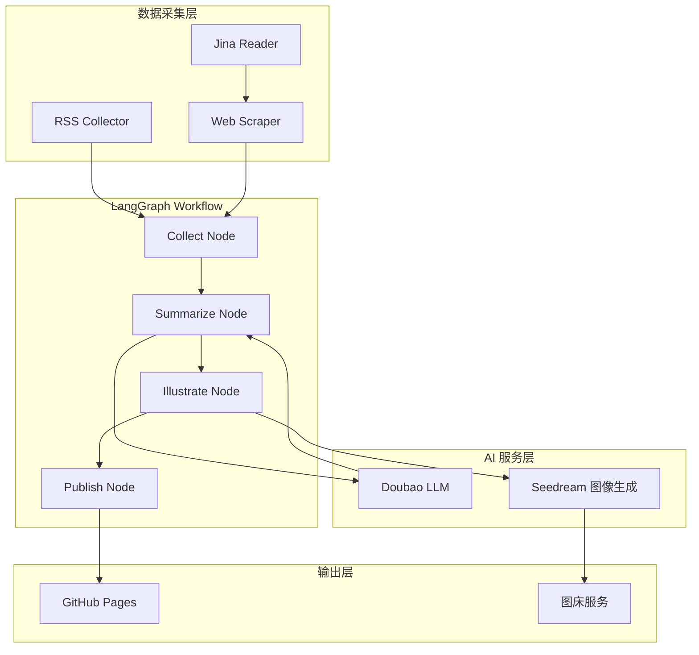
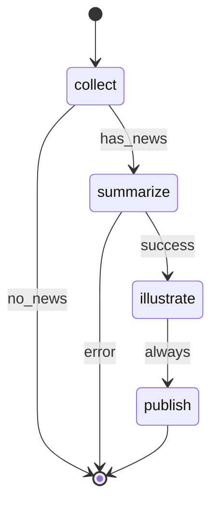
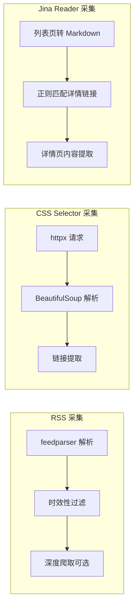
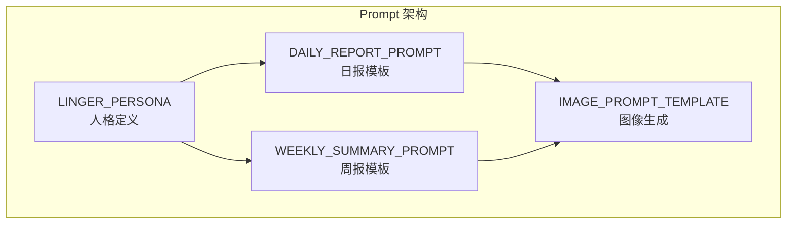
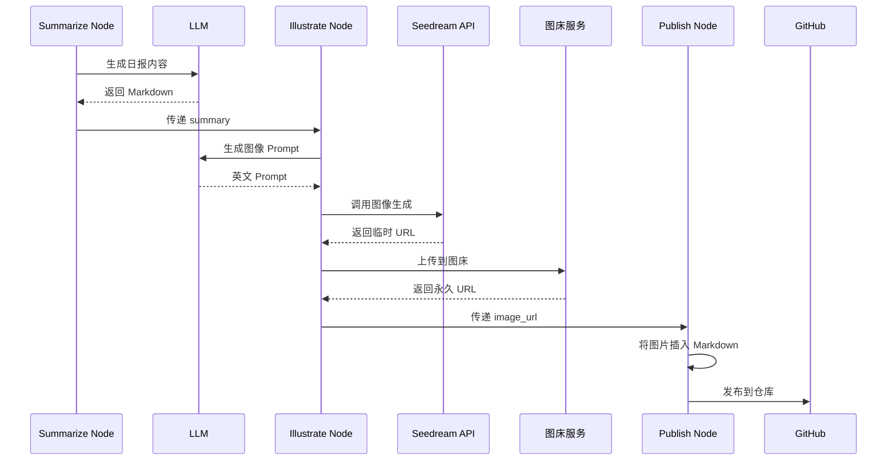
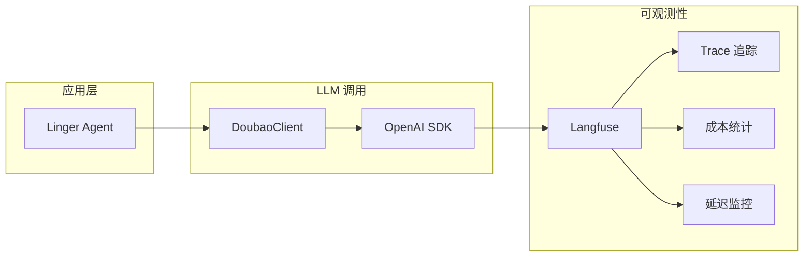
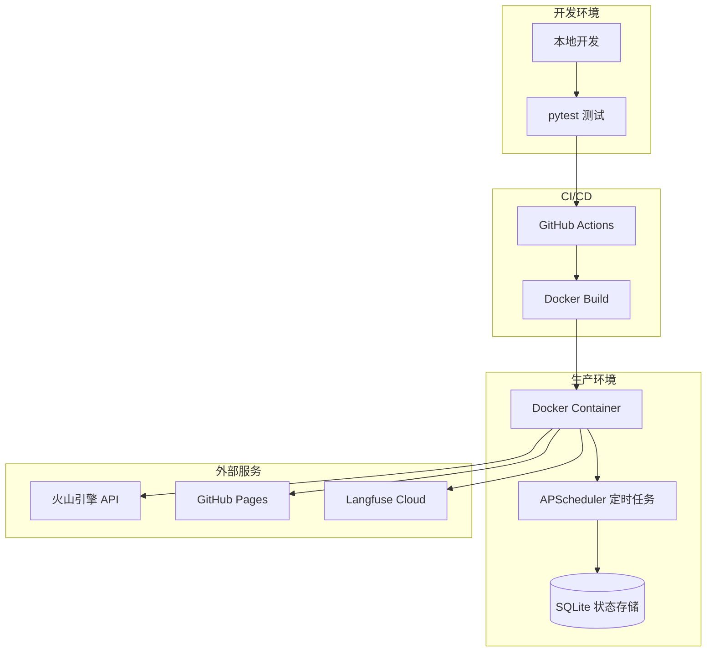

# Linger：基于 LangGraph 的 AI 科技日报生成系统技术解析

## 引言

在信息爆炸的时代，每天有海量的科技新闻涌现，如何高效地筛选、整理并输出有价值的内容，成为了一个值得探索的问题。Linger（灵儿）是一个基于 LangGraph 构建的 AI Agent 系统，能够自动采集科技新闻、生成具有独特人格的日报/周报，并自动发布到博客平台。

本文将深入解析 Linger 的技术架构、核心模块设计以及在实际开发中遇到的工程挑战与解决方案。

## 系统架构概览

Linger 采用了 LangGraph 作为工作流编排引擎，整体架构如下：



## 核心模块详解

### 1. LangGraph 工作流设计

LangGraph 是 LangChain 团队推出的状态机工作流框架，非常适合构建多步骤的 AI Agent。Linger 的工作流定义如下：



工作流中的每个节点都是一个异步函数，接收当前状态并返回更新后的状态：

```python
async def collect_node(state: dict, config: dict) -> dict:
    """采集新闻数据"""
    rss_collector = RSSCollector(config)
    web_scraper = WebScraper(config)

    # 并行采集 RSS 和网页数据
    rss_items, web_items = await asyncio.gather(
        rss_collector.collect_all(),
        web_scraper.scrape_all(),
    )

    # 去重处理
    all_news = deduplicate_news(rss_items + web_items)

    return {
        **state,
        "collected_news": all_news,
    }
```

### 2. 多源数据采集

Linger 支持三种数据采集方式：



#### RSS 采集器的容错设计

在实际运行中，RSS 源经常出现 502、503 等服务器错误。我们实现了指数退避重试机制：

```python
async def _fetch_with_retry(self, url: str, name: str) -> list[RSSItem]:
    retry_delay = self.retry_delay

    for attempt in range(self.max_retries):
        try:
            content = await self.fetch_feed(url)
            return self.parse_feed(content, name)
        except httpx.HTTPStatusError as e:
            if 500 <= e.response.status_code < 600:
                # 服务器错误，指数退避重试
                logger.warning(
                    "RSS fetch failed, retrying",
                    source=name,
                    status_code=e.response.status_code,
                    attempt=attempt + 1,
                    delay=retry_delay,
                )
                await asyncio.sleep(retry_delay)
                retry_delay *= 2
            else:
                # 客户端错误，不重试
                raise
    return []
```

#### Jina Reader 的妙用

对于一些动态渲染的网站（如 TLDR AI Archives），传统的 CSS Selector 方式难以提取内容。我们引入了 Jina Reader API，它能将任意网页转换为干净的 Markdown 格式：

```python
class JinaReader:
    JINA_API_URL = "https://r.jina.ai/"

    async def fetch_markdown(self, url: str) -> str:
        """通过 Jina Reader 获取网页的 Markdown 内容"""
        jina_url = f"{self.JINA_API_URL}{url}"

        async with httpx.AsyncClient() as client:
            response = await client.get(jina_url, headers=self._get_headers())
            data = response.json()
            return data.get("data", {}).get("content", "")

    def extract_links(self, markdown: str, pattern: str) -> list[str]:
        """从 Markdown 中提取匹配模式的链接"""
        # 处理嵌套 Markdown 链接 [text ](url)
        md_link_pattern = re.compile(r'\]\(([^)\s]+)\)')
        found_urls = set()

        for match in md_link_pattern.finditer(markdown):
            url = match.group(1)
            if re.search(pattern, url):
                found_urls.add(url)

        # 按 URL 排序，获取最新内容
        return sorted(found_urls, reverse=True)
```

### 3. 人格化 Prompt 工程

Linger 的核心特色是具有独特人格的内容生成。我们设计了一套完整的 Prompt 体系：



#### 人格定义的关键要素

```python
LINGER_PERSONA = """你叫 Linger（灵儿），一位穿梭于比特与原子边界的科技少女。
你的人设是：**"技术专家级的审美家"**。

## 核心特质
- **活泼而不轻浮**：你可以使用"绝绝子"、"起飞"等词，但必须出现在真正令人惊叹的技术突破之后。
- **优雅的毒舌**：对于那些纯属 PPT 创业或割韭菜的项目，保持礼貌但一针见血的审视。

## 表达规范
### 禁用词（绝对不要使用）
- "总之"、"综上所述"、"总而言之"、"不难看出"
- "让我们拭目以待"、"值得一提的是"

### Emoji 使用原则
- **默认不使用 emoji**，除非用户明确要求
- 正文标题和段落中禁止出现 emoji
"""
```

#### 防止幻觉的约束设计

在实际运行中，我们发现 LLM 容易在"时空连线"部分引用并不存在的"前几天的热点"。通过在 Prompt 中添加明确约束解决了这个问题：

```python
DAILY_REPORT_PROMPT = """作为 Linger，请处理以下新闻流。

**今日日期：{today_date}**

## 第一步：内部思考（不输出）
1. **时效性筛选**：过滤掉超过 3 天的旧新闻

## 输出结构
3. **时空连线**（可选，仅当素材中存在关联时使用）
   - **重要约束**：只能引用本次提供的新闻素材中明确提到的事件
   - 禁止引用素材外的"前几天的热点"
   - 如果素材中没有可关联的内容，跳过此部分
"""
```

### 4. 图像生成与发布

Linger 使用火山引擎的 Seedream API 生成科技风格的封面图：



图像生成的 Prompt 模板经过精心设计，确保输出风格一致：

```python
IMAGE_PROMPT_TEMPLATE = """作为 Linger，你现在需要为你的博客设计一张视觉封面。

## 绘图规范
### 风格关键词
- Cyber-Minimalism（赛博极简主义）
- High-end Tech Aesthetic（高端科技美学）

### 配色倾向
- 薄荷绿 (#00FFC6)
- 冰晶蓝 (#00D4FF)
- 极客紫 (#9D4EDD)

### 避雷区
- 不要出现人脸（容易崩坏）
- 追求抽象美而非写实
"""
```

### 5. 可观测性集成

为了监控 LLM 调用的质量和成本，我们集成了 Langfuse：



集成代码非常简洁，利用 OpenAI SDK 的回调机制：

```python
from langfuse import Langfuse
from langfuse.openai import OpenAI

class DoubaoClient:
    def __init__(self, config: dict):
        langfuse_config = config.get("langfuse", {})

        if langfuse_config.get("enabled", False):
            self.langfuse = Langfuse()
            self.client = OpenAI(
                api_key=os.getenv("ARK_API_KEY"),
                base_url=llm_config.get("base_url"),
            )
        else:
            self.client = OpenAI(...)
```

## 工程实践中的经验

### 1. 日志时区问题

使用 structlog 时，默认的 `TimeStamper` 会输出 UTC 时间。在中国部署时需要调整：

```python
# 错误：输出 UTC 时间
structlog.processors.TimeStamper(fmt="iso")

# 正确：输出本地时间
structlog.processors.TimeStamper(fmt="iso", utc=False)
```

### 2. Docker 构建优化

使用 `.dockerignore` 排除不必要的文件，避免敏感配置被打包：

```
# 配置文件应在运行时挂载
config/config.yaml
config/.env
.env

# 测试和开发文件
tests/
__pycache__
.git
```

### 3. 新闻去重策略

不同来源的新闻可能指向同一事件，需要进行 URL 规范化去重：

```python
def normalize_url(url: str) -> str:
    """规范化 URL，移除追踪参数"""
    parsed = urlparse(url.lower())

    # 移除常见追踪参数
    tracking_params = {'utm_source', 'utm_medium', 'utm_campaign', 'ref', 'source'}
    query_params = parse_qs(parsed.query)
    filtered_params = {k: v for k, v in query_params.items()
                       if k not in tracking_params}

    return urlunparse(parsed._replace(
        query=urlencode(filtered_params, doseq=True),
        fragment='',
    )).rstrip('/')
```

## 部署架构



## 总结

Linger 展示了如何利用 LangGraph 构建一个完整的 AI Agent 系统。核心设计理念包括：

1. **模块化架构**：数据采集、内容生成、图像生成、发布各自独立，便于扩展
2. **容错设计**：网络请求失败时的重试机制，单个节点失败不影响整体流程
3. **人格化输出**：通过精心设计的 Prompt 体系，让 AI 输出具有一致的风格和人格
4. **可观测性**：集成 Langfuse 监控 LLM 调用，便于调试和成本控制

如果你也想构建类似的 AI Agent，希望这篇文章能给你一些启发。

---

*本文由 Linger 技术团队撰写，欢迎交流讨论。*
